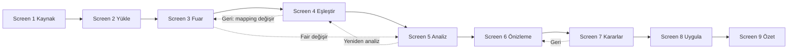

# Smart Import Wizard — UX Flow

**Status:** Design (Functional Design Phase)  
**Companion:** [IMPORT_WIZARD_FUNCTIONAL_SPEC.md](IMPORT_WIZARD_FUNCTIONAL_SPEC.md)  
**UI language:** Turkish (labels below are final-facing copy suggestions)  
**Implementation:** Forbidden until approved

---

## 1. Design Principles

1. **Progressive disclosure** — Show only what the current step needs; avoid overwhelming mapping on upload.
2. **Explicit over magic** — Auto-mapping is a suggestion; user confirms mappings before analyze.
3. **Decision support** — Preview and confidence scores help users choose; bulk actions reduce tedium without removing control.
4. **Recoverability** — Back navigation within wizard; clear batch state; no silent CRM writes.
5. **Consistency** — Reuse Sprint 04.5 components: `PageHeader`, `Card`, `DataTable`, `Badge`, `Modal`, `ConfirmDialog`, `Tabs`, `EmptyState`, `LoadingState`.
6. **Mobile** — Wizard usable on tablet; mapping screen may require horizontal scroll on narrow viewports.

---

## 2. Entry Points

| Entry | Route (proposed) | Notes |
|-------|------------------|-------|
| Sidebar | `/imports` | Replaces/enhances current ImportsPage |
| Customer list CTA | `/imports?from=customers` | Optional future |
| Fair detail | `/fairs/{id}/participants/import` | Pre-fills Fair on Screen 3 (ADR-012) |

**Alternative entry path (Fair pre-selected):**

```text
Fuarlar → Fuar Detayı → Katılımcı Firmalar → Katılımcıları İçe Aktar
```

When launched from Fair Detail, `fair_id` is set on batch creation; Screen 3 shows read-only Fair summary or is skipped.

Returning user with in-progress batch: banner “Devam eden içe aktarma” → resume at last incomplete step.

---

## 3. Wizard Shell

### 3.1 Layout

```text
┌─────────────────────────────────────────────────────────────┐
│ Breadcrumb: Ana Sayfa / İçe Aktarma / Yeni                  │
│ PageHeader: Akıllı İçe Aktarma                              │
├─────────────────────────────────────────────────────────────┤
│ Stepper (9 steps, horizontal scroll on mobile)              │
│ [1 Kaynak] [2 Yükle] [3 Fuar] [4 Eşleştir] … [9 Özet]     │
├─────────────────────────────────────────────────────────────┤
│                                                             │
│                    Step content area                        │
│                                                             │
├─────────────────────────────────────────────────────────────┤
│ [ ← Geri ]                              [ İleri / Devam → ] │
└─────────────────────────────────────────────────────────────┘
```

### 3.2 Stepper behavior

- Completed steps: checkmark, clickable to jump back **if batch state allows**
- Current step: highlighted
- Future steps: disabled until prerequisites met
- Step labels (Turkish):

| # | Step ID | Label |
|---|---------|-------|
| 1 | `source` | Kaynak |
| 2 | `upload` | Yükle |
| 3 | `fair` | Fuar Seçimi |
| 4 | `mapping` | Kolon Eşleştirme |
| 5 | `analyze` | Analiz |
| 6 | `preview` | Önizleme |
| 7 | `decisions` | Kararlar |
| 8 | `apply` | Uygula |
| 9 | `summary` | Özet |

### 3.3 Global actions

- **İptal** (secondary) — ConfirmDialog: “İçe aktarmayı iptal etmek istediğinize emin misiniz?”
- **Kaydet ve sonra devam** (optional v2) — Save batch draft

---

## 4. Screen-by-Screen UX

### Screen 1 — Import Source (`/imports/new`)

**Purpose:** Select source type only.

**Wireframe (conceptual):**

```text
┌─ Kaynak türünü seçin ─────────────────────────────────────┐
│  ┌──────────┐  ┌──────────┐  ┌──────────┐                  │
│  │  Excel   │  │   PDF    │  │ Scraper  │                  │
│  │  [aktif] │  │ Yakında  │  │ Yakında  │                  │
│  └──────────┘  └──────────┘  └──────────┘                  │
│  ┌──────────┐  ┌──────────┐  ┌──────────┐                  │
│  │ Veritab. │  │  Manuel  │  │  Diğer   │                  │
│  │ Yakında  │  │ Yakında  │  │ Yakında  │                  │
│  └──────────┘  └──────────┘  └──────────┘                  │
├─ İsteğe bağlı ──────────────────────────────────────────────┤
│  Batch adı: [ Otomatik: dosya adı ]                         │
└─────────────────────────────────────────────────────────────┘
```

**Note:** Fair selection is on Screen 3, not here (ADR-012).

**Interactions:**

- Card click selects source; only Excel proceeds
- Disabled cards: reduced opacity + badge “Yakında” + tooltip explaining future support
- **İleri** disabled until Excel selected

**Empty/error:** N/A

---

### Screen 2 — Upload

**Purpose:** Select and upload file; show raw ingest result.

**Components:**

- Drag-drop zone + “Dosya seç” button
- Accepted: `.xlsx` (v1)
- After upload: file name, size, sheet selector (if multi-sheet)
- Raw preview table: first 10 rows, **unmapped** column headers as A/B/C or detected headers

**Copy:**

- Title: “Dosyayı yükleyin”
- Hint: “Bu aşamada CRM kaydı oluşturulmaz. Yalnızca ham veri okunur.”
- Loading: “Dosya okunuyor…”

**Validation messages:**

| Condition | Message |
|-----------|---------|
| Wrong type | “Yalnızca .xlsx dosyaları desteklenir.” |
| Empty | “Dosya boş veya okunamadı.” |
| Too large | “Dosya çok büyük. Maksimum X MB.” |

**İleri** enabled when upload succeeds.

---

### Screen 3 — Fair Selection

**Purpose:** Select the target Fair for the entire import batch (required, ADR-012).

**Components:**

- Fair dropdown (searchable, active fairs only)
- Fair info card when selected:

```text
WIN Eurasia 2026
5–8 Haziran 2026
İstanbul Fuar Merkezi
Mevcut katılımcı: 1.842
```

**Copy:**

- Title: "Hedef fuarı seçin"
- Subtitle: "Tüm satırlar bu fuara katılımcı olarak içe aktarılacaktır."
- Hint: "Dosyada fuar adı aranmaz; fuar burada seçilir."

**Pre-selected Fair (Fair Detail entry):**

- Fair info card shown read-only
- Optional "Fuaru değiştir" link opens dropdown
- **İleri** enabled immediately when Fair pre-filled

**Validation:**

| Condition | Message |
|-----------|---------|
| No Fair selected | "Devam etmek için bir fuar seçin." |
| Archived Fair | "Bu fuar arşivlenmiş; içe aktarma yapılamaz." |

**İleri** disabled until Fair selected.

---

### Screen 4 — Column Mapping

**Purpose:** Map CRM fields to source columns — **most critical screen**.

#### 3.1 Header row control

```text
İlk satır başlık mı?
( ) Evet   ( ) Hayır   (•) Otomatik

[Otomatik algılandı: Evet — “Firma Adı”, “Telefon” benzeri etiketler bulundu]
```

- **Otomatik:** Backend heuristic; user sees result + override radio
- Changing header mode refreshes column dropdown labels

#### 3.2 Mapping table

Two-column layout (desktop); stacked on mobile:

| CRM alanı | Kaynak kolonu |
|-----------|---------------|
| Firma Adı * | [ Kolon B — Firma Adı ▼ ] |
| E-posta | [ Eşleştirme yok ▼ ] |
| Telefon | [ Kolon C ▼ ] |
| … | … |
| Salon | [ … ] |
| Stand | [ … ] |

**Not:** `fair_name` / Fuar adı mapping alanı **yoktur** (ADR-012). Fuar Screen 3'te seçilir.

- Required row (`Firma Adı`) highlighted with `*`
- Dropdown options:
  - `Eşleştirme yok` (optional fields)
  - `Kolon A`, `Kolon B`, … (always)
  - If header mode: `Firma Adı (B)`, `Telefon (C)`, …

**Actions:**

- **Otomatik eşleştirme öner** — fills mappings; toast “Eşleştirmeler önerildi, lütfen kontrol edin”
- **Tümünü temizle**

#### 3.3 Live preview strip

Below mapping: mini DataTable showing 5 rows **after mapping** (canonical field columns only).

#### 3.4 Validation

- Block **İleri** if `company_name` unmapped
- Inline warning if two fields map to same column

**Copy:**

- Title: “Kolon eşleştirme”
- Subtitle: "Her CRM alanını kaynak kolonuna bağlayın. Yalnızca firma adı zorunludur. Fuar adı eşleştirilmez."

---

### Screen 5 — Analyze

**Purpose:** Run analysis; show progress and summary.

**States:**

1. **Idle** — “Analiz başlat” button (auto-start on enter optional)
2. **Running** — Progress bar + “X / Y satır işlendi”
3. **Complete** — Summary cards:

```text
┌─────────┐ ┌─────────┐ ┌─────────┐ ┌─────────┐
│   120   │ │   45    │ │   12    │ │    3    │
│  Toplam │ │  Yeni   │ │Duplicate│ │ Hatalı  │
└─────────┘ └─────────┘ └─────────┘ └─────────┘
```

**İleri** → Screen 6 when complete.

**Error:** “Analiz başarısız. Lütfen eşleştirmeyi kontrol edip tekrar deneyin.” + retry

---

### Screen 6 — Import Preview / Duplicate Review

**Purpose:** Review analyzed rows.

**Page context:** Selected Fair name shown in page header or sticky banner (e.g. "Hedef fuar: WIN Eurasia 2026").

**Toolbar:**

- Search: “Firma ara…”
- Filters: Durum, Karar (multi-select chips)
- Pagination (standard 10/25/50/100)

**Table columns:**

| Kolon | Badge / format |
|-------|----------------|
| Firma | text + row expand |
| E-posta | truncated |
| Telefon | |
| Web | link if URL |
| Ülke / Şehir | |
| Salon / Stand | participation preview for batch Fair |
| Eşleşen müşteri | link button if customer match |
| Katılım durumu | Yeni katılım / Mevcut katılım badge |
| Güven | progress bar or % badge (customer match) |
| Durum | Yeni / Güncellenecek / Duplicate / Hatalı |
| Karar | read-only badge here; editable on Screen 7 |
| Hatalar | icon + tooltip list |

**Row expand panel:**

- Ham satır (source cells)
- Normalize edilmiş JSON (collapsible, power users)
- Duplicate match detail (customer level)
- Participation match detail (exists in selected Fair: yes/no)

**Empty filter:** EmptyState "Filtreye uygun satır yok."

**Navigation:** **İleri** → Screen 7 (Decisions).

---

### Screen 7 — Merge Decision

**Purpose:** Set and bulk-set decisions.

**Bulk action bar (sticky):**

```text
[ Tüm yenileri oluştur ] [ Tüm eşleşenleri güncelle ]
[ Duplicate atla ] [ Hatalıları atla ] [ Önerilere dön ]
```

Each opens ConfirmDialog with count: “47 satır ‘Oluştur’ olarak işaretlenecek.”

**Per-row inline controls:**

- Segmented control or dropdown: Oluştur | Güncelle | Atla
- **Güncelle** disabled when no match
- **Oluştur** disabled when row `invalid`

**Merge visualization (recommended):**

Side-by-side diff modal when user clicks “Karşılaştır” on update rows:

```text
┌─ Mevcut CRM ─────────┐  ┌─ Gelen veri ─────────┐
│ Firma: ABC Ltd       │  │ Firma: ABC Limited   │
│ E-posta: a@x.com     │  │ E-posta: a@x.com;b@  │
│ Telefon: (boş)       │  │ Telefon: +90 212 …   │
└──────────────────────┘  └──────────────────────┘
Alan bazında: [Boş alanı doldur] [Mevcut koru] (info only — actual merge rules automatic)
```

v1: read-only diff; merge rules applied on apply (see merge rules doc).

**Decision summary footer:**

“Oluştur: 45 · Güncelle: 12 · Atla: 3 · Kararsız: 0”

**İleri** disabled if any valid row lacks decision (or auto-fill suggested on leave).

---

### Screen 8 — Apply

**Purpose:** Confirm and execute CRM writes.

**Pre-apply summary card:**

```text
Uygulama özeti
• 45 yeni müşteri oluşturulacak
• 12 müşteri güncellenecek
• 8 fuar katılımı eklenecek/güncellenecek (WIN Eurasia 2026)
• 5 kişi kaydı eklenecek
• 3 satır atlanacak
```

**Primary action:** “İçe aktarmayı uygula” → ConfirmDialog

**During apply:**

- Full-page or modal progress
- “Uygulanıyor… 23 / 60”
- Cancel disabled (or “Arka planda devam et” future)

**On complete:** Auto-navigate to Screen 9

**Partial errors:** “Bazı satırlar uygulanamadı. Özette detayları görün.”

---

### Screen 9 — Summary

**Purpose:** Final batch report.

**Metrics grid:**

| Metrik | Icon/color |
|--------|------------|
| Oluşturulan | success green |
| Güncellenen | info blue |
| Katılım | accent |
| Kişi | accent |
| Atlanan | neutral |
| Başarısız | danger red |

**Sections:**

1. Batch meta: tarih, kaynak, dosya adı, **hedef fuar**, süre
2. Hata listesi (if any) — DataTable with row #, firma, hata mesajı
3. **Hata raporunu indir** (CSV)
4. Actions: **Yeni içe aktarma** | **İçe aktarma geçmişi** | **Müşterilere git**

**Success EmptyState variant:** Checkmark illustration + “İçe aktarma tamamlandı.”

---

## 5. User Journey Diagram



---

## 6. Open Design Questions — Recommended UX Solutions

### 6.1 Header mapping UX

**Problem:** Users unsure if first row is header.  
**Recommendation:** Three-way toggle (Evet/Hayır/Otomatik) with detected preview; show first row highlighted in raw preview when “Hayır” selected.

### 6.2 Field mapping UX

**Problem:** Many optional fields clutter UI.  
**Recommendation:** Collapsible groups — “Firma bilgileri” (required), “İletişim”, “Kişi”, “Salon / Stand”; search filter “Alan ara…”. No “Fuar adı” group (ADR-012).

### 6.3 Duplicate review UX

**Problem:** Users don’t trust fuzzy matches and need to distinguish customer vs participation duplicates.  
**Recommendation:** Two-level display — customer match confidence badge + separate “Katılım durumu” (Yeni / Mevcut); “Karşılaştır” modal; default sort duplicates first; filters “Düşük güven (<80%)” and “Mevcut katılım”.

### 6.4 Bulk decision UX

**Problem:** Bulk actions scary.  
**Recommendation:** Always ConfirmDialog with counts; undo via “Önerilere dön” before apply only.

### 6.5 Merge visualization

**Problem:** Users don’t know what update will change.  
**Recommendation:** Read-only side-by-side diff; highlight fields that **will** change per merge rules (green = fill empty, gray = keep existing, strikethrough = incoming ignored).

### 6.6 Import summary

**Problem:** Users need audit trail.  
**Recommendation:** Screen 9 + persistent batch history list at `/imports/history` with status badges.

### 6.7 Undo import strategy

**Problem:** Wrong apply is destructive.  
**Recommendation (v1):** No automatic undo; batch summary + link to affected records. **(v2):** Soft-rollback batch marking created IDs; 24h window — deferred.

### 6.8 Import template system

**Problem:** Repeat importers want saved mappings.  
**Recommendation (v2):** “Eşleştirmeyi şablon olarak kaydet” on Screen 4; template stores column index/header + source type; load on Screen 4.

### 6.9 Background processing

**Problem:** Large files block UI.  
**Recommendation:** Screen 5 async with email/toast; user can leave wizard; resume from batch list.

### 6.10 Batch management

**Problem:** Multiple in-progress imports.  
**Recommendation:** `/imports` landing = batch list (Devam eden / Tamamlanan); click row → resume at correct step.

---

## 7. Accessibility & Feedback

- All steps keyboard-navigable; mapping dropdowns searchable
- Error messages associated with fields (`aria-describedby`)
- Loading skeletons on tables; never blank screen > 200ms
- Success/error toasts for bulk actions
- Color not sole indicator — icons + text on badges

---

## 8. Migration from Current `/imports` Page

| v1 ImportsPage | Wizard equivalent |
|----------------|-------------------|
| Single upload panel | Screens 1–2 |
| Auto header mapping only | Screen 4 (+ auto suggest) |
| Immediate preview after upload | Screens 5–6 after explicit analyze |
| Inline decision dropdown | Screen 7 |
| Apply button | Screens 8–9 |
| No Fair context | Screen 3 mandatory Fair selection (ADR-012) |

**Transition:** Feature flag `importWizardEnabled` or replace page when wizard MVP ships.

---

## 9. References

- [IMPORT_WIZARD_FUNCTIONAL_SPEC.md](IMPORT_WIZARD_FUNCTIONAL_SPEC.md)
- [IMPORT_WIZARD_MERGE_RULES.md](IMPORT_WIZARD_MERGE_RULES.md)
- Sprint 04.5 UI components (`frontend/src/components/ui/`)
