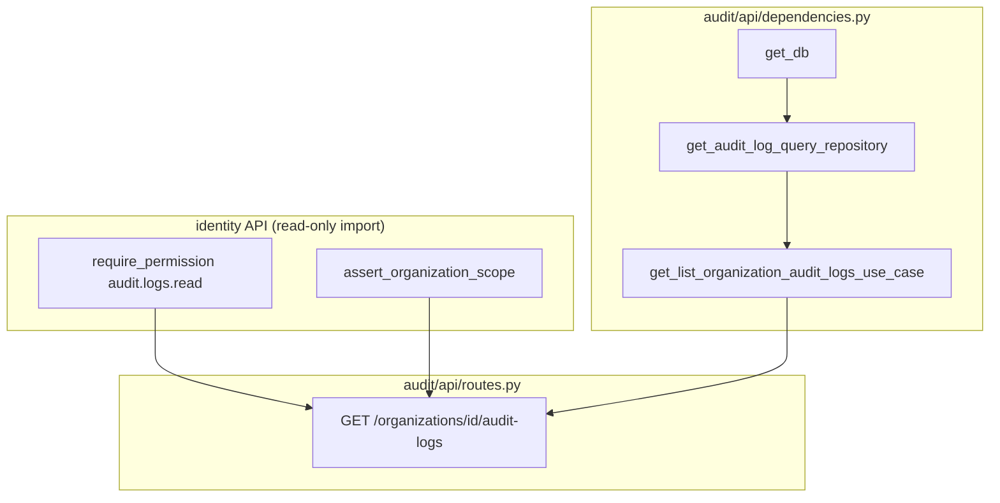
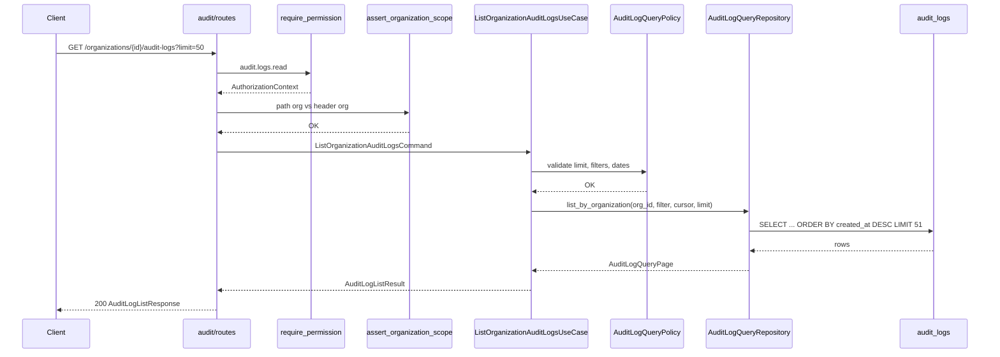

> **Historical design draft.** Not normative. As-built contract: [PRODUCT_INTEGRATION_GUIDE.md](../../../projects/kyrox-core/integrations/PRODUCT_INTEGRATION_GUIDE.md). Core status: [PROJECT_STATUS.md](../../../projects/kyrox-core/PROJECT_STATUS.md).

# Sprint 0.4.1 — Phase 1: Audit Query Platform Design

**Status:** Implemented — v0.4.0 (Sprint 0.4.1)  
**Sprint:** 0.4.1 (Platform Services — Audit read path)  
**Target:** Organization-scoped audit log query API  
**Prerequisite:** v0.3.0 Identity Platform — **completed**

**Related documents:**

- [Platform Services Design](PLATFORM_SERVICES_DESIGN.md) — Epic A backlog
- [Backend Architecture Standards](../../standards/backend/BACKEND_ARCHITECTURE_STANDARDS.md)
- [Identity Platform Design](IDENTITY_PLATFORM_DESIGN.md) — org context, RBAC
- [Roadmap](ROADMAP.md)

---

## 1. Scope & Constraints

### 1.1 In scope (Phase 2 implementation)

| Area | Deliverable |
|------|-------------|
| **Read port** | New query repository interface; no changes to append contract |
| **Application** | `ListOrganizationAuditLogsUseCase` + query command/result/policy |
| **Infrastructure** | SQLAlchemy query implementation + optional index migration |
| **API** | `GET /organizations/{id}/audit-logs` — thin controller, DI, error mapping |
| **Authorization** | Reuse identity guards; permission `audit.logs.read` |
| **Tests** | Architecture, import-boundary, integration, API route tests |

### 1.2 Explicitly out of scope

| Item | Reason |
|------|--------|
| **Audit recording changes** | `AuditService.record()`, `RecordAuditEventCommand`, append repository — **frozen** |
| **Identity module changes** | No hooks, no use case edits, no new identity endpoints |
| **Identity audit event emission** | Epic A5 — separate task (P1) |
| **System-scoped audit query** | `organization_id IS NULL` rows — future platform-admin API |
| **Single-event GET by id** | Future enhancement |
| **Full-text / JSONB search** | Performance risk; defer to later sprint |
| **Export / bulk download** | Future |
| **Write, update, delete APIs** | Append-only invariant |

### 1.3 Design principles

1. **CQRS-lite:** Append port unchanged; read path uses a **separate query port**.
2. **Org isolation:** Every query is scoped to one organization; cross-org reads impossible at repository + API layers.
3. **Cursor pagination:** No offset-based paging on large append-only tables.
4. **Thin API:** Filtering validation in application policy; SQL in infrastructure only.
5. **Identity reuse without modification:** Import `require_permission`, `assert_organization_scope` from identity API — do not edit identity packages.

---

## 2. Current State (v0.3.0)

### 2.1 Existing audit module

```text
backend/app/modules/audit/
├── domain/
│   ├── entities.py              # AuditLog dataclass
│   ├── ports.py                 # AuditLogRepository.append only
│   └── exceptions.py            # AuditError, InvalidAuditEventError
├── application/
│   ├── dto.py                   # RecordAuditEventCommand
│   └── service.py               # AuditService.record()
└── infrastructure/
    ├── repositories.py          # SqlAlchemyAuditLogRepository (append only)
    └── persistence/
        ├── models.py            # AuditLogModel
        └── mappers.py
```

**No `api/` layer.** Recording is invoked programmatically from other modules (future identity hooks).

### 2.2 Database schema (`audit_logs`, migration `20260701_0006`)

| Column | Type | Nullable | Notes |
|--------|------|----------|-------|
| `id` | UUID | NO | PK |
| `organization_id` | UUID | YES | Org-scoped events; NULL = platform-level |
| `user_id` | UUID | YES | Actor |
| `session_id` | UUID | YES | Auth session |
| `action` | VARCHAR(255) | NO | `module.resource.action` |
| `resource_type` | VARCHAR(128) | NO | |
| `resource_id` | VARCHAR(255) | YES | |
| `old_values` | JSONB | YES | |
| `new_values` | JSONB | YES | |
| `metadata` | JSONB | YES | ORM column `metadata`; domain field `metadata` |
| `ip_address` | VARCHAR(45) | YES | |
| `user_agent` | VARCHAR(512) | YES | |
| `created_at` | TIMESTAMPTZ | NO | Event timestamp; server default `now()` |

### 2.3 Existing indexes (single-column)

| Index | Column |
|-------|--------|
| `ix_audit_logs_organization_id` | `organization_id` |
| `ix_audit_logs_user_id` | `user_id` |
| `ix_audit_logs_session_id` | `session_id` |
| `ix_audit_logs_action` | `action` |
| `ix_audit_logs_resource_type` | `resource_type` |
| `ix_audit_logs_created_at` | `created_at` |

**Gap:** No composite index optimized for org-scoped time-ordered listing. List queries will not efficiently use single-column indexes together.

### 2.4 Action naming (recording validation — unchanged)

Recording validates: `^[a-z][a-z0-9_]*(\.[a-z][a-z0-9_]*){2,}$`  
Examples: `identity.organization.create`, `audit.logs.read` (future).

Query filters must accept the same action strings; no normalization beyond trim/lowercase **not** applied (case-sensitive match on stored value).

---

## 3. Goals

| Goal | Success metric |
|------|----------------|
| Authorized org members can list audit logs for their organization | 200 + paginated JSON |
| Cross-organization access denied | 403 / scope mismatch 400 |
| Append-only preserved | No update/delete repository methods |
| Predictable performance at scale | Cursor pagination + composite PG index |
| Layer boundaries enforced | Architecture + import-boundary tests pass |

---

## 4. Target Folder Structure (Phase 2)

```text
backend/app/modules/audit/
├── domain/
│   ├── entities.py                    # UNCHANGED
│   ├── ports.py                       # UNCHANGED (append port)
│   ├── ports/
│   │   └── audit_log_query_repository.py   # NEW — read port
│   ├── value_objects/
│   │   ├── audit_log_cursor.py        # NEW
│   │   └── audit_log_list_filter.py   # NEW
│   └── exceptions.py                  # ADD InvalidAuditQueryError only
│
├── application/
│   ├── dto.py                         # UNCHANGED
│   ├── service.py                     # UNCHANGED
│   ├── query_commands.py              # NEW
│   ├── query_results.py               # NEW
│   ├── query_policy.py                # NEW — limits, defaults
│   └── list_organization_audit_logs.py  # NEW — use case
│
├── infrastructure/
│   ├── repositories.py                # UNCHANGED append class OR split file
│   ├── query_repository.py            # NEW — SqlAlchemyAuditLogQueryRepository
│   └── persistence/                   # UNCHANGED models/mappers
│
└── api/                               # NEW
    ├── __init__.py
    ├── dependencies.py
    ├── routes.py
    ├── schemas.py
    ├── mappers.py
    └── error_mapping.py

backend/app/api/v1/router.py           # include audit router

backend/alembic/versions/
    20260701_0017_audit_logs_query_indexes.py   # NEW — composite indexes

backend/tests/modules/audit/
    test_query_repository_integration.py
    test_list_organization_audit_logs_use_case.py
    test_api_architecture.py
    test_api_import_boundary.py
    test_api_routes.py
```

**Note:** Prefer **new files** over editing `service.py`, `repositories.py` append logic, or `ports.py` append protocol.

---

## 5. Domain Design (Read Side — Additive)

### 5.1 Query port — `AuditLogQueryRepository`

Separate from append port to avoid coupling read semantics to write repository and to keep append-only tests unchanged.

```python
# Illustrative — not implementation code
class AuditLogQueryRepository(Protocol):
    def list_by_organization(
        self,
        organization_id: UUID,
        *,
        filter: AuditLogListFilter,
        cursor: AuditLogCursor | None,
        limit: int,
    ) -> AuditLogQueryPage: ...
```

**Return type `AuditLogQueryPage`:**

| Field | Type | Description |
|-------|------|-------------|
| `items` | `list[AuditLog]` | Domain entities, ordered per sort spec |
| `next_cursor` | `AuditLogCursor \| None` | Opaque cursor for next page; `None` if no more rows |

**Invariants enforced in infrastructure:**

- `organization_id` filter is **mandatory** and applied as equality on `audit_logs.organization_id`
- Rows with `organization_id IS NULL` are **never** returned (org API scope)
- `limit` is clamped upstream; repository uses `LIMIT limit + 1` to detect `has_next`

### 5.2 Value objects

#### `AuditLogListFilter`

| Field | Type | Required | Semantics |
|-------|------|----------|-----------|
| `action` | `str \| None` | No | Exact match on `action` |
| `action_prefix` | `str \| None` | No | SQL `LIKE prefix%` (prefix must be ≥ 3 chars; validated in policy) |
| `resource_type` | `str \| None` | No | Exact match |
| `resource_id` | `str \| None` | No | Exact match |
| `user_id` | `UUID \| None` | No | Exact match |
| `session_id` | `UUID \| None` | No | Exact match |
| `created_from` | `datetime \| None` | No | Inclusive lower bound (`created_at >=`) |
| `created_to` | `datetime \| None` | No | Exclusive upper bound (`created_at <`) |

**Rules:**

- `action` and `action_prefix` are **mutually exclusive**
- If both `created_from` and `created_to` set: `created_from < created_to`
- All datetimes must be timezone-aware (UTC normalized in application policy)

#### `AuditLogCursor`

Opaque pagination bookmark for stable ordering.

| Field | Type | Description |
|-------|------|-------------|
| `created_at` | `datetime` | Tie-breaker timestamp from last row |
| `id` | `UUID` | Tie-breaker id from last row |

**Wire encoding (API):** Base64URL-encoded JSON `{"created_at":"<ISO8601>","id":"<uuid>"}` — decoded and validated in application layer, not in API route body.

**Cursor predicate (descending sort):**

```text
(created_at, id) < (cursor.created_at, cursor.id)
```

Using lexicographic tuple comparison matching `ORDER BY created_at DESC, id DESC`.

### 5.3 Domain exception (additive)

| Exception | When |
|-----------|------|
| `InvalidAuditQueryError(AuditError)` | Invalid filter combo, bad cursor, limit out of range, malformed dates |

Recording exceptions (`InvalidAuditEventError`) remain unchanged.

---

## 6. Application Layer Design

### 6.1 Use case — `ListOrganizationAuditLogsUseCase`

**Dependencies:** `AuditLogQueryRepository` only (no `AuditService`, no identity repos).

**Responsibilities:**

1. Validate command via `AuditLogQueryPolicy`
2. Decode cursor if present; reject cursor/filter org mismatch (cursor is org-agnostic but query always scoped by command org id)
3. Delegate to `AuditLogQueryRepository.list_by_organization`
4. Map domain page to `AuditLogListResult`

**Does not:**

- Check permissions (API guard responsibility)
- Verify organization exists (optional: skip org lookup — empty list if org has no logs; **design choice: no org existence check** to avoid identity coupling; unauthorized org access blocked by RBAC + membership via existing authorization service)

### 6.2 Command — `ListOrganizationAuditLogsCommand`

| Field | Type | Source |
|-------|------|--------|
| `organization_id` | `UUID` | Path param (mapped in API layer) |
| `filter` | `AuditLogListFilter` | Query params via mapper |
| `cursor` | `AuditLogCursor \| None` | Query param `cursor` |
| `limit` | `int` | Query param `limit` (default from policy) |

### 6.3 Result — `AuditLogListResult`

| Field | Type |
|-------|------|
| `items` | `list[AuditLogResult]` |
| `next_cursor` | `str \| None` | Encoded opaque cursor for API |

#### `AuditLogResult` (application DTO)

Mirrors domain `AuditLog` fields needed for API — flat structure, no ORM leakage.

### 6.4 Policy — `AuditLogQueryPolicy`

| Rule | Value |
|------|-------|
| Default `limit` | `50` |
| Maximum `limit` | `100` |
| Minimum `limit` | `1` |
| Default sort | `created_at DESC, id DESC` (only sort in v1) |
| `action_prefix` min length | `3` |
| Max `action` / `resource_type` length | Match column sizes (255 / 128) |
| Date range max span | `90 days` (prevent unbounded scans — configurable constant) |

---

## 7. Repository Query Semantics

### 7.1 Base query shape

```sql
SELECT ...
FROM audit_logs
WHERE organization_id = :organization_id
  AND (optional filters)
  AND (optional cursor predicate)
ORDER BY created_at DESC, id DESC
LIMIT :limit_plus_one
```

### 7.2 Filter mapping

| Filter field | SQL condition |
|--------------|---------------|
| `action` | `action = :action` |
| `action_prefix` | `action LIKE :prefix \|\| '%'` (escape `%`, `_`) |
| `resource_type` | `resource_type = :resource_type` |
| `resource_id` | `resource_id = :resource_id` |
| `user_id` | `user_id = :user_id` |
| `session_id` | `session_id = :session_id` |
| `created_from` | `created_at >= :created_from` |
| `created_to` | `created_at < :created_to` |

### 7.3 Append repository — no changes

`SqlAlchemyAuditLogRepository.append()` remains the sole write path. Query class may live in:

- **Option A (preferred):** `SqlAlchemyAuditLogQueryRepository` in `query_repository.py`
- **Option B:** Same module, separate class implementing only query port

Do **not** add `update` / `delete` methods.

---

## 8. Filtering Specification (API Query Parameters)

| Parameter | Type | Example | Maps to |
|-----------|------|---------|---------|
| `action` | string | `identity.organization.create` | `filter.action` |
| `action_prefix` | string | `identity.organization` | `filter.action_prefix` |
| `resource_type` | string | `organization` | `filter.resource_type` |
| `resource_id` | string | `550e8400-...` | `filter.resource_id` |
| `user_id` | UUID | `550e8400-...` | `filter.user_id` |
| `session_id` | UUID | `550e8400-...` | `filter.session_id` |
| `from` | ISO8601 datetime | `2026-07-01T00:00:00Z` | `filter.created_from` |
| `to` | ISO8601 datetime | `2026-07-02T00:00:00Z` | `filter.created_to` |
| `limit` | integer | `50` | command limit |
| `cursor` | string | opaque | decoded cursor |

**Validation errors → `InvalidAuditQueryError` → HTTP 400**

---

## 9. Pagination Design

### 9.1 Strategy: keyset (cursor) pagination

| Aspect | Decision |
|--------|----------|
| Mechanism | Keyset on `(created_at DESC, id DESC)` |
| Offset pagination | **Rejected** — O(n) cost on large tables |
| Total count | **Not provided** in v1 (expensive `COUNT(*)` avoided) |
| Page size detection | Fetch `limit + 1`; trim last row; emit `next_cursor` if extra row exists |

### 9.2 Client flow

```text
1. GET .../audit-logs?limit=50
   → items[50], next_cursor = "eyJ..."

2. GET .../audit-logs?limit=50&cursor=eyJ...
   → next page

3. next_cursor absent → end of list
```

### 9.3 Cursor stability

Append-only table: new rows insert at top (newer `created_at`). Cursor pagination remains stable for historical pages; clients may see new events on page 1 when re-fetching without cursor — documented behavior.

---

## 10. Sorting

| Version | Supported sort | Notes |
|---------|----------------|-------|
| **0.4.1** | `created_at DESC, id DESC` only | Fixed; no client `sort` param |
| **Future** | Optional `sort=created_at:asc` | Requires inverted cursor predicate |

Rationale: Single sort path simplifies cursor encoding and index design for Phase 2.

---

## 11. Permission Model

### 11.1 Permission code

| Code | Description |
|------|-------------|
| `audit.logs.read` | List audit logs for organization in context |

**Module:** `audit`  
**Group code (seed):** `audit.logs`  
**Group name:** Audit Logs  
**Permission module enum:** `audit`

### 11.2 Authorization flow

Same pattern as organization/membership APIs (identity guards — **import only**):

```text
1. Bearer JWT → AccessTokenClaims
2. X-Organization-Id header → AuthorizationContext
3. require_permission("audit.logs.read")
4. assert_organization_scope(path_organization_id, context)
5. ListOrganizationAuditLogsUseCase.execute(...)
```

### 11.3 Super admin

Existing `SuperAdminPolicy` bypasses **`core.*`** permissions only.  
`audit.logs.read` is **`audit.*`** — **no automatic bypass**. Super admins require explicit role assignment unless policy is extended later (out of scope; document as intentional).

### 11.4 Permission seed (Phase 2 migration — separate from query code)

Migration `20260701_0018` (or bundled with indexes):

- Permission group `audit.logs`
- Permission `audit.logs.read`
- Optional: grant to existing admin role templates in seed data

**Not part of Phase 1 design approval gate** but listed in Phase 2 file list.

---

## 12. API Architecture

### 12.1 Router placement

```text
backend/app/modules/audit/api/routes.py
  router = APIRouter(tags=["audit"])

backend/app/api/v1/router.py
  api_v1_router.include_router(audit_router)
```

**Route path:** Mounted at root of v1 router (same as membership routes pattern):

```text
GET /api/v1/organizations/{organization_id}/audit-logs
```

Alternatively nested under organizations router — **design choice: dedicated audit router** with full path in decorator (matches membership list pattern).

### 12.2 Thin controller pattern

```text
routes.py
  → validate query via Pydantic (AuditLogListQueryParams)
  → mapper: params → ListOrganizationAuditLogsCommand
  → use_case.execute(command)
  → mapper: AuditLogListResult → AuditLogListResponse
  → catch InvalidAuditQueryError → map_audit_query_error
```

**Forbidden in routes:** SQLAlchemy, raw repository, filter SQL, permission logic beyond Depends().

### 12.3 Layer import rules (audit API)

| File | May import |
|------|------------|
| `routes.py` | application use case, api schemas/mappers/error_mapping, identity **guards** |
| `dependencies.py` | infrastructure query repo, application use case, `get_db` |
| `schemas.py` | pydantic, stdlib only |
| `mappers.py` | application commands/results, api schemas |
| `error_mapping.py` | domain exceptions, `AppException` |

---

## 13. FastAPI Endpoint Design

### 13.1 Endpoint contract

| Method | Path | Auth | Permission |
|--------|------|------|------------|
| `GET` | `/organizations/{organization_id}/audit-logs` | Bearer + `X-Organization-Id` | `audit.logs.read` |

### 13.2 Response codes

| Status | Condition |
|--------|-----------|
| `200` | Success |
| `400` | Invalid query (filter, cursor, limit, date range) |
| `401` | Missing/invalid JWT |
| `403` | Permission denied |
| `422` | Pydantic validation (malformed UUID query params) |

**404:** Not used for unknown organization (returns empty list). Scope mismatch → **400** via `assert_organization_scope`.

### 13.3 OpenAPI responses block

```text
200: AuditLogListResponse
400: ErrorResponse
403: ErrorResponse
422: ErrorResponse
```

---

## 14. API Schemas (Pydantic)

### 14.1 Request (query parameters)

**`AuditLogListQueryParams`** (dependency or nested model):

| Field | Type | Default |
|-------|------|---------|
| `action` | `str \| None` | None |
| `action_prefix` | `str \| None` | None |
| `resource_type` | `str \| None` | None |
| `resource_id` | `str \| None` | None |
| `user_id` | `UUID \| None` | None |
| `session_id` | `UUID \| None` | None |
| `from` | `datetime \| None` | None (alias `from_` in Python) |
| `to` | `datetime \| None` | None |
| `limit` | `int` | 50 |
| `cursor` | `str \| None` | None |

### 14.2 Response

**`AuditLogResponse`**

| Field | Type |
|-------|------|
| `id` | UUID |
| `organization_id` | UUID |
| `user_id` | UUID \| null |
| `session_id` | UUID \| null |
| `action` | str |
| `resource_type` | str |
| `resource_id` | str \| null |
| `old_values` | object \| null |
| `new_values` | object \| null |
| `metadata` | object \| null |
| `ip_address` | str \| null |
| `user_agent` | str \| null |
| `created_at` | datetime |

**`AuditLogListResponse`**

| Field | Type |
|-------|------|
| `items` | `list[AuditLogResponse]` |
| `next_cursor` | str \| null |

**`ErrorResponse`**

| Field | Type |
|-------|------|
| `detail` | str |

Reuse same error shape as identity APIs for consistency.

---

## 15. Mappers (API ↔ Application)

| Function | Direction |
|----------|-----------|
| `audit_log_list_params_to_command(org_id, params)` | Query params → `ListOrganizationAuditLogsCommand` |
| `audit_log_list_result_to_response(result)` | `AuditLogListResult` → `AuditLogListResponse` |
| `encode_cursor(cursor: AuditLogCursor) -> str` | Application helper (or value object method) |
| `decode_cursor(raw: str) -> AuditLogCursor` | Application policy (raises `InvalidAuditQueryError`) |

Date query params: parse ISO8601 in Pydantic; normalize to UTC in mapper before command construction.

---

## 16. Dependency Injection Strategy

### 16.1 Composition root — `audit/api/dependencies.py`

| Factory | Returns | Dependencies |
|---------|---------|--------------|
| `get_audit_log_query_repository` | `AuditLogQueryRepository` | `get_db` |
| `get_list_organization_audit_logs_use_case` | `ListOrganizationAuditLogsUseCase` | `get_audit_log_query_repository` |

### 16.2 Shared dependencies (import, do not modify)

| From | Import |
|------|--------|
| `app.db.session` | `get_db` |
| `app.modules.identity.api.authorization.guards` | `require_permission` |
| `app.modules.identity.api.membership.dependencies` | `assert_organization_scope` |

### 16.3 Wiring diagram



### 16.4 Transaction scope

Read-only query: use existing request-scoped session; no explicit commit required. `get_db` lifecycle unchanged.

---

## 17. Error Mapping

### 17.1 `audit/api/error_mapping.py`

| Domain / application exception | HTTP | Message |
|--------------------------------|------|---------|
| `InvalidAuditQueryError` | 400 | Exception message |
| `PermissionDeniedError` | 403 | Mapped by identity `map_authorization_error` (guard) |
| Missing auth | 401 | Identity guard |
| Scope mismatch | 400 | `AppException` from `assert_organization_scope` |

**No mapping for `InvalidAuditEventError`** on this endpoint (write-only).

### 17.2 Route pattern

```python
# Illustrative
try:
    result = use_case.execute(command)
except InvalidAuditQueryError as exc:
    raise map_audit_query_error(exc) from exc
return audit_log_list_result_to_response(result)
```

---

## 18. PostgreSQL Index Strategy

### 18.1 Query access patterns

| Pattern | Frequency | Columns |
|---------|-----------|---------|
| Org timeline (default) | High | `organization_id`, `created_at`, `id` |
| Org + action filter | Medium | `organization_id`, `action`, `created_at` |
| Org + user filter | Medium | `organization_id`, `user_id`, `created_at` |
| Org + resource_type | Medium | `organization_id`, `resource_type`, `created_at` |

### 18.2 Proposed composite indexes (migration `20260701_0017`)

| Index name | Columns | Purpose |
|------------|---------|---------|
| `ix_audit_logs_org_created_id_desc` | `(organization_id, created_at DESC, id DESC)` | Primary list + cursor pagination |
| `ix_audit_logs_org_action_created` | `(organization_id, action, created_at DESC)` | Filter by action |
| `ix_audit_logs_org_user_created` | `(organization_id, user_id, created_at DESC)` | Filter by actor |
| `ix_audit_logs_org_resource_type_created` | `(organization_id, resource_type, created_at DESC)` | Filter by resource type |

### 18.3 Existing single-column indexes

| Index | Retain? | Rationale |
|-------|---------|-----------|
| `ix_audit_logs_organization_id` | **Drop** after composite | Redundant with leading `organization_id` in composite |
| `ix_audit_logs_created_at` | **Drop** | Global time scans not used; org-scoped queries use composite |
| `ix_audit_logs_action` | **Drop** | Replaced by org+action composite |
| `ix_audit_logs_resource_type` | **Drop** | Replaced by org+resource_type composite |
| `ix_audit_logs_user_id` | **Optional retain** | Useful for cross-org user forensics (admin future); **retain for now** |
| `ix_audit_logs_session_id` | **Retain** | Session forensics outside org list path |

**Phase 2 migration strategy:**

1. Create new composite indexes concurrently (PostgreSQL `CONCURRENTLY` in production runbook; Alembic batch for dev)
2. Drop superseded indexes in same migration after verification
3. SQLite test env: create composites without CONCURRENTLY

### 18.4 Index-only scan feasibility

Not required for v1. Composite B-tree indexes support `ORDER BY created_at DESC, id DESC` with backward index scan on PostgreSQL.

### 18.5 `action_prefix` / LIKE queries

Leading wildcard forbidden; prefix pattern `identity.%` uses btree index on `(organization_id, action, created_at DESC)` when equality prefix is selective enough. Document that overly broad prefixes (`a%`) may degrade to sequential scan — policy min length 3 mitigates abuse.

---

## 19. Performance Considerations

| Topic | Approach |
|-------|----------|
| **Pagination** | Keyset cursor; max 100 rows per request |
| **Count queries** | Omit total count |
| **JSONB columns** | Returned in full row; not filtered in SQL v1 |
| **Date range** | Max 90-day window enforced in policy |
| **N+1** | Single query per request |
| **Connection pool** | No change; read uses same session |
| **Caching** | None in v1 (audit data is real-time) |
| **Read replica** | Future: route query repository to replica DSN |
| **Large payloads** | `old_values`/`new_values` may be large JSON; monitor p95 response size; truncation not in v1 |
| **Abuse** | Rate limiting at gateway (document; not Core v1 impl) |

### 19.1 Expected query plan (PostgreSQL)

Default org list:

```text
Index Scan using ix_audit_logs_org_created_id_desc on audit_logs
  Index Cond: (organization_id = ...)
  Filter: (cursor predicate if present)
  Limit: N+1
```

### 19.2 SQLite (tests)

Composites created for parity; query planner differs — integration tests assert correctness, not plan shape.

---

## 20. Sequence Diagram



---

## 21. Exception Flow

```text
Invalid limit/filter/cursor/date range
  → AuditLogQueryPolicy raises InvalidAuditQueryError
  → map_audit_query_error → 400

Missing Bearer token
  → get_access_token_claims → 401

Missing X-Organization-Id
  → FastAPI validation → 422

Permission denied
  → AuthorizationService → PermissionDeniedError → 403

Path org ≠ header org
  → assert_organization_scope → AppException 400

Success
  → 200 with items + next_cursor
```

---

## 22. SOLID Evaluation

| Principle | Application |
|-----------|-------------|
| **S** | List use case only queries; `AuditService` only records |
| **O** | New filters extend `AuditLogListFilter` + policy; append port untouched |
| **L** | Query repository substitutable (in-memory fake for tests) |
| **I** | Separate append vs query ports — clients depend on minimal interface |
| **D** | Use case depends on `AuditLogQueryRepository` port; SQLAlchemy in infrastructure |

---

## 23. Phase 2 Implementation File List

```text
# Domain (additive)
backend/app/modules/audit/domain/ports/audit_log_query_repository.py
backend/app/modules/audit/domain/value_objects/audit_log_cursor.py
backend/app/modules/audit/domain/value_objects/audit_log_list_filter.py

# Application (new)
backend/app/modules/audit/application/query_commands.py
backend/app/modules/audit/application/query_results.py
backend/app/modules/audit/application/query_policy.py
backend/app/modules/audit/application/list_organization_audit_logs.py

# Infrastructure (new)
backend/app/modules/audit/infrastructure/query_repository.py

# API (new)
backend/app/modules/audit/api/__init__.py
backend/app/modules/audit/api/dependencies.py
backend/app/modules/audit/api/routes.py
backend/app/modules/audit/api/schemas.py
backend/app/modules/audit/api/mappers.py
backend/app/modules/audit/api/error_mapping.py

# Router
backend/app/api/v1/router.py

# Migrations
backend/alembic/versions/20260701_0017_audit_logs_query_indexes.py
backend/alembic/versions/20260701_0018_audit_permissions_seed.py  # optional separate

# Tests
backend/tests/modules/audit/test_list_organization_audit_logs_use_case.py
backend/tests/modules/audit/test_query_repository_integration.py
backend/tests/modules/audit/test_api_architecture.py
backend/tests/modules/audit/test_api_import_boundary.py
backend/tests/modules/audit/test_api_routes.py
```

**Frozen files (must not change behavior):**

- `application/service.py`
- `application/dto.py` (RecordAuditEventCommand)
- `domain/entities.py`
- `domain/ports.py` (append protocol)
- `infrastructure/repositories.py` append method

---

## 24. Phase 3 Validation Plan

| Check | Command / test |
|-------|----------------|
| Unit tests | `test_list_organization_audit_logs_use_case.py` |
| Integration | `test_query_repository_integration.py` — filters, cursor, org isolation |
| API routes | `test_api_routes.py` — 200/400/403 with JWT + permission seed |
| Architecture | `test_api_architecture.py` — thin modules no infra imports |
| Import boundary | `test_api_import_boundary.py` |
| Full suite | `python -m pytest backend/tests` |
| Quality gate | `python scripts/quality_check.py` |

**Tenant isolation test (mandatory):**

- Seed logs for org A and org B
- Query org A with org A context → only A rows
- Path org B with header org A → 400 scope mismatch

---

## 25. Phase 1 Exit Criteria

- [x] Read-side architecture documented separately from append path
- [x] Query port, filter model, cursor pagination, and sort order defined
- [x] API endpoint, schemas, DI, and error mapping specified
- [x] Permission model `audit.logs.read` defined
- [x] PostgreSQL composite index strategy documented
- [x] Performance constraints and out-of-scope items explicit
- [x] No changes to recording logic or identity modules required by design
- [ ] Design reviewed and approved before Phase 2 starts

---

## 26. Remaining Risks

| Risk | Mitigation |
|------|------------|
| Permission not seeded → all queries 403 | Include seed migration in Phase 2; document in README |
| `action_prefix` scan cost | Min length 3; max 90-day window; monitor slow queries |
| Cursor opaque encoding breaks clients | Version cursor JSON schema; stable fields only |
| SQLite vs PostgreSQL index differences | Integration tests on both; production indexes via Alembic |
| Large JSON payloads in list responses | Document size expectations; pagination mandatory |
| Org-less audit rows invisible to org API | Document; plan platform-admin query in 0.4.x+ |
| Importing identity scope helper couples modules | Acceptable cross-module API dependency; no identity edits |

---

## Standart Rapor (Phase 1)

### 1. Created / Changed files

| File | Action |
|------|--------|
| `docs/AUDIT_QUERY_PLATFORM_DESIGN.md` | **Created** — this document |

No code changes.

### 2. Test Results

N/A — design-only phase.

### 3. Validation Results

N/A — design-only phase.

### 4. Remaining Risks

See [Section 26](#26-remaining-risks). Primary follow-up: approve design, then Phase 2 implementation per [Section 23](#23-phase-2-implementation-file-list).

---

**Next step:** Review and approve this design, then proceed to **Sprint 0.4.1 Phase 2** (implementation).
