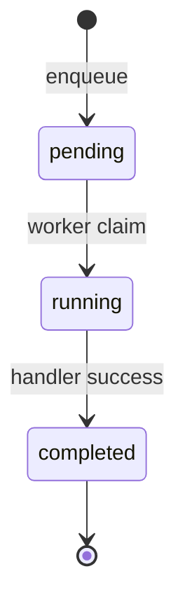
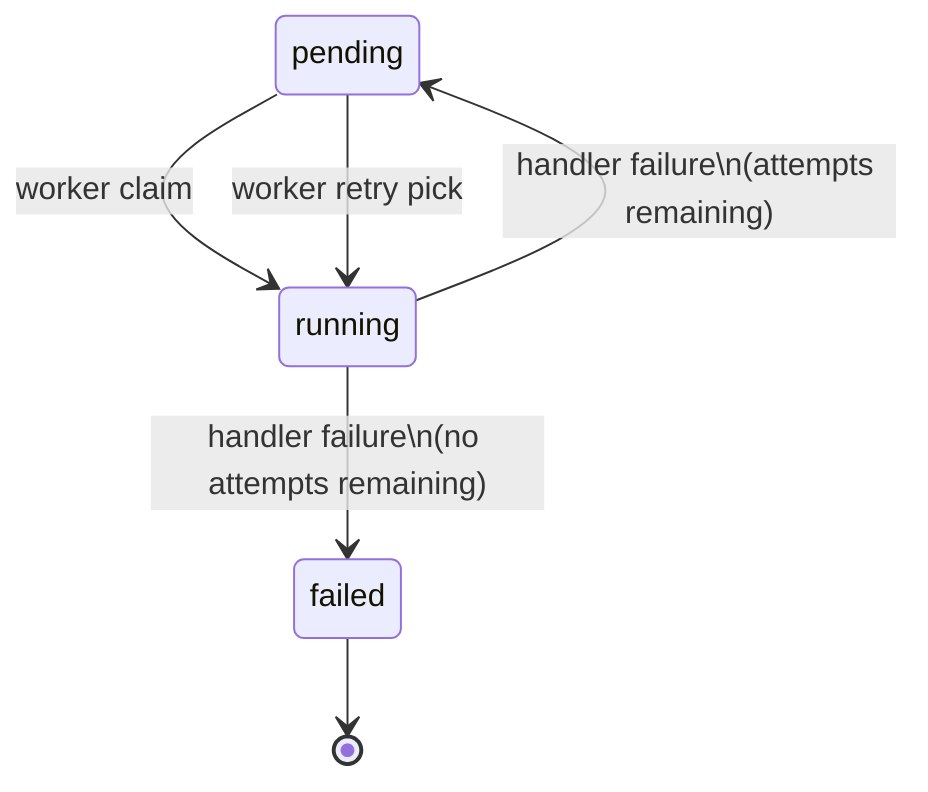
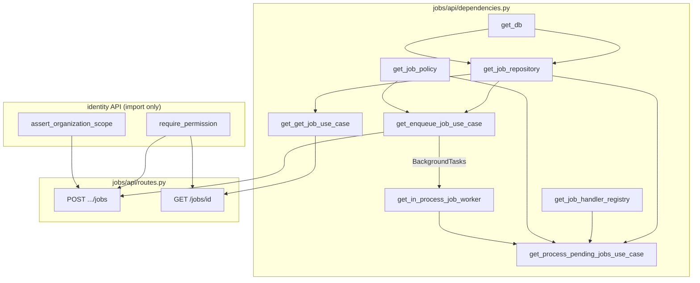

> **Historical design draft.** Not normative. As-built contract: [PRODUCT_INTEGRATION_GUIDE.md](../../../projects/kyrox-core/integrations/PRODUCT_INTEGRATION_GUIDE.md). Core status: [PROJECT_STATUS.md](../../../projects/kyrox-core/PROJECT_STATUS.md).

# Sprint 0.4.3 — Phase 1: Background Jobs Platform Design

**Status:** Implemented — v0.4.0 (Sprint 0.4.3)  
**Sprint:** 0.4.3 (Platform Services — Background Jobs full stack)  
**Target:** Organization-scoped job enqueue, status polling, in-process worker stub with retry  
**Prerequisite:** v0.3.0 Identity Platform — **completed**; Sprint 0.4.1 Audit Query — **completed**; Sprint 0.4.2 Settings — **completed**

**Related documents:**

- [Platform Services Design](PLATFORM_SERVICES_DESIGN.md) — Epic C backlog
- [Settings Platform Design](SETTINGS_PLATFORM_DESIGN.md) — Phase 1/2 template
- [Audit Query Platform Design](AUDIT_QUERY_PLATFORM_DESIGN.md)
- [Backend Architecture Standards](../../standards/backend/BACKEND_ARCHITECTURE_STANDARDS.md)
- [Identity Platform Design](IDENTITY_PLATFORM_DESIGN.md) — org context, RBAC
- [Roadmap](ROADMAP.md)

---

## 1. Scope & Constraints

### 1.1 In scope (Phase 2 implementation)

| Area | Deliverable |
|------|-------------|
| **Domain** | `Job` entity, `JobStatus`, `JobType`, `FailureReason`, repository + handler ports |
| **Application** | Enqueue, get job status, process pending (worker orchestration); retry policy |
| **Infrastructure** | `platform_jobs` table, SQLAlchemy repository, in-process worker runner |
| **Worker stub** | `JobHandler` registry + `core.platform.echo` stub handler |
| **Migration** | Alembic `20260701_0021` (table) + `20260701_0022` (permission seed) |
| **API — enqueue** | `POST /organizations/{id}/jobs` |
| **API — status** | `GET /jobs/{job_id}` with org scope check |
| **Authorization** | `jobs.platform.enqueue`, `jobs.platform.read` |
| **DI** | Composition root in `jobs/api/dependencies.py`; worker wired at app bootstrap |
| **Tests** | Domain lifecycle, retry, idempotency, API, architecture, import-boundary |

### 1.2 Explicitly out of scope

| Item | Reason |
|------|--------|
| **Identity module changes (Phase 1)** | No edits in design phase; Phase 2 allows **additive** `jobs` module in permission enum only |
| **Audit / Settings / other module changes** | Greenfield `modules/jobs/` only |
| **External worker process** | Celery, Redis queue, separate worker deployment — future |
| **Job cancellation API** | Epic C2 mentions cancel — deferred to 0.4.x+ |
| **Job listing / admin dashboard** | Poll by id only in v1 |
| **Scheduled / delayed jobs** | No `run_at`; immediate enqueue only |
| **Priority queues** | FIFO by `created_at` |
| **Product handler registration in Core repo** | Products register handlers in their repos; Core ships stub only |
| **Webhook on job completion** | Future |
| **Audit events for job lifecycle** | Future enhancement |

### 1.3 Design principles

1. **Opaque payload:** Core validates `job_type` format and JSON payload serializability — not business semantics.
2. **Org isolation:** Org-scoped jobs always carry `organization_id`; status reads enforce tenant match.
3. **At-least-once execution (in-process):** Worker may retry; handlers should be idempotent where possible.
4. **Explicit failure reason:** Terminal failures store human-readable `failure_reason` (+ optional structured detail in `result` / metadata).
5. **Thin API:** HTTP maps to commands; lifecycle rules in domain + application policy; SQL in infrastructure.
6. **Identity reuse without modification (Phase 1):** Import `require_permission`, `assert_organization_scope` — no identity package edits in Phase 1.
7. **Stub proves contract:** In-process worker + echo handler validates enqueue → run → complete/fail loop before external workers.

---

## 2. Current State (post 0.4.2)

### 2.1 Jobs module

**Does not exist.** No `backend/app/modules/jobs/`, no `platform_jobs` table, no job permissions seeded.

### 2.2 Related platform state

| Component | State |
|-----------|-------|
| Identity RBAC | `require_permission`, `AuthorizationService`, org-scoped roles |
| Permission module enum | `audit`, `core`, `identity`, `settings` — **`jobs` not yet allowed** |
| Settings pattern | Org routes + scope assert; permission codes use 3 segments (`settings.platform.read`) |
| Alembic head | `20260701_0020` (`settings.platform.*` seed) |
| App bootstrap | `create_app()` — no lifespan worker hook yet |
| Router pattern | Module routers in `app/api/v1/router.py` |

### 2.3 Platform Services draft (Epic C)

From [PLATFORM_SERVICES_DESIGN.md §4.4](PLATFORM_SERVICES_DESIGN.md):

- Table `platform_jobs` with status lifecycle, idempotency key, result/error fields
- `POST /organizations/{id}/jobs`, `GET /jobs/{job_id}`
- In-process stub handler; external worker out of band for v0.4.0

This document refines Epic C with **retry policy**, **failure reason model**, **repository/DI/test** detail, and permission naming aligned with identity validators.

---

## 3. Goals

| Goal | Success metric |
|------|----------------|
| Product enqueues org-scoped job with JSON payload | `201` + job id + `pending` status |
| Client polls job until terminal state | `200` with `completed` or `failed` |
| Duplicate enqueue with same idempotency key | `200`/`201` returns existing job (no duplicate row) |
| Handler failure retries up to policy limit | `attempt_count` increments; returns to `pending` then terminal `failed` |
| Terminal failure includes reason | `failure_reason` populated on `failed` |
| Cross-org job read denied | `403` or `404` (design choice: **404** to avoid id leakage) |
| Stub handler runs in-process | Echo job completes with payload echoed in `result` |
| Layer boundaries enforced | Architecture + import-boundary tests pass |

---

## 4. Target Folder Structure (Phase 2)

```text
backend/app/modules/jobs/
├── domain/
│   ├── entities.py                    # Job dataclass
│   ├── ports.py                         # JobRepository, JobHandler, JobHandlerRegistry
│   ├── value_objects/
│   │   ├── job_status.py                # JobStatus enum + transition helpers
│   │   ├── job_type.py                  # JobType value object
│   │   └── failure_reason.py            # FailureReason value object
│   └── exceptions.py                    # JobError hierarchy
│
├── application/
│   ├── commands.py                      # EnqueueJobCommand, GetJobCommand, ProcessPendingJobsCommand
│   ├── results.py                       # JobResult, EnqueueJobResult
│   ├── policy.py                        # JobPolicy — type, payload, retry limits
│   ├── enqueue_job.py                   # EnqueueJobUseCase
│   ├── get_job.py                       # GetJobUseCase
│   ├── process_pending_jobs.py          # ProcessPendingJobsUseCase (worker orchestration)
│   └── worker/
│       ├── job_runner.py                # Invokes handler, applies retry policy
│       └── stub_handlers.py             # core.platform.echo stub
│
├── infrastructure/
│   ├── repositories.py                  # SqlAlchemyJobRepository
│   ├── worker/
│   │   └── in_process_worker.py         # BackgroundTasks / lifespan integration
│   └── persistence/
│       ├── models.py                    # PlatformJobModel
│       └── mappers.py
│
└── api/
    ├── __init__.py
    ├── dependencies.py                  # Composition root
    ├── routes.py
    ├── schemas.py
    ├── mappers.py
    └── error_mapping.py

backend/app/api/v1/router.py             # include jobs router (single registration line)

backend/app/main.py                      # lifespan hook to register worker + stub handlers (Phase 2)

backend/alembic/versions/
    20260701_0021_platform_jobs.py
    20260701_0022_jobs_permissions.py

backend/tests/modules/jobs/
    test_domain.py
    test_job_status_lifecycle.py
    test_job_policy.py
    test_enqueue_job_use_case.py
    test_get_job_use_case.py
    test_process_pending_jobs_use_case.py
    test_job_runner_retry.py
    test_repository_integration.py
    test_jobs_api_architecture.py
    test_jobs_api_import_boundary.py
    test_jobs_api_routes.py
    test_stub_handler_integration.py
```

**Note:** All new code under `modules/jobs/`. Phase 2 also requires **one additive line** in identity `PermissionModule` enum (`jobs`) — documented in §16; no other identity/audit/settings edits.

---

## 5. Domain Design — Job Model

### 5.1 Entity — `Job`

| Field | Type | Notes |
|-------|------|-------|
| `id` | `UUID` | Surrogate PK; returned to client for polling |
| `organization_id` | `UUID` | **Required** in v1 — all API jobs are org-scoped |
| `job_type` | `JobType` | Registered handler name (namespaced string) |
| `payload` | `JsonPayload` | Opaque JSON object (not null) |
| `status` | `JobStatus` | Lifecycle state |
| `idempotency_key` | `str \| None` | Optional client-supplied dedup key |
| `attempt_count` | `int` | Number of execution attempts started (≥ 0) |
| `max_attempts` | `int` | Max attempts allowed (set at enqueue from policy) |
| `result` | `JsonValue \| None` | Handler success output |
| `failure_reason` | `FailureReason \| None` | Last failure message (set on failed attempt; cleared on success) |
| `created_at` | `datetime` | Enqueue time (UTC) |
| `started_at` | `datetime \| None` | Last run start |
| `finished_at` | `datetime \| None` | Terminal timestamp (`completed` or terminal `failed`) |

**Invariants:**

- `organization_id` is never null for v1 jobs
- `payload` is a JSON object (`dict`), not array/scalar at top level
- `attempt_count <= max_attempts` always
- `status == COMPLETED` ⇒ `result is not None`, `finished_at is not None`, `failure_reason is None`
- `status == FAILED` (terminal) ⇒ `failure_reason is not None`, `finished_at is not None`
- `status in (PENDING, RUNNING)` ⇒ `finished_at is None`
- Terminal states: `COMPLETED`, `FAILED` — no outbound transitions

### 5.2 Value object — `JobStatus`

| Member | DB value | Description |
|--------|----------|-------------|
| `PENDING` | `pending` | Queued; eligible for worker pickup (includes retry queue) |
| `RUNNING` | `running` | Worker claimed; handler executing |
| `COMPLETED` | `completed` | Success; terminal |
| `FAILED` | `failed` | Exhausted retries or non-retryable error; terminal |

**Allowed transitions:**

```text
PENDING   → RUNNING
RUNNING   → COMPLETED
RUNNING   → PENDING   (retry — attempts remaining)
RUNNING   → FAILED    (terminal — no attempts remaining)
```

**Forbidden:** Any transition from terminal states; `COMPLETED → *`, `FAILED → *`.

Domain helper: `JobStatus.can_transition_to(next: JobStatus) -> bool`.

### 5.3 Value object — `JobType`

**Format:** Same namespace rules as settings keys / permission codes — minimum **three** lowercase segments:

```text
^[a-z][a-z0-9_]*(\.[a-z][a-z0-9_]*){2,}$
```

**Examples:**

- `core.platform.echo` — Core stub handler (shipped in Phase 2)
- `fair_crm.export.run` — product handler (registered in product repo, not Core)

**Max length:** 255 characters.

### 5.4 Value object — `FailureReason`

| Field | Type | Notes |
|-------|------|-------|
| `message` | `str` | Human-readable, non-empty, max **2048** chars |
| `code` | `str \| None` | Optional machine code, e.g. `handler_error`, `timeout` — max 64 chars |

Stored in DB as:

- `failure_reason` TEXT — message
- `failure_code` VARCHAR(64) NULL — optional (additive column in migration)

**Visibility:**

- Exposed in GET job response when status is `failed`, or while `pending`/`running` after a failed attempt (last error visible during retry cycle)
- Cleared when job reaches `completed`

### 5.5 Type aliases

```python
# Illustrative
JsonPayload = dict[str, Any]   # enqueue body — must be object
JsonValue = dict[str, Any] | list[Any] | str | int | float | bool | None  # handler result
```

### 5.6 Domain exceptions

| Exception | When |
|-----------|------|
| `JobError` | Base |
| `JobNotFoundError(JobError)` | Job id not found |
| `JobAccessDeniedError(JobError)` | Org mismatch on read (optional — may map to 404 in API) |
| `InvalidJobTypeError(JobError)` | Bad job_type format |
| `InvalidJobPayloadError(JobError)` | Non-object JSON, too large, non-serializable |
| `InvalidJobTransitionError(JobError)` | Illegal status change |
| `DuplicateIdempotencyConflictError(JobError)` | Same key, different payload (optional strict mode) |
| `JobHandlerNotFoundError(JobError)` | No handler registered for job_type |
| `JobAlreadyTerminalError(JobError)` | Worker tries to run completed/failed job |

---

## 6. Job Status Lifecycle

### 6.1 Happy path



### 6.2 Retry path



### 6.3 Attempt counting semantics

| Event | `attempt_count` change |
|-------|------------------------|
| Worker claims job (`pending → running`) | `+1` |
| Handler succeeds | unchanged |
| Handler fails, retry scheduled | unchanged (already incremented on claim) |
| Handler fails, terminal | unchanged |

**Example:** `max_attempts=3`

| Attempt | Status flow | Outcome |
|---------|-------------|---------|
| 1 | pending → running → pending | fail, `attempt_count=1` |
| 2 | pending → running → pending | fail, `attempt_count=2` |
| 3 | pending → running → failed | fail, `attempt_count=3`, terminal |

### 6.4 Timestamps

| Field | Set when |
|-------|----------|
| `created_at` | Insert on enqueue |
| `started_at` | Each transition to `running` (overwrite) |
| `finished_at` | First transition to terminal `completed` or `failed` |

---

## 7. Retry Policy

### 7.1 Policy — `JobPolicy`

| Rule | Default | Notes |
|------|---------|-------|
| `DEFAULT_MAX_ATTEMPTS` | `3` | Applied at enqueue unless overridden |
| `MAX_MAX_ATTEMPTS` | `10` | Enqueue rejects higher values |
| `MIN_MAX_ATTEMPTS` | `1` | Single attempt, no retry |
| Payload max size | **65536 bytes** (UTF-8 JSON) | Same as settings |
| Payload shape | Top-level JSON **object** required | Arrays/scalars rejected |
| `job_type` validation | §5.3 regex | |
| Idempotency key max length | **128** chars | Alphanumeric + `_-` |
| Retry backoff | **None in v1** | Immediate re-eligible as `pending`; worker picks on next sweep |

### 7.2 Enqueue override

Request body may include optional `max_attempts` (integer). Policy clamps to `[1, 10]`.

### 7.3 Non-retryable errors (future hook)

`JobHandlerResult.retryable: bool` — default `True`. Handler may return `retryable=False` to transition directly to terminal `failed` regardless of attempts remaining.

Stub handler always returns `retryable=True` on failure.

### 7.4 Worker pick ordering

`pending` jobs ordered by `created_at ASC`, limit `N` per sweep (`DEFAULT_BATCH_SIZE = 10`).

---

## 8. Repository Design

### 8.1 Port — `JobRepository`

```python
# Illustrative — not implementation code
class JobRepository(Protocol):
    def get_by_id(self, job_id: UUID) -> Job | None: ...

    def find_by_idempotency(
        self,
        organization_id: UUID,
        job_type: JobType,
        idempotency_key: str,
    ) -> Job | None: ...

    def save(self, job: Job) -> Job: ...

    def list_pending(
        self,
        *,
        limit: int,
    ) -> list[Job]: ...

    def claim_pending(self, job_id: UUID) -> Job | None: ...
```

### 8.2 Method semantics

#### `get_by_id`

- Returns job regardless of org (application layer enforces access)

#### `find_by_idempotency`

- Filter: `organization_id`, `job_type`, `idempotency_key` exact match
- Used before insert on enqueue

#### `save`

- Insert or update full job row
- Used after enqueue and after worker state transitions

#### `list_pending`

- `status = pending`
- Order `created_at ASC`
- Limit for batch processing

#### `claim_pending`

- **Optimistic claim:** single SQL update

```sql
UPDATE platform_jobs
SET status = 'running',
    started_at = CURRENT_TIMESTAMP,
    attempt_count = attempt_count + 1,
    updated_at = CURRENT_TIMESTAMP
WHERE id = :job_id
  AND status = 'pending'
RETURNING ...;
```

- Returns `None` if job not pending (lost race — another worker claimed)
- SQLite: emulate with SELECT + conditional UPDATE in transaction

### 8.3 Idempotency

**Unique partial index** (when key present):

```sql
CREATE UNIQUE INDEX uq_platform_jobs_org_type_idempotency
  ON platform_jobs (organization_id, job_type, idempotency_key)
  WHERE idempotency_key IS NOT NULL;
```

**Enqueue behavior:**

| Case | Action |
|------|--------|
| No idempotency key | Always create new job |
| Key exists, same payload (canonical JSON) | Return existing job (`200`) |
| Key exists, different payload | `409 Conflict` (`DuplicateIdempotencyConflictError`) |

---

## 9. Worker & Handler Ports

### 9.1 Port — `JobHandler`

```python
# Illustrative
@dataclass(frozen=True)
class JobHandlerResult:
    result: JsonValue | None = None
    retryable: bool = True

class JobHandler(Protocol):
    def handle(self, job: Job) -> JobHandlerResult: ...
```

### 9.2 Port — `JobHandlerRegistry`

```python
class JobHandlerRegistry(Protocol):
    def register(self, job_type: JobType, handler: JobHandler) -> None: ...
    def get(self, job_type: JobType) -> JobHandler | None: ...
```

### 9.3 In-process worker stub

**`InProcessJobWorker`** (infrastructure):

- Depends on `ProcessPendingJobsUseCase`
- Invoked by:
  1. **FastAPI `BackgroundTasks`** after successful enqueue (async to response)
  2. **Optional lifespan startup sweep** — process orphaned `pending` jobs on app start

**Stub handler — `core.platform.echo`:**

- Registered in app bootstrap (Phase 2 `main.py` or jobs module factory)
- Returns `{ "echo": job.payload }` as result
- Used in tests and integration guide as reference implementation

### 9.4 `ProcessPendingJobsUseCase`

**Dependencies:** `JobRepository`, `JobHandlerRegistry`, `JobPolicy`

**Algorithm:**

```text
1. pending_jobs = repository.list_pending(limit=batch_size)
2. For each job:
   a. claimed = repository.claim_pending(job.id)
   b. If not claimed: continue
   c. handler = registry.get(job.job_type)
   d. If handler missing: mark failed (failure_reason=handler not found, non-retryable)
   e. Try handler.handle(claimed)
   f. On success: status=completed, result=..., failure_reason=None, finished_at=now
   g. On failure:
      - If not retryable OR attempt_count >= max_attempts: status=failed, failure_reason=..., finished_at=now
      - Else: status=pending, failure_reason=... (last error visible)
   h. repository.save(job)
```

**Concurrency (v1):** Single-process; in-process worker sufficient. Document that multi-worker deployment requires stronger claim logic (future).

---

## 10. Application Layer

### 10.1 Use cases

| Use case | Responsibility |
|----------|----------------|
| `EnqueueJobUseCase` | Validate type/payload; idempotency check; persist `pending` job; trigger worker |
| `GetJobUseCase` | Load by id; verify org access; return result |
| `ProcessPendingJobsUseCase` | Worker orchestration (§9.4) |

### 10.2 Commands

#### `EnqueueJobCommand`

| Field | Type |
|-------|------|
| `organization_id` | `UUID` |
| `job_type` | `str` |
| `payload` | `dict[str, Any]` |
| `idempotency_key` | `str \| None` |
| `max_attempts` | `int \| None` |

#### `GetJobCommand`

| Field | Type |
|-------|------|
| `job_id` | `UUID` |
| `organization_id` | `UUID` | From auth context — access check |

### 10.3 Results

#### `JobResult`

| Field | Type |
|-------|------|
| `id` | `UUID` |
| `organization_id` | `UUID` |
| `job_type` | `str` |
| `status` | `str` |
| `payload` | `dict` |
| `idempotency_key` | `str \| None` |
| `attempt_count` | `int` |
| `max_attempts` | `int` |
| `result` | `Any \| None` |
| `failure_reason` | `str \| None` |
| `failure_code` | `str \| None` |
| `created_at` | `datetime` |
| `started_at` | `datetime \| None` |
| `finished_at` | `datetime \| None` |

#### `EnqueueJobResult`

| Field | Type |
|-------|------|
| `job` | `JobResult` |
| `created` | `bool` | `True` if new row; `False` if idempotent hit |

---

## 11. API Design

### 11.1 Enqueue — `POST /organizations/{organization_id}/jobs`

| Aspect | Value |
|--------|-------|
| Permission | `jobs.platform.enqueue` |
| Auth | Bearer + `X-Organization-Id` |
| Guards | `require_permission` + `assert_organization_scope` |

**Request body:**

| Field | Type | Required |
|-------|------|----------|
| `job_type` | string | Yes |
| `payload` | object | Yes |
| `idempotency_key` | string | No |
| `max_attempts` | integer | No |

**Responses:**

| Status | Condition |
|--------|-----------|
| `201` | New job created |
| `200` | Idempotent return of existing job |
| `400` | Invalid type, payload, max_attempts |
| `403` | Permission denied |
| `409` | Idempotency key reuse with different payload |
| `422` | Pydantic validation |

**Side effect:** Schedule `InProcessJobWorker.process_batch` via `BackgroundTasks`.

### 11.2 Job status — `GET /jobs/{job_id}`

| Aspect | Value |
|--------|-------|
| Permission | `jobs.platform.read` |
| Auth | Bearer + `X-Organization-Id` |

**Access rule:**

- Load job by id
- If not found → **404**
- If `job.organization_id != context.organization_id` → **404** (not 403 — avoid cross-tenant id enumeration)

**Responses:**

| Status | Condition |
|--------|-----------|
| `200` | Job found in org scope |
| `404` | Not found or wrong org |

### 11.3 Router placement

```text
backend/app/modules/jobs/api/routes.py
  router = APIRouter(tags=["jobs"])

backend/app/api/v1/router.py
  api_v1_router.include_router(jobs_router)
```

**Full paths:**

```text
POST /api/v1/organizations/{organization_id}/jobs
GET  /api/v1/jobs/{job_id}
```

---

## 12. API Schemas (Pydantic)

### 12.1 `EnqueueJobRequest`

| Field | Type | Default |
|-------|------|---------|
| `job_type` | str | required |
| `payload` | dict | required |
| `idempotency_key` | str \| null | null |
| `max_attempts` | int \| null | null |

### 12.2 `EnqueueJobResponse`

| Field | Type |
|-------|------|
| `job` | `JobResponse` |
| `created` | bool |

### 12.3 `JobResponse`

Mirrors `JobResult` fields for OpenAPI.

### 12.4 `ErrorResponse`

Same shape as audit/settings: `{ "detail": str }`.

---

## 13. Dependency Injection Strategy

### 13.1 Composition root — `jobs/api/dependencies.py`

| Factory | Returns | Dependencies |
|---------|---------|--------------|
| `get_job_repository` | `JobRepository` | `get_db` |
| `get_job_policy` | `JobPolicy` | none |
| `get_job_handler_registry` | `JobHandlerRegistry` | app-singleton (see below) |
| `get_enqueue_job_use_case` | `EnqueueJobUseCase` | repo, policy, worker trigger |
| `get_get_job_use_case` | `GetJobUseCase` | repo |
| `get_process_pending_jobs_use_case` | `ProcessPendingJobsUseCase` | repo, registry, policy |
| `get_in_process_job_worker` | `InProcessJobWorker` | process use case |

### 13.2 Handler registry singleton

**Pattern:** Module-level registry instance populated at app startup:

```text
main.py (Phase 2 minimal change):
  registry = build_job_handler_registry()
  registry.register(JobType.create("core.platform.echo"), EchoJobHandler())
  app.state.job_handler_registry = registry
```

`dependencies.py` reads `request.app.state.job_handler_registry` — no identity coupling.

### 13.3 Wiring diagram



### 13.4 Transaction scope

- **Enqueue:** commit job row before scheduling worker (worker runs after commit via BackgroundTasks)
- **Worker:** each job processed in save-per-transition pattern; failed claim skips quietly

---

## 14. Error Mapping

| Domain exception | HTTP | Notes |
|------------------|------|-------|
| `JobNotFoundError` | 404 | Includes org mismatch masking |
| `InvalidJobTypeError` | 400 | |
| `InvalidJobPayloadError` | 400 | |
| `DuplicateIdempotencyConflictError` | 409 | |
| `InvalidJobTransitionError` | 500 | Should not leak to API in normal flow |
| `JobHandlerNotFoundError` | 500 | Worker internal; job row marked failed |
| `PermissionDeniedError` | 403 | Identity guard |

---

## 15. Permission Model

### 15.1 Permission codes

Identity `PermissionCode` requires **three segments** (`module.resource.action`):

| Code | Description | Endpoint |
|------|-------------|----------|
| `jobs.platform.enqueue` | Enqueue org-scoped background job | `POST .../jobs` |
| `jobs.platform.read` | Read job status | `GET /jobs/{id}` |

**Module:** `jobs`  
**Group code (seed):** `jobs.platform`  
**Group name:** Platform Jobs

### 15.2 Phase 2 prerequisite — permission module enum

`PermissionModule` currently allows: `audit`, `core`, `identity`, `settings`.

Phase 2 must **add** `"jobs"` to `_ALLOWED_MODULES` in identity (single-line additive change). No other identity edits required.

### 15.3 Authorization flow

**Enqueue:**

```text
1. Bearer JWT → claims
2. X-Organization-Id → AuthorizationContext
3. require_permission("jobs.platform.enqueue")
4. assert_organization_scope(path_organization_id, context)
5. EnqueueJobUseCase.execute(...)
```

**Get status:**

```text
1–3. require_permission("jobs.platform.read")
4. GetJobUseCase.execute(job_id, context.organization_id)
```

### 15.4 Super admin

No system-scoped job API in v1. Super-admin bypass does **not** apply to `jobs.platform.*`.

---

## 16. Migration Plan

### 16.1 Migration `20260701_0021_platform_jobs`

**Revises:** `20260701_0020`

**Table:** `platform_jobs`

| Column | Type | Nullable | Notes |
|--------|------|----------|-------|
| `id` | UUID | NO | PK |
| `organization_id` | UUID | NO | Tenant scope |
| `job_type` | VARCHAR(255) | NO | Handler name |
| `payload` | JSONB | NO | Enqueue payload object |
| `status` | VARCHAR(32) | NO | `pending`, `running`, `completed`, `failed` |
| `idempotency_key` | VARCHAR(128) | YES | |
| `attempt_count` | INTEGER | NO | Default `0` |
| `max_attempts` | INTEGER | NO | Default `3` |
| `result` | JSONB | YES | Handler output |
| `failure_reason` | TEXT | YES | Last failure message |
| `failure_code` | VARCHAR(64) | YES | Optional machine code |
| `created_at` | TIMESTAMPTZ | NO | `server_default now()` |
| `started_at` | TIMESTAMPTZ | YES | |
| `finished_at` | TIMESTAMPTZ | YES | |
| `updated_at` | TIMESTAMPTZ | NO | `server_default now()` |

**Check constraints:**

```sql
status IN ('pending', 'running', 'completed', 'failed')
attempt_count >= 0
max_attempts >= 1
attempt_count <= max_attempts
```

**Indexes:**

| Index | Columns | Purpose |
|-------|---------|---------|
| `ix_platform_jobs_organization_id` | `(organization_id)` | Org filtering |
| `ix_platform_jobs_status_created` | `(status, created_at)` | Pending job sweep |
| `uq_platform_jobs_org_type_idempotency` | `(organization_id, job_type, idempotency_key)` | Partial unique WHERE `idempotency_key IS NOT NULL` |

**Foreign keys:** None to `identity_organizations` (decoupling — same as settings/audit).

**Downgrade:** Drop indexes and table.

### 16.2 Migration `20260701_0022_jobs_permissions`

**Revises:** `20260701_0021`

Idempotent seed:

| Artifact | Value |
|----------|-------|
| Group | `jobs.platform` / module `jobs` |
| Permissions | `jobs.platform.enqueue`, `jobs.platform.read` |

Pattern mirrors `20260701_0020_settings_permissions.py`.

### 16.3 Migration test plan (Phase 3)

| Test | Description |
|------|-------------|
| Upgrade head | Table + indexes exist |
| Downgrade | Clean removal |
| Check constraints | Invalid status rejected (PostgreSQL integration) |
| Partial unique idempotency | Duplicate key rejected |

---

## 17. Scope Isolation Matrix

| Scenario | Expected |
|----------|----------|
| Enqueue in org A context | Job row has `organization_id = A` |
| GET job in org A for job in A | 200 |
| GET job in org A for job in B | 404 |
| Path org B, header org A on enqueue | 400 scope mismatch |
| Idempotency scoped per org | Same key in A and B creates two jobs |
| Pending sweep | Processes jobs across orgs (worker internal — no API leak) |

---

## 18. Product Integration Notes

### 18.1 Enqueue + poll flow

```text
1. POST /organizations/{org_id}/jobs
   Body: {
     "job_type": "fair_crm.export.run",
     "payload": { "format": "csv" },
     "idempotency_key": "export-2026-07-01"
   }
   → 201 { "job": { "id": "...", "status": "pending" }, "created": true }

2. GET /jobs/{id}  (poll)
   → 200 { "status": "running", ... }
   → 200 { "status": "completed", "result": { ... } }

3. On failure after retries
   → 200 { "status": "failed", "failure_reason": "...", "failure_code": "handler_error" }
```

### 18.2 Handler registration (product repos)

Products implement `JobHandler` and register types in **their** deployment bootstrap — not in Core repository. Core documents the port contract and ships `core.platform.echo` stub only.

### 18.3 Idempotency guidance

Use stable keys per logical operation (`export-{date}`, `sync-{entity_id}`) to survive client retries.

---

## 19. Test Strategy

### 19.1 Domain & lifecycle

| Test file | Coverage |
|-----------|----------|
| `test_domain.py` | `JobType` validation |
| `test_job_status_lifecycle.py` | All allowed/forbidden transitions |

### 19.2 Policy

| Test file | Coverage |
|-----------|----------|
| `test_job_policy.py` | Payload size/shape, max_attempts bounds, idempotency key format |

### 19.3 Application

| Test file | Coverage |
|-----------|----------|
| `test_enqueue_job_use_case.py` | Create, idempotent return, conflict |
| `test_get_job_use_case.py` | Found, not found, org denial |
| `test_process_pending_jobs_use_case.py` | Success, retry, terminal fail |
| `test_job_runner_retry.py` | Attempt counting edge cases |

### 19.4 Infrastructure

| Test file | Coverage |
|-----------|----------|
| `test_repository_integration.py` | claim_pending race, idempotency index, pending order |
| `test_stub_handler_integration.py` | Echo handler end-to-end through use case |

### 19.5 API

| Test file | Coverage |
|-----------|----------|
| `test_jobs_api_routes.py` | Enqueue 201, idempotent 200, GET 200/404, scope mismatch 400, permission 403 |
| `test_jobs_api_architecture.py` | Thin API modules |
| `test_jobs_api_import_boundary.py` | No infra imports in routes/schemas/mappers |

### 19.6 Mandatory scenarios

1. **Enqueue → worker → completed** (echo handler, BackgroundTasks in test client)
2. **Retry exhaustion** — mock handler fails N times → terminal `failed` + `failure_reason`
3. **Idempotency** — same key + payload → same job id
4. **Cross-org GET** → 404
5. **Invalid job_type** → 400

### 19.7 Phase 3 validation

| Check | Command |
|-------|---------|
| Jobs module tests | `python -m pytest backend/tests/modules/jobs` |
| Full suite | `python -m pytest backend/tests` |
| Quality gate | `python scripts/quality_check.py` |

---

## 20. Phase 2 Implementation File List

```text
# Domain
backend/app/modules/jobs/domain/entities.py
backend/app/modules/jobs/domain/ports.py
backend/app/modules/jobs/domain/value_objects/job_status.py
backend/app/modules/jobs/domain/value_objects/job_type.py
backend/app/modules/jobs/domain/value_objects/failure_reason.py
backend/app/modules/jobs/domain/exceptions.py

# Application
backend/app/modules/jobs/application/commands.py
backend/app/modules/jobs/application/results.py
backend/app/modules/jobs/application/policy.py
backend/app/modules/jobs/application/enqueue_job.py
backend/app/modules/jobs/application/get_job.py
backend/app/modules/jobs/application/process_pending_jobs.py
backend/app/modules/jobs/application/worker/job_runner.py
backend/app/modules/jobs/application/worker/stub_handlers.py

# Infrastructure
backend/app/modules/jobs/infrastructure/repositories.py
backend/app/modules/jobs/infrastructure/worker/in_process_worker.py
backend/app/modules/jobs/infrastructure/persistence/models.py
backend/app/modules/jobs/infrastructure/persistence/mappers.py

# API
backend/app/modules/jobs/api/...

# Bootstrap (minimal)
backend/app/api/v1/router.py                    # include jobs router
backend/app/main.py                             # registry + optional lifespan sweep

# Identity (additive only)
backend/app/modules/identity/domain/authorization/value_objects/rbac/permission_module.py
    → add "jobs" to _ALLOWED_MODULES

# Migrations
backend/alembic/versions/20260701_0021_platform_jobs.py
backend/alembic/versions/20260701_0022_jobs_permissions.py

# Tests
backend/tests/modules/jobs/...
```

**Frozen modules (no behavioral changes):**

- `backend/app/modules/audit/**`
- `backend/app/modules/settings/**`
- Identity packages except single-line `jobs` module enum addition

---

## 21. Phase 1 Exit Criteria

- [x] Job domain model and status lifecycle documented
- [x] Retry policy and failure reason model defined
- [x] Enqueue and job status query API specified
- [x] In-process worker stub and handler registry designed
- [x] Repository port and claim/idempotency semantics documented
- [x] Migration plan (`0021`, `0022`) with constraints and indexes
- [x] DI strategy and bootstrap wiring specified
- [x] Permission model (`jobs.platform.enqueue`, `jobs.platform.read`) defined
- [x] Test strategy with mandatory scenarios documented
- [x] No changes to existing modules required in Phase 1
- [ ] Design reviewed and approved before Phase 2 starts

---

## 22. Remaining Risks

| Risk | Mitigation |
|------|------------|
| `jobs` module not in permission enum | Document Phase 2 additive enum change |
| BackgroundTasks not run in all test contexts | Test client enable BackgroundTasks; direct use case tests for worker |
| Multi-instance claim races | v1 single-process; document future `FOR UPDATE SKIP LOCKED` |
| Handler exceptions vs return failure | JobRunner catches exceptions → `FailureReason` + retry policy |
| Idempotency payload comparison | Canonical JSON (`sort_keys=True`) before compare |
| Worker scope creep | Stub only in Core; products register handlers externally |
| Permission seed missing → 403 | Migration `0022` in Phase 2 |
| Large payload in poll response | Accept for v1; document size limits |

---

## Standart Rapor (Phase 1)

### 1. Created / Changed files

| File | Action |
|------|--------|
| `docs/BACKGROUND_JOBS_PLATFORM_DESIGN.md` | **Created** — this document |

No code changes. No existing modules modified.

### 2. Test Results

N/A — design-only phase.

### 3. Validation Results

N/A — design-only phase.

### 4. Remaining Risks

See [Section 22](#22-remaining-risks). Primary follow-up: approve design, then **Sprint 0.4.3 Phase 2** (implementation).

---

**Next step:** Review and approve this design, then proceed to **Sprint 0.4.3 Phase 2** (implementation).
