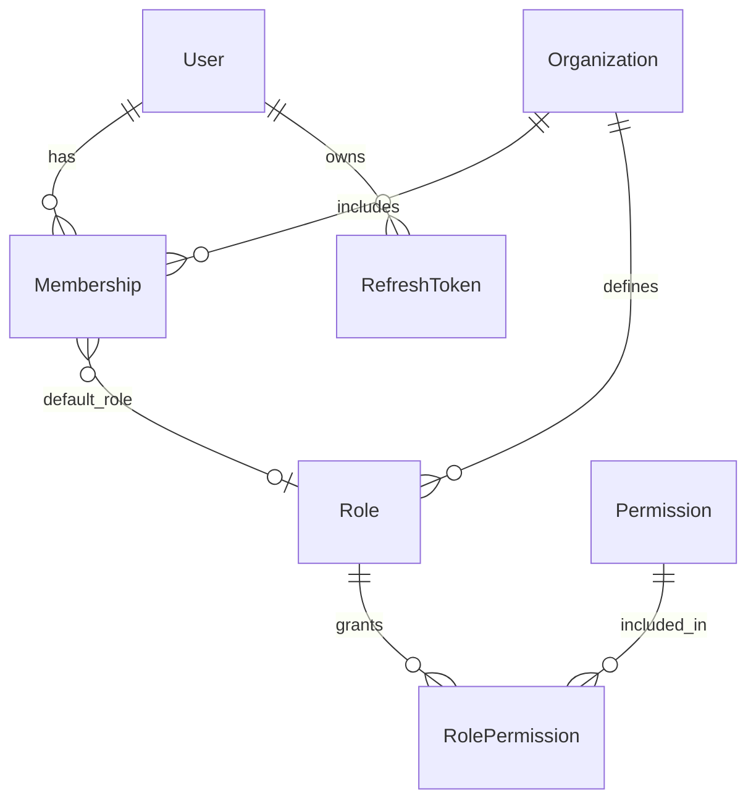

> **Historical design draft.** Not normative. As-built contract: [PRODUCT_INTEGRATION_GUIDE.md](../../../projects/kyrox-core/integrations/PRODUCT_INTEGRATION_GUIDE.md). Core status: [PROJECT_STATUS.md](../../../projects/kyrox-core/PROJECT_STATUS.md).

# Identity Platform Design

This document defines the KYROX Core **Identity Platform** bounded context: users, organizations, membership, roles, permissions, authentication, authorization, and sessions.

**Sprint:** 0.3 — Identity Platform Design (documentation only)

**Status:** Design for review. No implementation in this sprint.

**Related documents:**

- [Backend Architecture Standards](../../standards/backend/BACKEND_ARCHITECTURE_STANDARDS.md)
- [ADR 0001: Core / Product Separation](DECISIONS/0001-core-product-separation.md)
- [ADR 0002: Backend Layered Architecture](DECISIONS/0002-backend-layered-architecture.md)
- [ADR 0003: Organization as Tenant Concept](DECISIONS/0003-organization-as-tenant-concept.md)
- [Roadmap](ROADMAP.md)

---

## 1. Purpose of the Identity Platform

The Identity Platform is the **shared foundation for who can access KYROX products and what they can do** within an organization boundary.

It provides:

- **Identity** — user accounts and profile primitives
- **Organization scope** — the unit of membership, data isolation, and administration
- **Access control** — roles and permissions enforced consistently across products
- **Authentication** — proof of user identity (login, tokens, sessions)
- **Authorization** — permission checks for API and service operations

Products (FAIR CRM, Stock, WhatsApp, Warehouse, and future SaaS apps) **consume** Identity Platform APIs. They do not reimplement users, org membership, or platform RBAC.

Identity code will live under `backend/app/modules/identity/` following [Backend Architecture Standards](../../standards/backend/BACKEND_ARCHITECTURE_STANDARDS.md).

---

## 2. Why Organization Instead of Tenant

| Term | Role in KYROX Core |
|------|---------------------|
| **Organization** | Primary **domain entity**. The customer account, workspace, or company users belong to. Used in APIs, domain models, and admin UX contracts. |
| **Tenant** (infrastructure) | **Multi-tenancy mechanism**: row isolation, request context (`organization_id`), database scoping. May appear in middleware, logs, or infra config—not as the primary business noun. |

**Rationale:**

- "Organization" is meaningful across products: a CRM customer, a warehouse operator, and a messaging team all understand "organization."
- "Tenant" is technical jargon that leaks into APIs and confuses product teams and end-user documentation.
- Infrastructure still enforces **tenant isolation** by scoping every organization-bound resource to `organization_id`.

See [ADR 0003](DECISIONS/0003-organization-as-tenant-concept.md) for the accepted decision.

---

## 3. Core Entities and Responsibilities

| Entity | Responsibility |
|--------|----------------|
| **User** | Global person identity: email, credentials, status. May belong to many organizations via membership. |
| **Organization** | Isolated account boundary: name, slug, status, billing/plan hooks (future). Owns memberships and org-scoped roles. |
| **Membership** | Links a user to an organization with a membership status and optional default role assignment. |
| **Role** | Named collection of permissions within an organization (or system-wide for platform roles). |
| **Permission** | Atomic capability key (e.g. `identity.users.read`). System-defined catalog; not product CRM verbs. |
| **RolePermission** | Many-to-many: which permissions a role grants. |
| **Authentication** | Login, credential verification, token issuance (access + refresh). |
| **Authorization** | Permission evaluation for a user in an organization context. |
| **Session / RefreshToken** | Server-side or tracked refresh token lifecycle; ties to user and optional organization context. |

**Out of scope for Identity Platform:**

- Product entities (contacts, inventory SKUs, messages, warehouse locations)
- Product-specific permission names (`crm.deals.delete`) — products register extensions via documented integration, not hardcoded in Core domain

---

## 4. Entity Relationship Model

```text
User ─────────────┬──────────────── Membership ───────────── Organization
                  │         │
                  │         └── (optional) default Role
                  │
                  ├── Session / RefreshToken (user-scoped)
                  │
Organization ─────┼── Role ──── RolePermission ──── Permission
                  │
                  └── (all org data scoped by organization_id)

SuperAdmin (platform) ── User with system-level flag / system role (cross-organization)
```



**Cardinality rules:**

- A user may have zero or many memberships (zero before invite acceptance).
- An organization has one or many members; at least one owner required after onboarding (business rule).
- Roles are organization-scoped unless marked `is_system = true` (platform roles).
- Permissions are global catalog entries; assignment is via roles only.
- Refresh tokens belong to a user; access token claims carry `user_id` and active `organization_id` when applicable.

---

## 5. User Model Design

### 5.1 Attributes (domain)

| Field | Type | Notes |
|-------|------|-------|
| `id` | UUID | Primary key |
| `email` | string | Unique, normalized lowercase |
| `password_hash` | string | Nullable if SSO-only (future) |
| `display_name` | string | Optional |
| `status` | enum | `active`, `inactive`, `pending_verification` |
| `is_super_admin` | boolean | Platform operator; not organization-specific |
| `email_verified_at` | datetime | Nullable |
| `last_login_at` | datetime | Nullable |
| `created_at` | datetime | Audit |
| `updated_at` | datetime | Audit |

### 5.2 Rules

- Email uniqueness is **global** across the platform.
- A user exists independently of any organization until membership is created.
- Deactivating a user invalidates sessions; memberships may remain for audit but cannot authenticate.
- Super admin is a **platform** concern; authorization bypass is explicit and audited (see Section 12).

### 5.3 Not in Core User model

- Product preferences, CRM owner fields, warehouse employee codes
- Organization-specific job titles (belong on Membership or product layer)

---

## 6. Organization Model Design

### 6.1 Attributes (domain)

| Field | Type | Notes |
|-------|------|-------|
| `id` | UUID | Primary key; used as tenant isolation key in infrastructure |
| `name` | string | Display name |
| `slug` | string | Unique URL-safe identifier |
| `status` | enum | `active`, `suspended`, `archived` |
| `created_at` | datetime | Audit |
| `updated_at` | datetime | Audit |

### 6.2 Rules

- Slug uniqueness is global.
- Suspended organizations: members cannot obtain new tokens; existing sessions revoked.
- Organization is the **authorization boundary** for org-scoped permissions.
- Infrastructure maps `organization_id` to tenant context for all org-bound tables.

### 6.3 Lifecycle (high level)

1. Create organization (signup or platform admin)
2. Create owner membership + assign owner role
3. Invite additional users via membership
4. Suspend / archive when account ends

---

## 7. Membership Model Design

### 7.1 Attributes (domain)

| Field | Type | Notes |
|-------|------|-------|
| `id` | UUID | Primary key |
| `user_id` | UUID | FK → User |
| `organization_id` | UUID | FK → Organization |
| `status` | enum | `active`, `invited`, `suspended`, `removed` |
| `default_role_id` | UUID | Nullable FK → Role |
| `invited_at` | datetime | Nullable |
| `joined_at` | datetime | Nullable |
| `created_at` | datetime | Audit |
| `updated_at` | datetime | Audit |

### 7.2 Rules

- Unique constraint on `(user_id, organization_id)`.
- A user accesses organization resources only with `status = active` membership.
- Invited users complete acceptance flow before `joined_at` is set.
- Role assignments may extend beyond `default_role_id` via separate assignment table in implementation (Sprint 0.3.x); design allows multiple roles per membership.

### 7.3 Membership vs User

- **User** = who you are globally.
- **Membership** = your relationship to a specific organization.

---

## 8. Role / Permission Model Design

### 8.1 Permission (global catalog)

| Field | Type | Notes |
|-------|------|-------|
| `id` | UUID | Primary key |
| `key` | string | Unique, dot notation: `identity.users.read` |
| `description` | string | Human-readable |
| `module` | string | Grouping: `identity`, `audit`, `settings`, … |
| `is_system` | boolean | Core-defined; not deletable by org admins |

**Naming convention:** `{module}.{resource}.{action}`

Examples (Identity module only):

- `identity.organizations.read`
- `identity.organizations.update`
- `identity.memberships.invite`
- `identity.roles.assign`
- `identity.users.deactivate`

Products define **additional permission keys in their own repos** and register them at integration time; Core stores assignments, not CRM-specific catalog entries in Sprint 0.3 design.

### 8.2 Role (organization-scoped)

| Field | Type | Notes |
|-------|------|-------|
| `id` | UUID | Primary key |
| `organization_id` | UUID | Nullable for system roles |
| `name` | string | e.g. `Owner`, `Admin`, `Member` |
| `slug` | string | Unique per organization |
| `is_system` | boolean | Seeded defaults (Owner, Admin, Member) |
| `created_at` | datetime | Audit |
| `updated_at` | datetime | Audit |

### 8.3 RolePermission

| Field | Type | Notes |
|-------|------|-------|
| `role_id` | UUID | FK → Role |
| `permission_id` | UUID | FK → Permission |

Composite unique: `(role_id, permission_id)`.

### 8.4 Default system roles (seed)

| Role | Scope | Intent |
|------|-------|--------|
| **Owner** | Organization | Full org admin including billing hooks (future) |
| **Admin** | Organization | User/role management without destructive org actions |
| **Member** | Organization | Standard access; minimal identity permissions |

Exact permission mappings defined in implementation seed data (Sprint 0.3.x).

### 8.5 Organization-scoped permissions

- Permission **checks** always include `organization_id` from request context.
- Roles with `organization_id = NULL` and `is_system = true` are platform roles (super admin only).
- Org admins cannot grant permissions outside their organization's assigned roles.

---

## 9. Authentication Model

### 9.1 Strategy (design)

- **Primary:** Email + password login (bcrypt or argon2 password hashing)
- **Tokens:** Short-lived **access token** (JWT or opaque) + long-lived **refresh token**
- **Future:** SSO/OIDC as separate ADR; password nullable on user when SSO linked

### 9.2 Login flow

```text
1. Client POST /api/v1/auth/login { email, password, organization_slug? }
2. Core validates credentials
3. If organization_slug provided: verify active membership
4. Issue access_token + refresh_token
5. Access token claims: sub=user_id, org_id?, exp, iat, jti
6. Client sends Authorization: Bearer <access_token>
7. On expiry: POST /api/v1/auth/refresh { refresh_token }
```

### 9.3 Organization context at login

- User may belong to multiple organizations.
- Login may specify target organization (slug or id) or return organization list for selection (implementation detail in 0.3.x).
- Access token **must** include active `organization_id` for org-scoped API calls.

### 9.4 Security requirements

- Rate limit login and refresh endpoints
- Constant-time password comparison
- Refresh token rotation on use (see Section 11)
- Revoke all sessions on password change

---

## 10. Authorization Model

### 10.1 Evaluation order

1. Authenticate request → resolve `user_id`
2. Resolve **organization context** from token or header (`X-Organization-Id` only if matches token)
3. Verify active membership
4. Resolve user's roles in organization (via membership + role assignments)
5. Collect permissions from roles via RolePermission
6. If `user.is_super_admin`: allow platform operations; org operations still audited

### 10.2 Enforcement layers

| Layer | Responsibility |
|-------|----------------|
| **API middleware** | Authentication, organization context, coarse permission decorator |
| **Application use case** | Fine-grained permission check before mutation |
| **Product APIs** | Call Core authorization client or validate Core-issued token claims |

### 10.3 Permission check API (internal / product-facing draft)

```text
POST /api/v1/auth/check
{ "permission": "identity.users.read", "organization_id": "..." }
→ { "allowed": true }
```

Products use this or embedded claims depending on integration pattern (Sprint 0.3.x).

### 10.4 Fail closed

- Missing organization context → 403 for org-scoped resources
- Missing permission → 403
- Invalid or expired token → 401

---

## 11. Session / RefreshToken Model

### 11.1 RefreshToken (persisted)

| Field | Type | Notes |
|-------|------|-------|
| `id` | UUID | Primary key |
| `user_id` | UUID | FK → User |
| `token_hash` | string | Store hash only, never plaintext |
| `organization_id` | UUID | Nullable; org context at issuance |
| `expires_at` | datetime | Hard expiry |
| `revoked_at` | datetime | Nullable |
| `replaced_by_id` | UUID | Nullable; rotation chain |
| `user_agent` | string | Optional fingerprint |
| `ip_address` | string | Optional |
| `created_at` | datetime | Audit |

### 11.2 Session rules

- **Rotation:** each refresh invalidates previous token and issues new pair
- **Revocation:** logout, password change, admin suspend → revoke tokens
- **Access token:** stateless JWT recommended; short TTL (e.g. 15 minutes)
- **Refresh token:** stored server-side; longer TTL (e.g. 7–30 days)

### 11.3 Access token claims (JWT draft)

```json
{
  "sub": "<user_id>",
  "org_id": "<organization_id>",
  "email": "user@example.com",
  "permissions": ["identity.users.read"],
  "is_super_admin": false,
  "exp": 1710000000,
  "iat": 1710000000,
  "jti": "<unique-token-id>"
}
```

Permission list in token is optional optimization; authoritative check remains server-side for sensitive operations.

---

## 12. Super Admin Concept

**Super admin** is a platform operator with cross-organization capabilities.

| Aspect | Design |
|--------|--------|
| **Identification** | `User.is_super_admin = true` and/or system role `PlatformAdmin` |
| **Capabilities** | Create/suspend organizations, view platform metrics, support impersonation (future ADR) |
| **Restrictions** | Cannot silently bypass org permission checks without audit; destructive actions logged |
| **Assignment** | Manual seed / break-glass process; not self-service signup |

Super admin does **not** replace organization Owner; it operates above organizations for platform support.

---

## 13. Organization-Scoped Permissions

All routine authorization is **organization-scoped**:

- Permission keys are global strings; **enforcement** is always `(user, organization, permission)`.
- Data access in Core modules filters by `organization_id`.
- Cross-organization access is denied unless super admin with explicit platform permission.

**Request context (infrastructure):**

```text
RequestContext:
  user_id: UUID
  organization_id: UUID | None
  is_super_admin: bool
  permissions: set[str]  # cached for request
```

Middleware populates context after token validation.

---

## 14. Product-Independent Identity Rules

1. **Neutral vocabulary** — Organization, User, Membership, Role, Permission only in Core domain.
2. **No product entities** in identity schema or APIs.
3. **No product branching** — Core identity services do not inspect product type.
4. **Extensible permission namespace** — products use their own `{product}.*` keys; Core assigns via roles.
5. **Products never import Core identity internals** — HTTP/API contracts only.
6. **One user, many organizations** — same email across products with unified login (KYROX account model).
7. **FAIR CRM, Stock, WhatsApp, Warehouse** share the same identity primitives.

---

## 15. API Surface Draft

Base path: `/api/v1`. All endpoints below are **design drafts**; not implemented in Sprint 0.3.

### 15.1 Authentication

| Method | Path | Description |
|--------|------|-------------|
| POST | `/auth/login` | Email/password login; optional organization context |
| POST | `/auth/refresh` | Rotate refresh token |
| POST | `/auth/logout` | Revoke refresh token |
| GET | `/auth/me` | Current user profile + memberships summary |

### 15.2 Users (platform / org admin)

| Method | Path | Description |
|--------|------|-------------|
| GET | `/users/{user_id}` | Get user (permission: `identity.users.read`) |
| PATCH | `/users/{user_id}` | Update user (permission: `identity.users.update`) |
| POST | `/users/{user_id}/deactivate` | Deactivate user |

### 15.3 Organizations

| Method | Path | Description |
|--------|------|-------------|
| POST | `/organizations` | Create organization (signup or super admin) |
| GET | `/organizations/{organization_id}` | Get organization |
| PATCH | `/organizations/{organization_id}` | Update organization |
| POST | `/organizations/{organization_id}/suspend` | Suspend organization |

### 15.4 Memberships

| Method | Path | Description |
|--------|------|-------------|
| GET | `/organizations/{organization_id}/memberships` | List members |
| POST | `/organizations/{organization_id}/memberships/invite` | Invite user |
| PATCH | `/memberships/{membership_id}` | Update membership status / default role |
| DELETE | `/memberships/{membership_id}` | Remove member |

### 15.5 Roles & permissions

| Method | Path | Description |
|--------|------|-------------|
| GET | `/organizations/{organization_id}/roles` | List roles |
| POST | `/organizations/{organization_id}/roles` | Create custom role |
| PUT | `/organizations/{organization_id}/roles/{role_id}/permissions` | Set role permissions |
| GET | `/permissions` | List system permission catalog |

### 15.6 Authorization helper

| Method | Path | Description |
|--------|------|-------------|
| POST | `/auth/check` | Check permission for current user in organization |

**Note:** Existing `GET /api/v1/health` remains unchanged.

---

## 16. Database Table Draft

Schema prefix: `identity_` (or schema `identity` in PostgreSQL). All org-bound tables include `organization_id` where applicable.

### 16.1 Tables

**identity_users**

| Column | Type | Constraints |
|--------|------|-------------|
| id | UUID | PK |
| email | VARCHAR(320) | UNIQUE, NOT NULL |
| password_hash | VARCHAR | NULL |
| display_name | VARCHAR | NULL |
| status | VARCHAR | NOT NULL |
| is_super_admin | BOOLEAN | DEFAULT false |
| email_verified_at | TIMESTAMPTZ | NULL |
| last_login_at | TIMESTAMPTZ | NULL |
| created_at | TIMESTAMPTZ | NOT NULL |
| updated_at | TIMESTAMPTZ | NOT NULL |

**identity_organizations**

| Column | Type | Constraints |
|--------|------|-------------|
| id | UUID | PK |
| name | VARCHAR | NOT NULL |
| slug | VARCHAR | UNIQUE, NOT NULL |
| status | VARCHAR | NOT NULL |
| created_at | TIMESTAMPTZ | NOT NULL |
| updated_at | TIMESTAMPTZ | NOT NULL |

**identity_memberships**

| Column | Type | Constraints |
|--------|------|-------------|
| id | UUID | PK |
| user_id | UUID | FK → identity_users, NOT NULL |
| organization_id | UUID | FK → identity_organizations, NOT NULL |
| status | VARCHAR | NOT NULL |
| default_role_id | UUID | FK → identity_roles, NULL |
| invited_at | TIMESTAMPTZ | NULL |
| joined_at | TIMESTAMPTZ | NULL |
| created_at | TIMESTAMPTZ | NOT NULL |
| updated_at | TIMESTAMPTZ | NOT NULL |

UNIQUE (`user_id`, `organization_id`)

**identity_permissions**

| Column | Type | Constraints |
|--------|------|-------------|
| id | UUID | PK |
| key | VARCHAR | UNIQUE, NOT NULL |
| description | VARCHAR | NOT NULL |
| module | VARCHAR | NOT NULL |
| is_system | BOOLEAN | DEFAULT true |

**identity_roles**

| Column | Type | Constraints |
|--------|------|-------------|
| id | UUID | PK |
| organization_id | UUID | FK → identity_organizations, NULL |
| name | VARCHAR | NOT NULL |
| slug | VARCHAR | NOT NULL |
| is_system | BOOLEAN | DEFAULT false |
| created_at | TIMESTAMPTZ | NOT NULL |
| updated_at | TIMESTAMPTZ | NOT NULL |

UNIQUE (`organization_id`, `slug`)

**identity_role_permissions**

| Column | Type | Constraints |
|--------|------|-------------|
| role_id | UUID | FK → identity_roles |
| permission_id | UUID | FK → identity_permissions |

PK (`role_id`, `permission_id`)

**identity_membership_roles** (optional; multiple roles per member)

| Column | Type | Constraints |
|--------|------|-------------|
| membership_id | UUID | FK → identity_memberships |
| role_id | UUID | FK → identity_roles |

PK (`membership_id`, `role_id`)

**identity_refresh_tokens**

| Column | Type | Constraints |
|--------|------|-------------|
| id | UUID | PK |
| user_id | UUID | FK → identity_users, NOT NULL |
| token_hash | VARCHAR | NOT NULL |
| organization_id | UUID | FK → identity_organizations, NULL |
| expires_at | TIMESTAMPTZ | NOT NULL |
| revoked_at | TIMESTAMPTZ | NULL |
| replaced_by_id | UUID | FK → identity_refresh_tokens, NULL |
| user_agent | VARCHAR | NULL |
| ip_address | VARCHAR | NULL |
| created_at | TIMESTAMPTZ | NOT NULL |

Indexes: `user_id`, `token_hash`, `organization_id`, `(user_id, revoked_at)`.

---

## 17. Security Considerations

| Area | Requirement |
|------|-------------|
| **Password storage** | Argon2id or bcrypt; never log passwords |
| **Tokens** | HTTPS only; refresh token hashed at rest; short access TTL |
| **Organization isolation** | Every query org-scoped; integration tests for cross-org denial |
| **Super admin** | Least privilege; full audit trail; no shared accounts |
| **Invite flow** | Time-limited invite tokens; email verification |
| **Rate limiting** | Login, refresh, invite endpoints |
| **CSRF** | Not applicable to Bearer API; document for cookie-based clients |
| **Secrets** | JWT signing keys in environment/secrets manager |
| **Logging** | Never log tokens or password hashes; log auth failures with care |

---

## 18. Implementation Roadmap (Sprint 0.3.x)

Sprint **0.3** (this document) is design only. Implementation splits into sub-sprints:

| Sprint | Focus | Deliverables | Status |
|--------|--------|--------------|--------|
| **0.3.1** | Domain & persistence | `modules/identity/` scaffold; domain entities; Alembic migrations for tables in Section 16; repository ports | Completed (v0.2.0) |
| **0.3.2** | Authentication | Login, refresh, logout, token middleware, refresh rotation | Completed (v0.2.0) |
| **0.3.3** | Authentication core (implementation) | Canonical auth domain/application/infrastructure/API | Completed (v0.2.0) |
| **0.3.4** | RBAC + hardening | Permission checker, guards, super-admin policy, edge-case tests | Completed (v0.2.0) |
| **0.3.5** | Organizations & membership | Canonical domain, application, infrastructure, migrations, API & DI | Completed (**v0.3.0**) |

Each sub-sprint follows [Backend Architecture Standards](../../standards/backend/BACKEND_ARCHITECTURE_STANDARDS.md): domain → application use cases → infrastructure → API.

**Exit criteria for full Identity Platform implementation:**

- Product can authenticate a user, select organization, and enforce org-scoped permissions via Core APIs
- Cross-organization data access blocked by test
- No product-specific entities in Core
- Health endpoint unchanged

---

## 19. Sprint 0.3 Design Exit Criteria

- [x] Identity bounded context documented
- [x] Organization chosen over Tenant as domain term ([ADR 0003](DECISIONS/0003-organization-as-tenant-concept.md))
- [x] Entity models, ERD, and table drafts complete
- [x] Auth, authorization, and session models defined
- [x] API surface draft published
- [x] Security considerations documented
- [x] Implementation roadmap for 0.3.x defined
- [ ] Design reviewed and approved before Sprint 0.3.1 starts

---

## 20. Compliance

Identity implementation must comply with:

- [ADR 0001](DECISIONS/0001-core-product-separation.md) — no product domain in Core
- [ADR 0002](DECISIONS/0002-backend-layered-architecture.md) — layered module structure
- [ADR 0003](DECISIONS/0003-organization-as-tenant-concept.md) — Organization naming
- [Backend Architecture Standards](../../standards/backend/BACKEND_ARCHITECTURE_STANDARDS.md) — imports, repositories, testing
