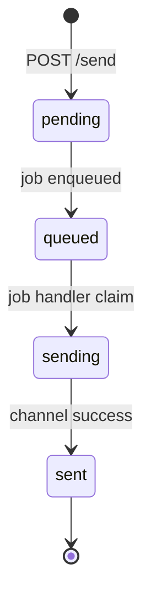
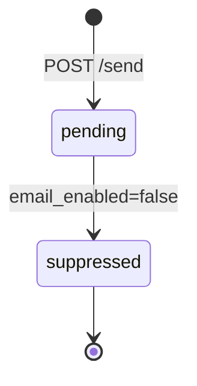
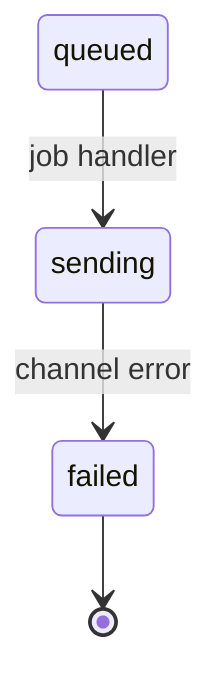
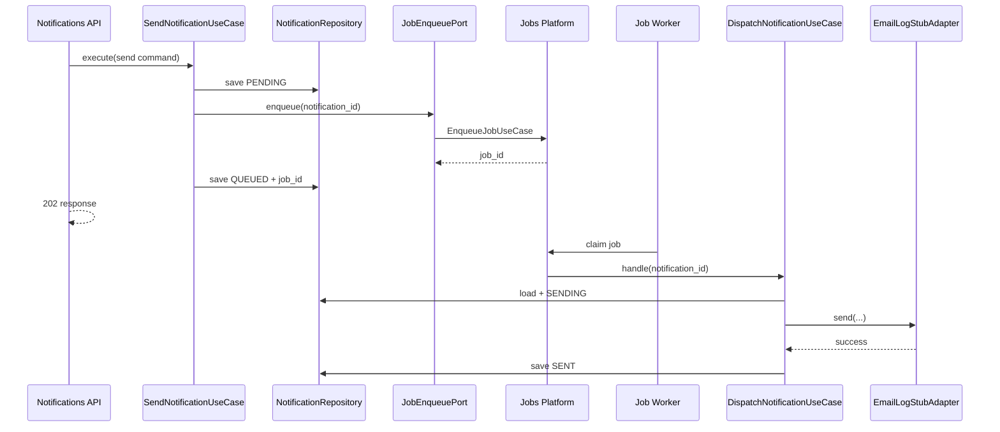
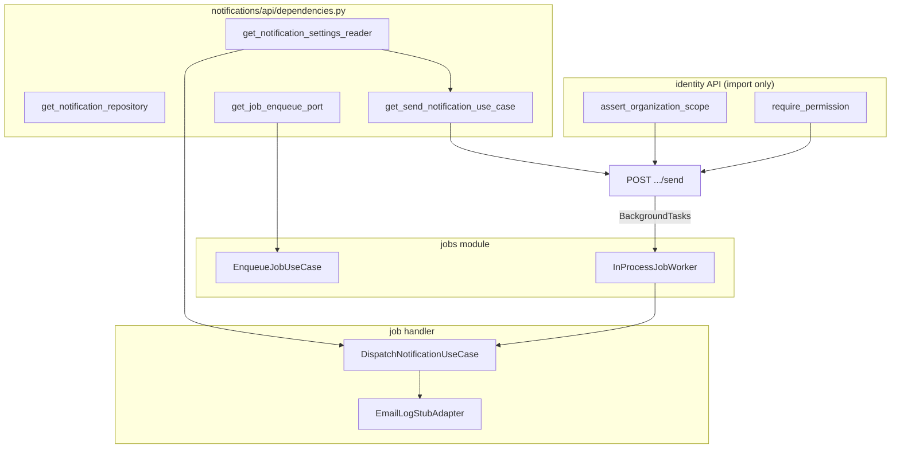

> **Historical design draft.** Not normative. As-built contract: [PRODUCT_INTEGRATION_GUIDE.md](../../../projects/kyrox-core/integrations/PRODUCT_INTEGRATION_GUIDE.md). Core status: [PROJECT_STATUS.md](../../../projects/kyrox-core/PROJECT_STATUS.md).

# Sprint 0.4.4 — Phase 1: Notifications Platform Design

**Status:** Implemented — v0.4.0 (Sprint 0.4.4)
**Sprint:** 0.4.4 (Platform Services — Notifications full stack)  
**Target:** Organization-scoped notification dispatch with async job integration, channel port, and settings-aware suppression  
**Prerequisite:** v0.3.0 Identity — **completed**; Sprint 0.4.1 Audit Query — **completed**; Sprint 0.4.2 Settings — **completed**; Sprint 0.4.3 Background Jobs — **completed**

**Related documents:**

- [Platform Services Design](PLATFORM_SERVICES_DESIGN.md) — Epic D backlog
- [Background Jobs Platform Design](BACKGROUND_JOBS_PLATFORM_DESIGN.md) — async dispatch integration
- [Settings Platform Design](SETTINGS_PLATFORM_DESIGN.md) — org notification settings keys
- [Backend Architecture Standards](../../standards/backend/BACKEND_ARCHITECTURE_STANDARDS.md)
- [Identity Platform Design](IDENTITY_PLATFORM_DESIGN.md)
- [Roadmap](ROADMAP.md)

---

## 1. Scope & Constraints

### 1.1 In scope (Phase 2 implementation)

| Area | Deliverable |
|------|-------------|
| **Domain** | `Notification` entity, `NotificationStatus`, `NotificationChannel`, dispatch ports |
| **Application** | Send notification, get status; policy; settings reader port |
| **Infrastructure** | `platform_notifications` table, repository, email log stub adapter |
| **Jobs integration** | Enqueue `core.platform.notification.dispatch`; job handler in notifications module |
| **Settings integration** | Read org keys via `NotificationSettingsReader` port (no settings module edits) |
| **Migration** | Alembic `20260701_0023` (table) + `20260701_0024` (permission seed) |
| **API** | `POST .../notifications/send`, `GET /notifications/{id}` |
| **Authorization** | `notifications.platform.send`, `notifications.platform.read` |
| **DI** | Composition root in `notifications/api/dependencies.py`; channel + job handler bootstrap |
| **Tests** | Lifecycle, settings suppression, job handoff, stub adapter (no PII logs), API |

### 1.2 Explicitly out of scope

| Item | Reason |
|------|--------|
| **Identity / Audit / Settings / Jobs module edits (Phase 1)** | Design only; Phase 2 allows additive `notifications` permission enum + job handler registration in bootstrap |
| **Template engine in Core** | Products render subject/body or pass opaque template_key for logging |
| **SMS / push channels** | Enum extensibility only; email v1 |
| **SMTP production adapter** | Log stub in v1; real SMTP in 0.4.x+ |
| **Webhook delivery** | Future |
| **Notification listing / inbox UI** | Poll by id only |
| **Bounce handling / provider webhooks** | Future |
| **Audit events on send** | Future enhancement |
| **Rate limiting / quota** | Future; document org settings hook for product-level limits |

### 1.3 Design principles

1. **Async-first:** API persists notification and enqueues a platform job; channel I/O runs off the request thread.
2. **Port-based channels:** Domain/application depend on `NotificationChannelAdapter` — no vendor SDK in inner layers.
3. **Settings, not hardcoding:** Org-level enable/disable and defaults read from existing `platform_settings` via a reader port — Core does not own product templates.
4. **No PII in stub logs:** Email stub logs notification id, org id, channel, redacted recipient — not full body in INFO logs.
5. **Thin API:** HTTP → commands; validation in policy; persistence/SMTP in infrastructure.
6. **Identity reuse:** Import `require_permission`, `assert_organization_scope` only — no identity package edits in Phase 1.
7. **Greenfield module:** All new code under `modules/notifications/` except router registration and bootstrap job handler wiring.

---

## 2. Current State (post 0.4.3)

### 2.1 Notifications module

**Does not exist.** No `backend/app/modules/notifications/`, no `platform_notifications` table.

### 2.2 Related platform state

| Component | State |
|-----------|-------|
| **Settings** | Org-scoped keys in `platform_settings`; GET/PUT API live |
| **Jobs** | `POST /organizations/{id}/jobs`, `GET /jobs/{id}`; worker + `core.platform.echo` stub |
| **Job worker** | `ProcessPendingJobsUseCase`, `claim_next_pending` with PostgreSQL `FOR UPDATE SKIP LOCKED` |
| **Permission pattern** | Three-segment codes: `jobs.platform.enqueue`, `settings.platform.read` |
| **Permission module enum** | `audit`, `core`, `identity`, `jobs`, `settings` — **`notifications` not yet allowed** |
| **Alembic head** | `20260701_0022` |
| **Platform draft API path** | `POST /organizations/{id}/notifications/send` ([§4.5](PLATFORM_SERVICES_DESIGN.md)) |

### 2.3 Settings keys (convention — not seeded by Core)

Documented org-scoped keys consumed by notifications policy (stored by products or future Core seed):

| Key | Type | Default if absent |
|-----|------|-------------------|
| `kyrox.notifications.email_enabled` | boolean | `true` |
| `kyrox.notifications.email_from` | string (email) | `null` (adapter uses app default) |

Products may define additional keys (`fair_crm.notifications.*`); Core v1 reads **only** `kyrox.notifications.*` keys listed above.

---

## 3. Goals

| Goal | Success metric |
|------|----------------|
| Product sends org-scoped notification via API | `202` + notification id + `pending`/`queued` |
| Dispatch runs asynchronously via jobs platform | Linked `job_id`; job completes → notification `sent` |
| Org email disabled via settings | Notification → `suppressed` without channel call |
| Channel failure recorded | Terminal `failed` + `failure_reason` |
| Client polls delivery status | `GET /notifications/{id}` → `sent` / `failed` / `suppressed` |
| Cross-org read denied | `404` |
| Stub logs contain no raw PII | Test asserts log format redacts recipient |
| Layer boundaries enforced | Architecture + import-boundary tests pass |

---

## 4. Target Folder Structure (Phase 2)

```text
backend/app/modules/notifications/
├── domain/
│   ├── entities.py                         # Notification
│   ├── ports.py                            # Repository, ChannelAdapter, SettingsReader
│   ├── value_objects/
│   │   ├── notification_status.py
│   │   ├── notification_channel.py
│   │   ├── recipient.py
│   │   └── failure_reason.py
│   └── exceptions.py
│
├── application/
│   ├── commands.py
│   ├── results.py
│   ├── policy.py
│   ├── send_notification.py                # API entry — persist + enqueue job
│   ├── get_notification.py
│   ├── dispatch_notification.py            # Job handler use case — channel dispatch
│   └── ports/
│       └── job_enqueue_port.py               # Abstraction over jobs EnqueueJobUseCase
│
├── infrastructure/
│   ├── repositories.py
│   ├── settings_reader.py                  # Reads platform_settings for org
│   ├── channels/
│   │   ├── registry.py
│   │   └── email_log_stub_adapter.py
│   ├── jobs/
│   │   ├── job_enqueue_adapter.py          # Wraps jobs module enqueue
│   │   └── notification_dispatch_job_handler.py
│   └── persistence/
│       ├── models.py
│       └── mappers.py
│
└── api/
    ├── dependencies.py
    ├── routes.py
    ├── schemas.py
    ├── mappers.py
    └── error_mapping.py

backend/app/modules/notifications/bootstrap.py   # Register channel + job handler

backend/app/api/v1/router.py                     # include notifications router
backend/app/main.py                              # bootstrap call (minimal)

backend/alembic/versions/
    20260701_0023_platform_notifications.py
    20260701_0024_notifications_permissions.py

backend/tests/modules/notifications/
    test_notifications_domain.py
    test_notification_status_lifecycle.py
    test_notification_policy.py
    test_send_notification_use_case.py
    test_get_notification_use_case.py
    test_dispatch_notification_use_case.py
    test_settings_suppression.py
    test_email_stub_adapter.py
    test_jobs_integration.py
    test_notifications_repository_integration.py
    test_notifications_api_architecture.py
    test_notifications_api_import_boundary.py
    test_notifications_api_routes.py
```

**Phase 2 additive touch outside notifications (minimal):**

- `PermissionModule` enum: add `"notifications"`
- `main.py` / jobs bootstrap: register `core.platform.notification.dispatch` handler
- `router.py`: one `include_router` line

**No edits** to settings, jobs, audit, or identity business logic.

---

## 5. Domain Design — Notification Model

### 5.1 Entity — `Notification`

| Field | Type | Notes |
|-------|------|-------|
| `id` | `UUID` | PK; returned to client |
| `organization_id` | `UUID` | Required — org-scoped |
| `channel` | `NotificationChannel` | v1: `email` only |
| `recipient` | `Recipient` | Channel-specific address (email string) |
| `subject` | `str` | Rendered subject (required v1) |
| `body` | `str` | Rendered body text or HTML (required v1) |
| `template_key` | `str \| None` | Optional metadata for product tracing |
| `variables` | `dict \| None` | Optional opaque JSON metadata |
| `status` | `NotificationStatus` | Lifecycle state |
| `idempotency_key` | `str \| None` | Optional dedup key |
| `job_id` | `UUID \| None` | Linked `platform_jobs.id` after enqueue |
| `failure_reason` | `FailureReason \| None` | Terminal / last error |
| `created_at` | `datetime` | API accept time |
| `queued_at` | `datetime \| None` | Job enqueued |
| `sent_at` | `datetime \| None` | Terminal success |
| `failed_at` | `datetime \| None` | Terminal failure |
| `suppressed_at` | `datetime \| None` | Terminal suppressed |

**Invariants:**

- `organization_id` always set
- `subject` and `body` non-empty after policy normalization
- Terminal states: `SENT`, `FAILED`, `SUPPRESSED` — no outbound transitions
- `job_id` set when status reaches `QUEUED` or later (except fast-path suppression before enqueue)

### 5.2 Value object — `NotificationStatus`

| Member | DB value | Description |
|--------|----------|-------------|
| `PENDING` | `pending` | Persisted; not yet queued to jobs |
| `QUEUED` | `queued` | Job enqueued; awaiting worker |
| `SENDING` | `sending` | Job handler invoking channel adapter |
| `SENT` | `sent` | Delivered (stub: logged); terminal |
| `FAILED` | `failed` | Dispatch failed; terminal |
| `SUPPRESSED` | `suppressed` | Blocked by org settings; terminal |

**Allowed transitions:**

```text
PENDING   → QUEUED
PENDING   → SUPPRESSED     (settings disable before enqueue)
QUEUED    → SENDING        (job handler start)
SENDING   → SENT
SENDING   → FAILED
QUEUED    → FAILED         (enqueue/job failure — optional fast fail)
```

Domain helper: `NotificationStatus.can_transition_to(next) -> bool`.

### 5.3 Value object — `NotificationChannel`

| Member | Wire / DB value |
|--------|-----------------|
| `EMAIL` | `email` |

v1 API accepts `email` only; enum extensible for `sms`, `push` later.

### 5.4 Value object — `Recipient`

| Field | Type | Notes |
|-------|------|-------|
| `value` | `str` | Email address when channel = email |

Validated by `NotificationPolicy` (format, max length 320).

### 5.5 Value object — `FailureReason`

Same pattern as jobs: `message` (max 2048) + optional `code` (max 64).

### 5.6 Domain exceptions

| Exception | When |
|-----------|------|
| `NotificationError` | Base |
| `NotificationNotFoundError` | Get by id / org mismatch |
| `InvalidNotificationRequestError` | Validation failures |
| `NotificationSuppressedError` | Optional — internal; usually persisted as status |
| `DuplicateIdempotencyConflictError` | Same key, different payload |
| `InvalidNotificationTransitionError` | Illegal status change |
| `UnsupportedNotificationChannelError` | Unknown channel |
| `NotificationDispatchError` | Channel adapter failure (wrapped in application) |

---

## 6. Notification Status Lifecycle

### 6.1 Happy path (async + job)



### 6.2 Suppressed path (settings)



### 6.3 Failure path



### 6.4 Timestamps

| Field | Set when |
|-------|----------|
| `created_at` | Insert on send |
| `queued_at` | Transition to `queued` |
| `sent_at` | Transition to `sent` |
| `failed_at` | Transition to `failed` |
| `suppressed_at` | Transition to `suppressed` |

---

## 7. Notification Channel Model

### 7.1 Port — `NotificationChannelAdapter`

```python
# Illustrative — not implementation code
@dataclass(frozen=True)
class ChannelDispatchRequest:
    notification_id: UUID
    organization_id: UUID
    channel: NotificationChannel
    recipient: Recipient
    subject: str
    body: str
    from_address: str | None


@dataclass(frozen=True)
class ChannelDispatchResult:
    provider_message_id: str | None = None


class NotificationChannelAdapter(Protocol):
    def send(self, request: ChannelDispatchRequest) -> ChannelDispatchResult: ...
```

### 7.2 Port — `NotificationChannelRegistry`

```python
class NotificationChannelRegistry(Protocol):
    def get(self, channel: NotificationChannel) -> NotificationChannelAdapter | None: ...
```

Phase 2 registers **email** → `EmailLogStubAdapter`.

### 7.3 Email stub adapter — `EmailLogStubAdapter`

**Behavior (v1):**

- Writes **structured INFO log** with: `notification_id`, `organization_id`, `channel`, `recipient_redacted`, `subject_length`, `body_length`, `template_key`
- Does **not** log full `recipient`, `subject`, or `body` at INFO level
- Returns `ChannelDispatchResult(provider_message_id="stub-{notification_id}")`
- Simulated failure mode for tests: env flag or injectable `fail_next: bool` in test only

**Recipient redaction:** `u***@example.com` — first char of local part + masked domain visible.

**Future:** `SmtpNotificationChannelAdapter` implements same port; selected via config/DI.

---

## 8. Dispatch Port (Application)

### 8.1 Send path — `SendNotificationUseCase`

**Dependencies:** `NotificationRepository`, `NotificationSettingsReader`, `JobEnqueuePort`, `NotificationPolicy`

**Algorithm:**

```text
1. Validate command (channel, recipient, subject, body, idempotency)
2. If idempotency hit → return existing (200 semantics at API)
3. Load OrganizationNotificationSettings via NotificationSettingsReader
4. If channel disabled (e.g. email_enabled=false) → persist SUPPRESSED → return
5. Persist notification PENDING
6. Enqueue job:
     job_type = "core.platform.notification.dispatch"
     payload = { "notification_id": "<uuid>" }
     idempotency_key = "notification-{notification_id}"  (internal dedup)
7. On enqueue success → status QUEUED, job_id set, queued_at
8. On enqueue failure → status FAILED, failure_reason
9. Return SendNotificationResult
```

**Does not** call channel adapter directly — dispatch deferred to job handler.

### 8.2 Dispatch path — `DispatchNotificationUseCase`

**Invoked by:** Job handler `core.platform.notification.dispatch`

**Dependencies:** `NotificationRepository`, `NotificationChannelRegistry`, `NotificationSettingsReader`, `NotificationPolicy`

**Algorithm:**

```text
1. Load notification by id from job payload
2. If terminal → no-op (idempotent)
3. Re-check settings (race: disabled after queue) → SUPPRESSED if disabled
4. Transition QUEUED → SENDING
5. Resolve adapter for channel; missing → FAILED
6. adapter.send(...)
7. Success → SENT, sent_at
8. Exception → FAILED, failure_reason, failed_at
9. Save notification
```

### 8.3 Port — `JobEnqueuePort`

Decouples notifications application from jobs module concrete use case:

```python
class JobEnqueuePort(Protocol):
    def enqueue_notification_dispatch(
        self,
        *,
        organization_id: UUID,
        notification_id: UUID,
    ) -> UUID: ...  # returns job_id
```

**Infrastructure:** `JobsModuleEnqueueAdapter` wraps `EnqueueJobUseCase` from jobs module (import jobs **application** only from notifications infrastructure).

---

## 9. Queue / Job Integration

### 9.1 Job type contract

| Property | Value |
|----------|-------|
| `job_type` | `core.platform.notification.dispatch` |
| `payload` | `{ "notification_id": "<uuid>" }` |
| `max_attempts` | `3` (inherits jobs retry policy) |
| Handler location | `notifications/infrastructure/jobs/notification_dispatch_job_handler.py` |
| Registration | `notifications/bootstrap.py` called from `main.py` (registers on shared `JobHandlerRegistry`) |

### 9.2 Sequence diagram



### 9.3 Worker trigger

After successful send API (new notification queued):

- Schedule jobs `InProcessJobWorker.process_batch` via **BackgroundTasks** (same pattern as jobs API enqueue)
- Lifespan sweep already processes pending jobs globally

### 9.4 Job failure ↔ notification status

| Job terminal state | Notification update |
|--------------------|-------------------|
| Job `completed` | Handler sets notification `sent` (or already terminal) |
| Job `failed` after retries | If notification still `queued`/`sending` → `failed` with job failure_reason propagated |

Handler owns notification terminal state; job `result` may include `{ "notification_id", "status" }` for observability.

### 9.5 GET job status

**Out of scope for notifications API v1** — clients poll `GET /notifications/{id}` only. Optional cross-link: response includes `job_id` for advanced clients.

---

## 10. Organization-Scoped Notification Settings Relationship

### 10.1 Principle

Notifications module **does not write** settings. Products (or admins) configure org behavior via existing **Settings API**:

```text
PUT /organizations/{id}/settings/kyrox.notifications.email_enabled
Body: { "value": { "enabled": false } }
```

### 10.2 Port — `NotificationSettingsReader`

```python
@dataclass(frozen=True)
class OrganizationNotificationSettings:
    email_enabled: bool
    email_from: str | None


class NotificationSettingsReader(Protocol):
    def get_for_organization(self, organization_id: UUID) -> OrganizationNotificationSettings: ...
```

### 10.3 Infrastructure implementation

`SqlAlchemyNotificationSettingsReader`:

- Queries `platform_settings` directly (same table as settings module) **or** delegates to injected `SettingRepository` port from settings domain
- Keys read:
  - `kyrox.notifications.email_enabled` → JSON `{ "enabled": bool }` or bare bool (policy normalizes)
  - `kyrox.notifications.email_from` → JSON string or `{ "address": "..." }`
- **Defaults when key absent:** `email_enabled=True`, `email_from=None`
- **No FK** to settings rows — loose coupling by key convention

### 10.4 Suppression rules

| Condition | Result |
|-----------|--------|
| `email_enabled == false` and channel = EMAIL | `SUPPRESSED` before enqueue |
| Re-check on dispatch finds disabled | `SUPPRESSED` at handler (was `queued`) |

### 10.5 Future product keys

Document-only examples (not read by Core v1):

- `fair_crm.notifications.digest_enabled`
- `fair_crm.notifications.quiet_hours`

Products implement custom logic in their repos; may call Core send API when appropriate.

---

## 11. Repository Design

### 11.1 Port — `NotificationRepository`

```python
class NotificationRepository(Protocol):
    def get_by_id(self, notification_id: UUID) -> Notification | None: ...

    def find_by_idempotency(
        self,
        organization_id: UUID,
        idempotency_key: str,
    ) -> Notification | None: ...

    def save(self, notification: Notification) -> Notification: ...
```

### 11.2 Idempotency

Partial unique index:

```sql
CREATE UNIQUE INDEX uq_platform_notifications_org_idempotency
  ON platform_notifications (organization_id, idempotency_key)
  WHERE idempotency_key IS NOT NULL;
```

Same payload → return existing; different payload → `409 Conflict`.

### 11.3 Query patterns

| Method | Use |
|--------|-----|
| `get_by_id` | Get status API, dispatch handler |
| `find_by_idempotency` | Send dedup |
| `save` | Insert + update lifecycle |

No list/query API in v1.

---

## 12. Migration Plan

### 12.1 Migration `20260701_0023_platform_notifications`

**Revises:** `20260701_0022`

**Table:** `platform_notifications`

| Column | Type | Nullable | Notes |
|--------|------|----------|-------|
| `id` | UUID | NO | PK |
| `organization_id` | UUID | NO | Tenant scope |
| `channel` | VARCHAR(32) | NO | `email` |
| `recipient` | VARCHAR(320) | NO | Email address |
| `subject` | VARCHAR(998) | NO | |
| `body` | TEXT | NO | Rendered content |
| `template_key` | VARCHAR(255) | YES | |
| `variables` | JSONB | YES | |
| `status` | VARCHAR(32) | NO | §5.2 |
| `idempotency_key` | VARCHAR(128) | YES | |
| `job_id` | UUID | YES | FK optional — no DB FK (decoupling) |
| `failure_reason` | TEXT | YES | |
| `failure_code` | VARCHAR(64) | YES | |
| `created_at` | TIMESTAMPTZ | NO | |
| `queued_at` | TIMESTAMPTZ | YES | |
| `sent_at` | TIMESTAMPTZ | YES | |
| `failed_at` | TIMESTAMPTZ | YES | |
| `suppressed_at` | TIMESTAMPTZ | YES | |
| `updated_at` | TIMESTAMPTZ | NO | |

**Check constraints:**

```sql
channel IN ('email')
status IN ('pending', 'queued', 'sending', 'sent', 'failed', 'suppressed')
```

**Indexes:**

| Index | Columns | Purpose |
|-------|---------|---------|
| `ix_platform_notifications_organization_id` | `(organization_id)` | Org filter |
| `ix_platform_notifications_status_created` | `(status, created_at)` | Ops/debug |
| `ix_platform_notifications_job_id` | `(job_id)` | Job correlation |
| `uq_platform_notifications_org_idempotency` | `(organization_id, idempotency_key)` | Partial unique WHERE key NOT NULL |

**Downgrade:** Drop indexes and table.

### 12.2 Migration `20260701_0024_notifications_permissions`

**Revises:** `20260701_0023`

| Artifact | Value |
|----------|-------|
| Group | `notifications.platform` / module `notifications` |
| Permissions | `notifications.platform.send`, `notifications.platform.read` |

Idempotent seed — same pattern as `20260701_0022`.

### 12.3 Phase 2 prerequisite

Add `"notifications"` to `PermissionModule._ALLOWED_MODULES` (single line).

---

## 13. API Design

### 13.1 Send — `POST /organizations/{organization_id}/notifications/send`

| Aspect | Value |
|--------|-------|
| Permission | `notifications.platform.send` |
| Auth | Bearer + `X-Organization-Id` |
| Guards | `require_permission` + `assert_organization_scope` |

**Request body:**

| Field | Type | Required | Notes |
|-------|------|----------|-------|
| `channel` | string | Yes | `email` |
| `recipient` | string | Yes | Email address |
| `subject` | string | Yes | Rendered |
| `body` | string | Yes | Rendered |
| `template_key` | string | No | Metadata |
| `variables` | object | No | Opaque JSON |
| `idempotency_key` | string | No | Dedup |

**Responses:**

| Status | Condition |
|--------|-----------|
| `202` | Accepted — new notification queued or suppressed |
| `200` | Idempotent return of existing notification |
| `400` | Validation error |
| `403` | Permission denied |
| `409` | Idempotency conflict |
| `422` | Pydantic validation |

**Side effect:** `BackgroundTasks` → jobs worker batch (when status is `queued`).

### 13.2 Get status — `GET /notifications/{notification_id}`

| Aspect | Value |
|--------|-------|
| Permission | `notifications.platform.read` |
| Auth | Bearer + `X-Organization-Id` |

**Access:** `notification.organization_id == context.organization_id` else **404**.

### 13.3 Router paths

```text
POST /api/v1/organizations/{organization_id}/notifications/send
GET  /api/v1/notifications/{notification_id}
```

---

## 14. API Schemas (Pydantic)

### 14.1 `SendNotificationRequest`

Fields mirror §13.1.

### 14.2 `SendNotificationResponse`

| Field | Type |
|-------|------|
| `notification` | `NotificationResponse` |
| `created` | bool |

### 14.3 `NotificationResponse`

| Field | Type |
|-------|------|
| `id` | UUID |
| `organization_id` | UUID |
| `channel` | str |
| `recipient` | str |
| `subject` | str |
| `status` | str |
| `template_key` | str \| null |
| `job_id` | UUID \| null |
| `failure_reason` | str \| null |
| `failure_code` | str \| null |
| `created_at` | datetime |
| `queued_at` | datetime \| null |
| `sent_at` | datetime \| null |
| `failed_at` | datetime \| null |
| `suppressed_at` | datetime \| null |

**Note:** `body` **excluded** from GET response by default (size/PII). Optional `?include_body=true` deferred to future.

---

## 15. Dependency Injection Strategy

### 15.1 Composition root — `notifications/api/dependencies.py`

| Factory | Returns |
|---------|---------|
| `get_notification_repository` | `NotificationRepository` |
| `get_notification_policy` | `NotificationPolicy` |
| `get_notification_settings_reader` | `NotificationSettingsReader` |
| `get_job_enqueue_port` | `JobEnqueuePort` |
| `get_send_notification_use_case` | `SendNotificationUseCase` |
| `get_get_notification_use_case` | `GetNotificationUseCase` |
| `get_dispatch_notification_use_case` | `DispatchNotificationUseCase` |
| `get_notification_channel_registry` | From `app.state.notification_channel_registry` |

### 15.2 Bootstrap — `notifications/bootstrap.py`

```text
1. build_notification_channel_registry() → register EmailLogStubAdapter
2. register_notification_job_handler(job_handler_registry) → core.platform.notification.dispatch
```

Called from `create_app()` after `job_handler_registry` initialization.

### 15.3 Wiring diagram



### 15.4 Layer import rules

| Layer | May import |
|-------|------------|
| `notifications/domain` | stdlib only |
| `notifications/application` | domain; jobs enqueue **port** only (not jobs infra) |
| `notifications/infrastructure` | domain, application ports, jobs application use cases |
| `notifications/api` | application, api helpers, identity guards |

---

## 16. Permission Model

### 16.1 Permission codes

| Code | Description | Endpoint |
|------|-------------|----------|
| `notifications.platform.send` | Send org-scoped notification | `POST .../send` |
| `notifications.platform.read` | Read notification status | `GET /notifications/{id}` |

**Module:** `notifications`  
**Group code:** `notifications.platform`

### 16.2 Authorization flow

Same as jobs/settings — org context via `X-Organization-Id`, scope assert on path org id for send.

### 16.3 Super admin

No system-scoped notification API in v1. No `core.*` bypass for `notifications.platform.*`.

---

## 17. Notification Policy (`NotificationPolicy`)

| Rule | Value |
|------|-------|
| Channel v1 | `email` only |
| Recipient | RFC5322 simplified regex; max 320 chars |
| Subject max length | 998 chars |
| Body max size | 256 KiB UTF-8 |
| `template_key` | Optional; same 3-segment key format as settings if provided |
| `variables` | JSON object; max 16 KiB serialized |
| Idempotency key | Same rules as jobs (128 chars, `[a-zA-Z0-9_-]`) |

---

## 18. Test Strategy

### 18.1 Domain & policy

| File | Coverage |
|------|----------|
| `test_notifications_domain.py` | Channel, recipient, status transitions |
| `test_notification_policy.py` | Email validation, size limits |

### 18.2 Application

| File | Coverage |
|------|----------|
| `test_send_notification_use_case.py` | Queue path, idempotency, enqueue failure |
| `test_get_notification_use_case.py` | Found, 404 org mask |
| `test_dispatch_notification_use_case.py` | Sent, failed, adapter missing |
| `test_settings_suppression.py` | Disabled email → suppressed |

### 18.3 Infrastructure

| File | Coverage |
|------|----------|
| `test_email_stub_adapter.py` | Success; log output has no full email/body |
| `test_notifications_repository_integration.py` | Idempotency index, save/load |
| `test_jobs_integration.py` | Send → job enqueued → worker → sent E2E |

### 18.4 API

| File | Coverage |
|------|----------|
| `test_notifications_api_routes.py` | 202 send, poll sent, 404 cross-org, idempotency |
| `test_notifications_api_architecture.py` | Thin API |
| `test_notifications_api_import_boundary.py` | No forbidden imports |

### 18.5 Mandatory scenarios

1. **Send email → async dispatch → sent** (with stub adapter)
2. **Settings `email_enabled=false` → suppressed** (no job or job skipped)
3. **Idempotency** — same key returns same notification
4. **Cross-org GET → 404**
5. **Stub log redaction** — caplog assert no full recipient string

### 18.6 Phase 3 validation

```bash
python -m pytest backend/tests/modules/notifications
python -m pytest backend/tests
python scripts/quality_check.py
```

---

## 19. Phase 2 Implementation File List

(See §4 folder structure — all under `modules/notifications/` plus migrations, router line, bootstrap, permission enum.)

**Frozen modules:** audit, settings, jobs, identity (except `notifications` in enum).

---

## 20. Phase 1 Exit Criteria

- [x] Notification domain model and status lifecycle documented
- [x] Notification channel model and email stub adapter specified
- [x] Dispatch port and dispatch use case designed
- [x] Queue/job integration with `core.platform.notification.dispatch` documented
- [x] Organization notification settings relationship via reader port documented
- [x] Migration plan (`0023`, `0024`) with schema and indexes
- [x] Repository design and idempotency documented
- [x] API endpoints, schemas, DI, and permission model specified
- [x] Test strategy with PII-safe logging requirements documented
- [x] No changes to existing modules required in Phase 1
- [ ] Design reviewed and approved before Phase 2 starts

---

## 21. Remaining Risks

| Risk | Mitigation |
|------|------------|
| `notifications` not in permission enum | Phase 2 single-line enum add |
| Cross-module dependency on jobs enqueue | `JobEnqueuePort` adapter; infrastructure-only import |
| Settings JSON shape drift | Policy normalizes bool/object; document canonical shapes |
| Body omitted from GET may frustrate clients | Document; add `include_body` in future if needed |
| Job succeeds but notification stuck in `sending` | Handler uses single transaction; job result mirrors notification status |
| Duplicate dispatch on job retry | Handler idempotent: terminal notification → no-op |
| Log stub vs real SMTP divergence | Same port interface; swap adapter in DI |
| Large body in DB | 256 KiB policy limit |

---

## Standart Rapor (Phase 1)

### 1. Created / Changed files

| File | Action |
|------|--------|
| `docs/NOTIFICATIONS_PLATFORM_DESIGN.md` | **Created** — this document |

No code changes. No existing modules modified.

### 2. Test Results

N/A — design-only phase.

### 3. Validation Results

N/A — design-only phase.

### 4. Remaining Risks

See [Section 21](#21-remaining-risks). Primary follow-up: approve design, then **Sprint 0.4.4 Phase 2** (implementation).

---

**Next step:** Review and approve this design, then proceed to **Sprint 0.4.4 Phase 2** (implementation).
