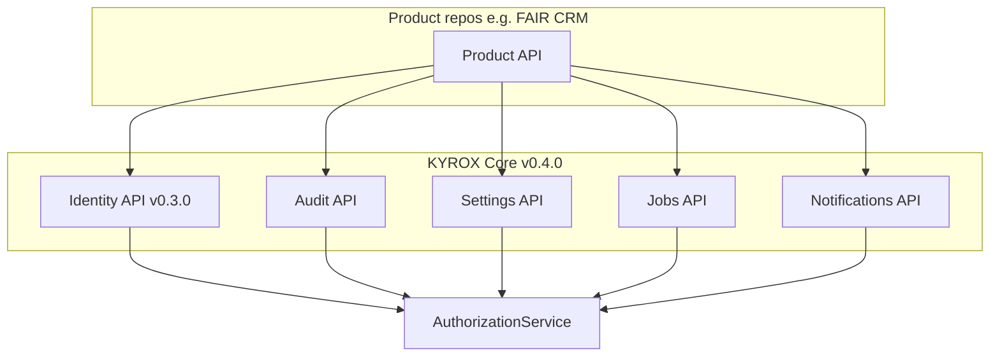

> **Historical design draft.** Not normative. As-built contract: [PRODUCT_INTEGRATION_GUIDE.md](../../../projects/kyrox-core/integrations/PRODUCT_INTEGRATION_GUIDE.md). Core status: [PROJECT_STATUS.md](../../../projects/kyrox-core/PROJECT_STATUS.md).

# Platform Services — Sprint 0.4.0 Design Proposal

**Status:** Implemented — v0.4.0 (Sprint 0.4.0)  
**Target release:** v0.4.0 — **released**  
**Prerequisite:** v0.3.0 Identity Platform (Organization & Membership) — **completed**

---

## 1. Purpose

Sprint 0.4.0 delivers **shared platform services** that products consume without reimplementing infrastructure. Identity (auth, org context, RBAC) is complete; platform services add cross-cutting capabilities every SaaS product needs.

**Guiding rule:** Same layered architecture as identity — domain → application → infrastructure → API. Products call documented Core APIs; Core never imports product code.

---

## 2. Scope Summary

| Service | Current state (v0.4.0) | Sprint 0.4.0 target |
|---------|------------------------|----------------------|
| **Audit** | Domain + append service + query API + permission `audit.logs.read` | Public query API, identity hook integration, permission `audit.logs.read` |
| **Settings** | Org + system scoped settings API; permissions `settings.platform.read`, `settings.platform.update` | Tenant + system scoped key/value store with validation API |
| **Background Jobs** | Enqueue, status, in-process worker; permissions `jobs.platform.enqueue`, `jobs.platform.read` | Job registration, enqueue, status, worker contract |
| **Notifications** | Async dispatch via jobs; settings-aware suppression; permissions `notifications.platform.send`, `notifications.platform.read` | Dispatch abstraction (email first); no product templates in Core |

**Out of scope for 0.4.0**

- Files / object storage service (0.4.x or later)
- Product-specific setting schemas enforced inside Core
- FAIR CRM entities or workflows
- Email delivery provider implementation details beyond a pluggable port

---

## 3. Backlog (Sprint 0.4.0)

Tasks follow the established **Phase 1 Design → Phase 2 Implementation → Phase 3 Validation** model.

### Epic A — Audit Platform Service

| ID | Task | Layer | Priority |
|----|------|-------|----------|
| A1 | Audit domain review & canonical bounded context (`modules/audit/domain/`) | Domain | P0 |
| A2 | Query use cases: list audit logs (org-scoped, filtered) | Application | P0 |
| A3 | Infrastructure: query repository methods, indexes for filter paths | Infrastructure | P0 |
| A4 | API: `GET /api/v1/organizations/{id}/audit-logs` + DI | API | P0 |
| A5 | Identity integration: record audit events from org/membership use cases | Application | P1 |
| A6 | Permission seed: `audit.logs.read` | Migration | P1 |
| A7 | Architecture, import-boundary, and tenant-isolation tests | Tests | P0 |

**Acceptance:** Authorized caller with `audit.logs.read` can paginate org audit logs; cross-org access denied; append-only invariant preserved.

---

### Epic B — Settings Platform Service

| ID | Task | Layer | Priority |
|----|------|-------|----------|
| B1 | Settings domain design: `Setting`, scope enum (system / organization), value types | Domain | P0 |
| B2 | Application: get, upsert, delete setting; validation policy (key format, JSON value) | Application | P0 |
| B3 | Infrastructure: `platform_settings` table, repository, mapper | Infrastructure | P0 |
| B4 | Alembic migration + rollback plan | Migration | P0 |
| B5 | API: org-scoped CRUD under `/organizations/{id}/settings` | API | P0 |
| B6 | System-scoped settings (super-admin only) — design + guard | API | P1 |
| B7 | Permission seed: `settings.read`, `settings.update` | Migration | P1 |
| B8 | Tests: scope isolation, invalid key rejection, JSON roundtrip | Tests | P0 |

**Acceptance:** Organization can read/write its own settings; system settings require super-admin; products register keys in their repos, Core stores opaque JSON values.

---

### Epic C — Background Jobs Platform Service

| ID | Task | Layer | Priority |
|----|------|-------|----------|
| C1 | Jobs domain: `Job`, status lifecycle (pending, running, completed, failed) | Domain | P0 |
| C2 | Application: enqueue, get status, cancel (where allowed) | Application | P0 |
| C3 | Infrastructure: `platform_jobs` table, repository | Infrastructure | P0 |
| C4 | Worker port: `JobHandler` registry pattern (in-process stub for 0.4.0) | Application | P1 |
| C5 | API: enqueue + poll status | API | P0 |
| C6 | Alembic migration | Migration | P0 |
| C7 | Tests: enqueue/idempotency key, status transitions | Tests | P0 |

**Acceptance:** Product can enqueue a named job with payload JSON; poll status by id; jobs are org-scoped where applicable.

---

### Epic D — Notifications Platform Service

| ID | Task | Layer | Priority |
|----|------|-------|----------|
| D1 | Notifications domain: `NotificationRequest`, channel enum (email) | Domain | P0 |
| D2 | Application: dispatch use case; `NotificationChannel` port | Application | P0 |
| D3 | Infrastructure: log-only or SMTP stub adapter | Infrastructure | P1 |
| D4 | API: `POST /notifications/send` (org-scoped, permission-gated) | API | P1 |
| D5 | Permission seed: `notifications.send` | Migration | P1 |
| D6 | Tests: port mock, validation, no PII in logs | Tests | P0 |

**Acceptance:** Core exposes a single dispatch contract; channel implementation is swappable; no product-specific templates in Core.

---

### Epic E — Cross-Cutting (0.4.0)

| ID | Task | Priority |
|----|------|----------|
| E1 | Permission seed migration: identity org/membership + platform service permissions | P0 |
| E2 | Update `docs/ROADMAP.md`, `CHANGELOG.md`, `README.md` for v0.4.0 | P0 |
| E3 | Product integration guide draft (how FAIR CRM emits audit, reads settings) | P1 |
| E4 | ADR 0004: Platform Services boundaries (if not already covered) | P2 |

---

## 4. Technical Design

### 4.1 Module layout

```text
backend/app/modules/
├── audit/                    # EXISTS — extend with api/ + query use cases
│   ├── domain/
│   ├── application/
│   ├── infrastructure/
│   └── api/                  # NEW
├── settings/                 # NEW
│   ├── domain/
│   ├── application/
│   ├── infrastructure/
│   └── api/
├── jobs/                     # NEW
│   └── ...
└── notifications/            # NEW
    └── ...
```

Router registration in `app/api/v1/router.py` — one router per service, same pattern as identity.

---

### 4.2 Audit — query API design

**Existing:** `AuditService.record()` append-only; `audit_logs` table (migration `20260701_0006`).

**New:**

| Method | Path | Auth | Permission |
|--------|------|------|------------|
| `GET` | `/organizations/{organization_id}/audit-logs` | Bearer + `X-Organization-Id` | `audit.logs.read` |

Query params: `action`, `resource_type`, `user_id`, `from`, `to`, `limit`, `cursor`.

**Integration hooks (P1):** Identity use cases call `AuditService.record()` after:

- Organization create / update / suspend
- Membership invite / accept / suspend / remove

Action naming: `identity.organization.create`, `identity.membership.invite`, etc. (matches existing `module.resource.action` validation).

---

### 4.3 Settings — data model draft

**Table:** `platform_settings`

| Column | Type | Notes |
|--------|------|-------|
| id | UUID PK | |
| scope | VARCHAR | `system` \| `organization` |
| organization_id | UUID NULL | Required when scope = organization |
| key | VARCHAR | Namespaced: `product.feature.key` |
| value | JSONB / JSON | Opaque to Core |
| created_at, updated_at | TIMESTAMPTZ | |

Unique: `(scope, organization_id, key)`.

**API (org-scoped):**

| Method | Path | Permission |
|--------|------|------------|
| `GET` | `/organizations/{id}/settings` | `settings.read` |
| `GET` | `/organizations/{id}/settings/{key}` | `settings.read` |
| `PUT` | `/organizations/{id}/settings/{key}` | `settings.update` |
| `DELETE` | `/organizations/{id}/settings/{key}` | `settings.update` |

Core validates key format and JSON serializability only — not business semantics.

---

### 4.4 Background jobs — data model draft

**Table:** `platform_jobs`

| Column | Type | Notes |
|--------|------|-------|
| id | UUID PK | |
| organization_id | UUID NULL | Optional org scope |
| job_type | VARCHAR | Registered handler name |
| payload | JSON | |
| status | VARCHAR | pending, running, completed, failed |
| idempotency_key | VARCHAR NULL | Unique per org + type when set |
| result | JSON NULL | |
| error | TEXT NULL | |
| created_at, started_at, finished_at | TIMESTAMPTZ | |

**API:**

| Method | Path | Permission |
|--------|------|------------|
| `POST` | `/organizations/{id}/jobs` | `jobs.enqueue` |
| `GET` | `/jobs/{job_id}` | `jobs.read` |

Worker execution is **out of band** for 0.4.0 API surface; in-process stub handler proves the contract.

---

### 4.5 Notifications — dispatch design

**Port:**

```text
NotificationChannel.send(request: NotificationRequest) -> NotificationResult
```

**Request fields:** `organization_id`, `channel` (email), `recipient`, `template_key`, `variables` (JSON).

Core does **not** store templates. Products pass rendered subject/body or template_key + variables; adapter resolves (stub logs in dev).

**API:**

| Method | Path | Permission |
|--------|------|------------|
| `POST` | `/organizations/{id}/notifications/send` | `notifications.send` |

---

### 4.6 Authorization integration

All org-scoped routes reuse:

- `require_permission("<module>.<resource>.<action>")`
- `assert_organization_scope(path_org_id, context)` (from identity API)

Super-admin bypass remains limited to `core.*` permissions — platform permissions are **not** bypassed unless explicitly added to policy (document in ADR).

---

### 4.7 Dependency diagram



---

## 5. Proposed Sprint 0.4.x Split

| Sprint | Focus | Release tag |
|--------|--------|-------------|
| **0.4.1** | Audit query API + identity audit hooks + permission seed (partial) | — |
| **0.4.2** | Settings full stack | — |
| **0.4.3** | Background jobs full stack | — |
| **0.4.4** | Notifications + integration guide + v0.4.0 release | **v0.4.0** |

Each sub-sprint: Phase 1 design doc sign-off → Phase 2 implementation → Phase 3 validation (`quality_check.py`).

---

## 6. Exit Criteria (v0.4.0)

- [ ] Products can query org audit logs through Core API
- [ ] Identity mutations emit audit events for security-relevant actions
- [ ] Products can read/write org-scoped settings with documented key convention
- [ ] Products can enqueue and poll background jobs
- [ ] Products can dispatch notifications through a pluggable channel port
- [ ] Tenant isolation proven by tests for every new endpoint
- [ ] No product-specific code in Core repository
- [ ] `CHANGELOG.md` and `ROADMAP.md` updated; tag **v0.4.0**

---

## 7. Risks & Dependencies

| Risk | Mitigation |
|------|------------|
| Permission catalog drift | Single seed migration in E1; document in integration guide |
| Audit volume / query performance | Cursor pagination; indexes on `(organization_id, created_at)` — already partially present |
| Job worker scope creep | Stub in-process handler only for 0.4.0; external worker in 0.4.x+ |
| Notification provider lock-in | Port + adapter; no vendor SDK in domain/application |
| Identity permission seed gap (0.3.0) | E1 bundles `identity.organizations.*` and `identity.memberships.*` with platform permissions |

---

## 8. References

- [ROADMAP.md](ROADMAP.md) — Sprint 0.4.0 milestone
- [../../standards/backend/BACKEND_ARCHITECTURE_STANDARDS.md](../../standards/backend/BACKEND_ARCHITECTURE_STANDARDS.md) — layer rules
- [IDENTITY_PLATFORM_DESIGN.md](IDENTITY_PLATFORM_DESIGN.md) — org context and RBAC
- Existing audit module: `backend/app/modules/audit/`
- Alembic: `20260701_0006_audit_logs.py`

---

**Next step:** Review and approve this proposal, then start **Sprint 0.4.1 Phase 1** (Audit query API design refinement) before any code changes.
