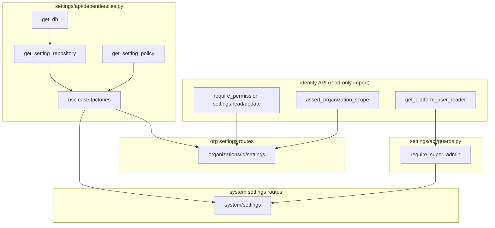

> **Historical design draft.** Not normative. As-built contract: [PRODUCT_INTEGRATION_GUIDE.md](../../../projects/kyrox-core/integrations/PRODUCT_INTEGRATION_GUIDE.md). Core status: [PROJECT_STATUS.md](../../../projects/kyrox-core/PROJECT_STATUS.md).

# Sprint 0.4.2 — Phase 1: Settings Platform Design

**Status:** Implemented — v0.4.0 (Sprint 0.4.2)  
**Sprint:** 0.4.2 (Platform Services — Settings full stack)  
**Target:** Organization-scoped and system-scoped key/value settings API  
**Prerequisite:** v0.3.0 Identity Platform — **completed**; Sprint 0.4.1 Audit Query — **completed**

**Related documents:**

- [Platform Services Design](PLATFORM_SERVICES_DESIGN.md) — Epic B backlog
- [Audit Query Platform Design](AUDIT_QUERY_PLATFORM_DESIGN.md) — Phase 1 template
- [Backend Architecture Standards](../../standards/backend/BACKEND_ARCHITECTURE_STANDARDS.md)
- [Identity Platform Design](IDENTITY_PLATFORM_DESIGN.md) — org context, RBAC, super-admin
- [Roadmap](ROADMAP.md)

---

## 1. Scope & Constraints

### 1.1 In scope (Phase 2 implementation)

| Area | Deliverable |
|------|-------------|
| **Domain** | `Setting` entity, `SettingScope`, `SettingKey`, repository port, domain exceptions |
| **Application** | Get, list, upsert, delete use cases; validation policy (key format, JSON value) |
| **Infrastructure** | `platform_settings` table, SQLAlchemy model/mapper/repository |
| **Migration** | Alembic `20260701_0019` (table) + `20260701_0020` (permission seed) |
| **API — org** | CRUD under `/organizations/{id}/settings` |
| **API — system** | CRUD under `/system/settings` (super-admin guard) |
| **Authorization** | `settings.read`, `settings.update`; reuse identity org guards; new super-admin guard |
| **DI** | Composition root in `settings/api/dependencies.py` |
| **Tests** | Architecture, import-boundary, integration, API route tests (scope isolation) |

### 1.2 Explicitly out of scope

| Item | Reason |
|------|--------|
| **Identity module changes** | No edits to identity packages — import guards/dependencies only |
| **Audit module changes** | Settings change audit events — future enhancement (Epic A5 pattern) |
| **Product-specific value schemas** | Core stores opaque JSON; products validate semantics in their repos |
| **Setting versioning / history** | No append-only revision table in v1 |
| **Bulk import/export** | Future |
| **Encrypted-at-rest values** | Future; products may encrypt before write |
| **Cache layer** | Direct DB read/write in v1 |
| **Webhooks on setting change** | Future |
| **Role seed granting `settings.*` to admin templates** | Optional follow-up; tests seed permissions explicitly |

### 1.3 Design principles

1. **Opaque storage:** Core validates key namespace format and JSON serializability only — not business meaning.
2. **Scope isolation:** Organization settings never leak across tenants; system settings never appear on org routes.
3. **Thin API:** Routes map HTTP ↔ commands/results; validation in application policy; SQL in infrastructure only.
4. **Identity reuse without modification:** Import `require_permission`, `assert_organization_scope`, `get_platform_user_reader` from identity API — do not edit identity packages.
5. **Upsert semantics:** `PUT` creates or fully replaces value; no PATCH partial merge in v1.
6. **Greenfield module:** All code lives under new `modules/settings/` — no changes to audit, identity, or other existing modules.

---

## 2. Current State (post 0.4.1)

### 2.1 Settings module

**Does not exist.** No `backend/app/modules/settings/` directory, no `platform_settings` table, no settings permissions seeded.

### 2.2 Related platform state

| Component | State |
|-----------|-------|
| Identity RBAC | `require_permission`, `AuthorizationService`, org-scoped roles |
| Super-admin | `PlatformUserSnapshot.is_super_admin`; bypass limited to `core.*` permissions |
| Permission module enum | `settings` already allowed in `PermissionModule` |
| Alembic head | `20260701_0018` (`audit.logs.read` seed) |
| Router pattern | Module routers included from `app/api/v1/router.py` |

### 2.3 Platform Services draft (Epic B)

From [PLATFORM_SERVICES_DESIGN.md §4.3](PLATFORM_SERVICES_DESIGN.md):

- Table `platform_settings` with scope `system` \| `organization`
- Org API paths and permissions `settings.read` / `settings.update`
- System scope requires super-admin (guard design deferred to this document)

---

## 3. Goals

| Goal | Success metric |
|------|----------------|
| Org members with permission can read/write org settings | 200/201 on GET/PUT; 404 on missing key |
| Cross-org access denied | 403 / scope mismatch 400 |
| System settings accessible only to super-admin | 403 for non-super-admin |
| Invalid keys rejected | 400 with clear message |
| Non-JSON values rejected | 400 |
| JSON roundtrip preserved | Integration test: write → read identical value |
| Layer boundaries enforced | Architecture + import-boundary tests pass |
| No product code in Core | Keys are namespaced strings owned by products |

---

## 4. Target Folder Structure (Phase 2)

```text
backend/app/modules/settings/
├── domain/
│   ├── entities.py                    # Setting dataclass
│   ├── ports.py                       # SettingRepository protocol
│   ├── value_objects/
│   │   ├── setting_scope.py           # SettingScope enum
│   │   └── setting_key.py             # SettingKey value object
│   └── exceptions.py                  # SettingError hierarchy
│
├── application/
│   ├── commands.py                    # Get/List/Upsert/Delete commands
│   ├── results.py                     # SettingResult, SettingListResult
│   ├── policy.py                      # SettingPolicy — key/value rules
│   ├── get_setting.py                 # GetSettingUseCase
│   ├── list_settings.py               # ListSettingsUseCase
│   ├── upsert_setting.py              # UpsertSettingUseCase
│   └── delete_setting.py              # DeleteSettingUseCase
│
├── infrastructure/
│   ├── repositories.py                # SqlAlchemySettingRepository
│   └── persistence/
│       ├── models.py                  # PlatformSettingModel
│       └── mappers.py                 # model ↔ entity
│
└── api/
    ├── __init__.py
    ├── dependencies.py                # Composition root
    ├── guards.py                      # require_super_admin (system routes)
    ├── routes.py                      # org + system routers (or single router)
    ├── schemas.py
    ├── mappers.py
    └── error_mapping.py

backend/app/api/v1/router.py           # include settings router

backend/alembic/versions/
    20260701_0019_platform_settings.py
    20260701_0020_settings_permissions.py

backend/tests/modules/settings/
    test_domain.py
    test_setting_policy.py
    test_repository_integration.py
    test_get_setting_use_case.py
    test_list_settings_use_case.py
    test_upsert_setting_use_case.py
    test_delete_setting_use_case.py
    test_settings_api_architecture.py
    test_settings_api_import_boundary.py
    test_settings_api_routes_org.py
    test_settings_api_routes_system.py
```

**Note:** Prefer **new files only** under `modules/settings/`. Do not modify audit, identity, or shared modules except `app/api/v1/router.py` (router registration only).

---

## 5. Domain Design

### 5.1 Entity — `Setting`

| Field | Type | Notes |
|-------|------|-------|
| `id` | `UUID` | Surrogate PK |
| `scope` | `SettingScope` | `system` or `organization` |
| `organization_id` | `UUID \| None` | Required when scope = organization; MUST be `None` when scope = system |
| `key` | `SettingKey` | Namespaced string (see §5.2) |
| `value` | `JsonValue` | Opaque JSON document (see §5.3) |
| `created_at` | `datetime` | Timezone-aware UTC |
| `updated_at` | `datetime` | Timezone-aware UTC |

**Invariants (enforced in entity factory / application policy):**

- `scope == ORGANIZATION` ⇒ `organization_id is not None`
- `scope == SYSTEM` ⇒ `organization_id is None`
- `key` passes `SettingKey` validation
- `value` passes `SettingPolicy` JSON rules

### 5.2 Value object — `SettingScope`

| Member | Wire / DB value |
|--------|-----------------|
| `SYSTEM` | `system` |
| `ORGANIZATION` | `organization` |

String enum stored in `platform_settings.scope` (`VARCHAR(32)`).

### 5.3 Value object — `SettingKey`

**Format:** Dot-separated lowercase segments, minimum **three** segments (same segment rules as permission codes):

```text
^[a-z][a-z0-9_]*(\.[a-z][a-z0-9_]*){2,}$
```

**Examples (valid):**

- `fair_crm.pipeline.default_stage`
- `kyrox.notifications.email_enabled`

**Examples (invalid):**

- `feature` — too few segments
- `FAIR.CRM.Key` — uppercase rejected (normalized to lowercase on create)
- `fair..crm.key` — empty segment

**Constraints:**

| Rule | Value |
|------|-------|
| Max length | 255 characters (matches column) |
| Normalization | Trim + lowercase in `SettingKey.create(raw)` |
| URL path | Keys passed as path segment; use FastAPI `{setting_key:path}` for dots |

**Rationale:** Three-segment minimum ensures product namespace ownership (`product.feature.key`) without Core maintaining a registry.

### 5.4 Type alias — `JsonValue`

JSON-compatible scalar or structure:

```python
# Illustrative
JsonValue = dict[str, Any] | list[Any] | str | int | float | bool | None
```

Domain does not validate nested schema — only top-level JSON serializability and size (application policy).

### 5.5 Repository port — `SettingRepository`

```python
# Illustrative — not implementation code
class SettingRepository(Protocol):
    def get(
        self,
        scope: SettingScope,
        organization_id: UUID | None,
        key: SettingKey,
    ) -> Setting | None: ...

    def list_by_scope(
        self,
        scope: SettingScope,
        organization_id: UUID | None,
        *,
        key_prefix: str | None = None,
    ) -> list[Setting]: ...

    def upsert(self, setting: Setting) -> Setting: ...

    def delete(
        self,
        scope: SettingScope,
        organization_id: UUID | None,
        key: SettingKey,
    ) -> bool: ...
```

**Repository invariants:**

- All queries filter by exact `scope` + `organization_id` tuple (including `NULL` for system)
- `list_by_scope` ordered by `key ASC` (stable, predictable)
- `key_prefix` filter: SQL `LIKE prefix%` with `%` / `_` escaped; prefix min length 3 (policy)
- `delete` returns `True` if row removed, `False` if not found
- No cross-scope methods; scope is always explicit

### 5.6 Domain exceptions

| Exception | When |
|-----------|------|
| `SettingError` | Base for settings domain |
| `SettingNotFoundError(SettingError)` | Get/delete target missing |
| `InvalidSettingKeyError(SettingError)` | Key format / length violation |
| `InvalidSettingValueError(SettingError)` | Non-serializable JSON, empty object rejected, size exceeded |
| `InvalidSettingScopeError(SettingError)` | Command scope vs organization_id mismatch |

---

## 6. Application Layer Design

### 6.1 Use cases

| Use case | Responsibility |
|----------|----------------|
| `GetSettingUseCase` | Load single setting by scope + org + key; raise `SettingNotFoundError` if missing |
| `ListSettingsUseCase` | List all settings for scope (+ optional key_prefix) |
| `UpsertSettingUseCase` | Validate key/value; insert or replace value; set timestamps |
| `DeleteSettingUseCase` | Delete by scope + org + key; raise `SettingNotFoundError` if missing |

**Shared dependencies:** `SettingRepository`, `SettingPolicy`

**Does not:**

- Check permissions (API guard responsibility)
- Verify organization exists in identity DB (**design choice:** same as audit query — RBAC + membership block unauthorized org access; empty list / write to valid UUID org allowed)

### 6.2 Commands

#### `GetSettingCommand`

| Field | Type |
|-------|------|
| `scope` | `SettingScope` |
| `organization_id` | `UUID \| None` |
| `key` | `str` (raw; normalized in use case) |

#### `ListSettingsCommand`

| Field | Type |
|-------|------|
| `scope` | `SettingScope` |
| `organization_id` | `UUID \| None` |
| `key_prefix` | `str \| None` |

#### `UpsertSettingCommand`

| Field | Type |
|-------|------|
| `scope` | `SettingScope` |
| `organization_id` | `UUID \| None` |
| `key` | `str` |
| `value` | `JsonValue` |

#### `DeleteSettingCommand`

| Field | Type |
|-------|------|
| `scope` | `SettingScope` |
| `organization_id` | `UUID \| None` |
| `key` | `str` |

**Scope mapping from API:**

| Route group | `scope` | `organization_id` |
|-------------|---------|-------------------|
| `/organizations/{organization_id}/settings/...` | `ORGANIZATION` | path param |
| `/system/settings/...` | `SYSTEM` | `None` |

### 6.3 Results

#### `SettingResult`

| Field | Type |
|-------|------|
| `id` | `UUID` |
| `scope` | `str` |
| `organization_id` | `UUID \| None` |
| `key` | `str` |
| `value` | `JsonValue` |
| `created_at` | `datetime` |
| `updated_at` | `datetime` |

#### `SettingListResult`

| Field | Type |
|-------|------|
| `items` | `list[SettingResult]` |

### 6.4 Policy — `SettingPolicy`

| Rule | Value |
|------|-------|
| Key pattern | §5.3 regex via `SettingKey.create` |
| Key max length | 255 |
| `key_prefix` min length | 3 (when provided) |
| Value max serialized size | **65536 bytes** (UTF-8 JSON); constant `MAX_SETTING_VALUE_BYTES` |
| Value must be JSON-serializable | `json.dumps` without custom encoders |
| `null` top-level value | **Rejected** — use DELETE to remove; prevents ambiguous "unset vs null" |
| Empty `{}` / `[]` | **Allowed** |
| Scope validation | Org commands require non-null `organization_id`; system commands require null |

**Upsert timestamp behavior:**

- Insert: `created_at` = `updated_at` = now (from DB server default or application clock — prefer DB `now()` on insert, `updated_at` on update)
- Update: preserve `id` and `created_at`; bump `updated_at`

---

## 7. Repository Persistence Semantics

### 7.1 Upsert strategy

PostgreSQL:

```sql
INSERT INTO platform_settings (id, scope, organization_id, key, value, created_at, updated_at)
VALUES (...)
ON CONFLICT (scope, organization_id, key)
DO UPDATE SET value = EXCLUDED.value, updated_at = CURRENT_TIMESTAMP
RETURNING ...;
```

Requires unique constraint supporting NULL `organization_id` (see §18).

SQLite (tests): emulate with SELECT + INSERT/UPDATE in repository (same port contract).

### 7.2 List query shape

```sql
SELECT ...
FROM platform_settings
WHERE scope = :scope
  AND organization_id IS NOT DISTINCT FROM :organization_id
  AND (optional: key LIKE :prefix || '%' ESCAPE '\')
ORDER BY key ASC
```

`IS NOT DISTINCT FROM` handles `NULL` organization_id for system scope correctly.

### 7.3 Delete query shape

```sql
DELETE FROM platform_settings
WHERE scope = :scope
  AND organization_id IS NOT DISTINCT FROM :organization_id
  AND key = :key
```

---

## 8. API Surface

### 8.1 Organization-scoped endpoints

| Method | Path | Permission | Notes |
|--------|------|------------|-------|
| `GET` | `/organizations/{organization_id}/settings` | `settings.read` | List all org settings; optional `key_prefix` query |
| `GET` | `/organizations/{organization_id}/settings/{setting_key:path}` | `settings.read` | Single setting |
| `PUT` | `/organizations/{organization_id}/settings/{setting_key:path}` | `settings.update` | Upsert body `{ "value": ... }` |
| `DELETE` | `/organizations/{organization_id}/settings/{setting_key:path}` | `settings.update` | Remove setting |

**Auth:** Bearer JWT + **`X-Organization-Id`** header (same as audit/membership).

**Guards:**

1. `require_permission("settings.read")` or `settings.update`
2. `assert_organization_scope(path_organization_id, context)`

### 8.2 System-scoped endpoints

| Method | Path | Guard | Notes |
|--------|------|-------|-------|
| `GET` | `/system/settings` | `require_super_admin` | List system settings |
| `GET` | `/system/settings/{setting_key:path}` | `require_super_admin` | Single system setting |
| `PUT` | `/system/settings/{setting_key:path}` | `require_super_admin` | Upsert |
| `DELETE` | `/system/settings/{setting_key:path}` | `require_super_admin` | Remove |

**Auth:** Bearer JWT only — **no `X-Organization-Id` required** (header ignored if present).

**Rationale:** System settings are platform-global; org RBAC does not apply. Super-admin flag is the gate (see §11).

### 8.3 Query parameters

| Parameter | Endpoints | Type | Maps to |
|-----------|-----------|------|---------|
| `key_prefix` | List (org + system) | string | `ListSettingsCommand.key_prefix` |

### 8.4 Response codes

| Status | Condition |
|--------|-----------|
| `200` | GET list, GET single, PUT upsert (return updated body) |
| `204` | DELETE success (**alternative:** `200` with empty body — **design choice: `204 No Content`** on delete) |
| `400` | Invalid key, value, scope mismatch, key_prefix too short |
| `401` | Missing/invalid JWT |
| `403` | Permission denied (org) or not super-admin (system) |
| `404` | GET single / DELETE when key not found |
| `422` | Pydantic validation (malformed JSON body, invalid UUID path) |

**Org scope mismatch:** Path org ≠ `X-Organization-Id` → **400** via `assert_organization_scope` (consistent with audit API).

---

## 9. Permission Model

### 9.1 Permission codes

| Code | Description | Used on |
|------|-------------|---------|
| `settings.read` | Read settings for organization in context | Org GET routes |
| `settings.update` | Upsert/delete organization settings | Org PUT/DELETE routes |

**Module:** `settings`  
**Group code (seed):** `settings.platform`  
**Group name:** Platform Settings  
**Permission module enum:** `settings`

System routes do **not** use `settings.read` / `settings.update` — they use `require_super_admin` (§11.2).

### 9.2 Organization authorization flow

Same pattern as audit query API (identity guards — **import only**):

```text
1. Bearer JWT → AccessTokenClaims
2. X-Organization-Id header → AuthorizationContext
3. require_permission("settings.read" | "settings.update")
4. assert_organization_scope(path_organization_id, context)
5. SettingsUseCase.execute(...)
```

### 9.3 Super admin and platform permissions

Existing `SuperAdminPolicy` bypasses **`core.*`** permissions only.  
`settings.read` / `settings.update` are **`settings.*`** — **no automatic super-admin bypass** on org routes.

Super admins operating on **organization** settings must hold org role grants like any other user (unless assigned `settings.*` on that org).

### 9.4 Permission seed (Phase 2 migration `20260701_0020`)

- Permission group `settings.platform` (module `settings`)
- Permissions `settings.read`, `settings.update`
- Idempotent insert (`WHERE NOT EXISTS`) — same pattern as `20260701_0018`

---

## 10. Super-Admin Guard (System Routes)

### 10.1 Problem

`require_permission()` always requires `X-Organization-Id` and evaluates org-scoped RBAC. System settings are not tied to an organization.

### 10.2 Solution — `require_super_admin` in `settings/api/guards.py`

New guard in **settings module only** (no identity edits):

```python
# Illustrative — not implementation code
@dataclass(frozen=True)
class SuperAdminContext:
    user_id: UUID
    email: str


def require_super_admin(
    claims: AccessTokenClaims = Depends(get_access_token_claims),
    reader: PlatformUserReader = Depends(get_platform_user_reader),
) -> SuperAdminContext:
    snapshot = reader.get_snapshot(UserId(claims.sub.value))
    if snapshot is None or not snapshot.can_be_authorized() or not snapshot.is_super_admin:
        raise AppException("Super admin required", status_code=403)
    return SuperAdminContext(user_id=claims.sub.value, email=claims.email.value)
```

**Imports (allowed — identity API surface only):**

| From | Import |
|------|--------|
| `identity.api.authorization.guards` | `get_access_token_claims` |
| `identity.api.authorization.dependencies` | `get_platform_user_reader` |
| `identity.domain.authorization.ports` | `PlatformUserReader` (type hint) |

**Forbidden:** Direct SQLAlchemy user queries in routes; infrastructure imports in `routes.py` / `schemas.py`.

### 10.3 Future extension (out of scope)

Optional `core.settings.read` / `core.settings.update` permissions for super-admin bypass via `AuthorizationService` without org header — defer unless product needs granular system-setting delegation.

---

## 11. API Architecture

### 11.1 Router placement

```text
backend/app/modules/settings/api/routes.py
  router = APIRouter(tags=["settings"])

backend/app/api/v1/router.py
  api_v1_router.include_router(settings_router)
```

**Full paths (v1 prefix applied globally):**

```text
GET    /api/v1/organizations/{organization_id}/settings
GET    /api/v1/organizations/{organization_id}/settings/{setting_key:path}
PUT    /api/v1/organizations/{organization_id}/settings/{setting_key:path}
DELETE /api/v1/organizations/{organization_id}/settings/{setting_key:path}

GET    /api/v1/system/settings
GET    /api/v1/system/settings/{setting_key:path}
PUT    /api/v1/system/settings/{setting_key:path}
DELETE /api/v1/system/settings/{setting_key:path}
```

### 11.2 Thin controller pattern

```text
routes.py
  → org: require_permission + assert_organization_scope
  → system: require_super_admin
  → mapper: path/body → Command
  → use_case.execute(command)
  → mapper: Result → Response
  → catch SettingNotFoundError / InvalidSetting* → map_setting_error
```

**Forbidden in routes:** SQLAlchemy, raw repository, key regex, JSON size checks.

### 11.3 Layer import rules (settings API)

| File | May import |
|------|------------|
| `routes.py` | application use cases, api schemas/mappers/error_mapping/guards, identity **guards** (org only) |
| `dependencies.py` | infrastructure repository, application use cases/policy, `get_db` |
| `guards.py` | identity api guards/dependencies, `AppException` |
| `schemas.py` | pydantic, stdlib only |
| `mappers.py` | application commands/results, api schemas |
| `error_mapping.py` | domain exceptions, `AppException` |

Same import-boundary test pattern as audit: `dependencies.py` exempt from infra ban; other API files must not import sqlalchemy/infrastructure.

---

## 12. FastAPI Schemas (Pydantic)

### 12.1 Request body — upsert

**`SettingUpsertRequest`**

| Field | Type | Required |
|-------|------|----------|
| `value` | `Any` (JSON) | Yes |

Validated by Pydantic for JSON shape at transport layer; business rules in `SettingPolicy`.

### 12.2 Response — single

**`SettingResponse`**

| Field | Type |
|-------|------|
| `id` | UUID |
| `scope` | str |
| `organization_id` | UUID \| null |
| `key` | str |
| `value` | Any |
| `created_at` | datetime |
| `updated_at` | datetime |

### 12.3 Response — list

**`SettingListResponse`**

| Field | Type |
|-------|------|
| `items` | `list[SettingResponse]` |

### 12.4 Error

**`ErrorResponse`** — reuse identity/audit shape:

| Field | Type |
|-------|------|
| `detail` | str |

---

## 13. Mappers (API ↔ Application)

| Function | Direction |
|----------|-----------|
| `org_path_to_get_command(org_id, key)` | → `GetSettingCommand(ORGANIZATION, org_id, key)` |
| `org_path_to_list_command(org_id, key_prefix)` | → `ListSettingsCommand` |
| `org_path_to_upsert_command(org_id, key, body)` | → `UpsertSettingCommand` |
| `org_path_to_delete_command(org_id, key)` | → `DeleteSettingCommand` |
| `system_path_to_*` | Same with `SYSTEM`, `organization_id=None` |
| `setting_result_to_response(result)` | → `SettingResponse` |
| `setting_list_result_to_response(result)` | → `SettingListResponse` |

Raw path `setting_key` passed to use case as string; normalization happens in `SettingPolicy` / `SettingKey.create`.

---

## 14. Dependency Injection Strategy

### 14.1 Composition root — `settings/api/dependencies.py`

| Factory | Returns | Dependencies |
|---------|---------|--------------|
| `get_setting_repository` | `SettingRepository` | `get_db` |
| `get_setting_policy` | `SettingPolicy` | none (stateless) |
| `get_get_setting_use_case` | `GetSettingUseCase` | repo, policy |
| `get_list_settings_use_case` | `ListSettingsUseCase` | repo, policy |
| `get_upsert_setting_use_case` | `UpsertSettingUseCase` | repo, policy |
| `get_delete_setting_use_case` | `DeleteSettingUseCase` | repo, policy |

### 14.2 Shared dependencies (import, do not modify)

| From | Import |
|------|--------|
| `app.db.session` | `get_db` |
| `identity.api.authorization.guards` | `require_permission`, `get_access_token_claims` |
| `identity.api.authorization.dependencies` | `get_platform_user_reader` |
| `identity.api.membership.dependencies` | `assert_organization_scope` |

### 14.3 Wiring diagram



### 14.4 Transaction scope

Write operations (`upsert`, `delete`): use request-scoped session; commit via existing `get_db` lifecycle (same as identity mutation routes).

Read operations: no explicit commit.

---

## 15. Error Mapping

### 15.1 `settings/api/error_mapping.py`

| Domain / application exception | HTTP | Message |
|--------------------------------|------|---------|
| `SettingNotFoundError` | 404 | Exception message |
| `InvalidSettingKeyError` | 400 | Exception message |
| `InvalidSettingValueError` | 400 | Exception message |
| `InvalidSettingScopeError` | 400 | Exception message |
| `PermissionDeniedError` | 403 | Identity guard (org routes) |
| Super-admin failure | 403 | `Super admin required` |
| Scope mismatch | 400 | `assert_organization_scope` |

### 15.2 Route pattern

```python
# Illustrative
try:
    result = use_case.execute(command)
except SettingNotFoundError as exc:
    raise map_setting_error(exc) from exc
except (InvalidSettingKeyError, InvalidSettingValueError) as exc:
    raise map_setting_error(exc) from exc
return setting_result_to_response(result)
```

---

## 16. Migration Design

### 16.1 Migration `20260701_0019_platform_settings`

**Revises:** `20260701_0018`

**Table:** `platform_settings`

| Column | Type | Nullable | Notes |
|--------|------|----------|-------|
| `id` | UUID | NO | PK |
| `scope` | VARCHAR(32) | NO | `system` \| `organization` |
| `organization_id` | UUID | YES | NULL for system scope |
| `key` | VARCHAR(255) | NO | Namespaced key |
| `value` | JSONB | NO | Opaque JSON document |
| `created_at` | TIMESTAMPTZ | NO | `server_default now()` |
| `updated_at` | TIMESTAMPTZ | NO | `server_default now()` |

**Check constraints:**

```sql
(scope = 'organization' AND organization_id IS NOT NULL)
OR (scope = 'system' AND organization_id IS NULL)
```

**Scope check:**

```sql
scope IN ('system', 'organization')
```

**Unique indexes (NULL-safe):**

PostgreSQL partial unique indexes (preferred):

```sql
CREATE UNIQUE INDEX uq_platform_settings_system_key
  ON platform_settings (key)
  WHERE scope = 'system';

CREATE UNIQUE INDEX uq_platform_settings_org_key
  ON platform_settings (organization_id, key)
  WHERE scope = 'organization';
```

**Non-unique indexes:**

| Index | Columns | Purpose |
|-------|---------|---------|
| `ix_platform_settings_scope_org` | `(scope, organization_id)` | List by scope |
| `ix_platform_settings_key` | `(key)` | Optional prefix scans |

**Foreign keys:** **None** to `identity_organizations` — intentional decoupling (same pattern as `audit_logs.organization_id`). Tenant isolation enforced at API + repository query layer.

**Downgrade:** Drop indexes and table.

### 16.2 Migration `20260701_0020_settings_permissions`

**Revises:** `20260701_0019`

Seed idempotent:

| Artifact | Value |
|----------|-------|
| Group code | `settings.platform` |
| Group module | `settings` |
| Permissions | `settings.read`, `settings.update` |

Pattern mirrors `20260701_0018_audit_logs_read_permission.py`.

---

## 17. Scope Isolation Matrix

| Scenario | Expected |
|----------|----------|
| User with org A context reads org A settings | 200, only A rows |
| User with org A context, path org B | 400 scope mismatch |
| User without `settings.read` | 403 |
| Org A user reads `/system/settings` | 403 (not super-admin) |
| Super-admin reads `/system/settings` | 200 |
| Super-admin PUT system key | 200 upsert |
| Repository query org scope | Always `scope=organization AND organization_id=:id` |
| Repository query system scope | Always `scope=system AND organization_id IS NULL` |
| Org route cannot read system rows | Enforced by scope filter in use case + repository |

---

## 18. Product Integration Notes

### 18.1 Key ownership

Products document their keys in product repos, e.g.:

```text
fair_crm.pipeline.stages
fair_crm.ui.theme
```

Core stores values without interpreting them.

### 18.2 Recommended client flow

```text
1. PUT /organizations/{id}/settings/fair_crm.feature.flags
   Body: { "value": { "beta_enabled": true } }

2. GET /organizations/{id}/settings/fair_crm.feature.flags
   → same JSON value

3. DELETE when reverting to product default
```

### 18.3 System settings example

Platform-wide defaults (super-admin only):

```text
PUT /system/settings/kyrox.platform.maintenance_mode
Body: { "value": { "enabled": false } }
```

---

## 19. Test Plan (Phase 2 / Phase 3)

### 19.1 Domain & policy

| Test file | Coverage |
|-----------|----------|
| `test_domain.py` | `SettingKey` valid/invalid; scope invariants |
| `test_setting_policy.py` | Size limit, null rejection, prefix rules |

### 19.2 Application

| Test file | Coverage |
|-----------|----------|
| `test_*_use_case.py` | Each use case with fake repository; not-found paths |

### 19.3 Infrastructure

| Test file | Coverage |
|-----------|----------|
| `test_repository_integration.py` | Upsert idempotency, scope isolation, prefix list, delete |

### 19.4 API

| Test file | Coverage |
|-----------|----------|
| `test_settings_api_routes_org.py` | 200/403/400/404 with JWT + permission seed |
| `test_settings_api_routes_system.py` | Super-admin 200; normal user 403 |
| `test_settings_api_architecture.py` | Thin modules |
| `test_settings_api_import_boundary.py` | No forbidden imports |

### 19.5 Mandatory tenant isolation tests

- Seed settings for org A and org B
- List org A → only A keys
- Path org B with header org A → 400
- System settings not returned on org list endpoint

### 19.6 Phase 3 validation commands

| Check | Command |
|-------|---------|
| Unit + integration | `python -m pytest backend/tests/modules/settings` |
| Full suite | `python -m pytest backend/tests` |
| Quality gate | `python scripts/quality_check.py` |

---

## 20. Phase 2 Implementation File List

```text
# Domain
backend/app/modules/settings/domain/entities.py
backend/app/modules/settings/domain/ports.py
backend/app/modules/settings/domain/value_objects/setting_scope.py
backend/app/modules/settings/domain/value_objects/setting_key.py
backend/app/modules/settings/domain/exceptions.py

# Application
backend/app/modules/settings/application/commands.py
backend/app/modules/settings/application/results.py
backend/app/modules/settings/application/policy.py
backend/app/modules/settings/application/get_setting.py
backend/app/modules/settings/application/list_settings.py
backend/app/modules/settings/application/upsert_setting.py
backend/app/modules/settings/application/delete_setting.py

# Infrastructure
backend/app/modules/settings/infrastructure/repositories.py
backend/app/modules/settings/infrastructure/persistence/models.py
backend/app/modules/settings/infrastructure/persistence/mappers.py

# API
backend/app/modules/settings/api/__init__.py
backend/app/modules/settings/api/dependencies.py
backend/app/modules/settings/api/guards.py
backend/app/modules/settings/api/routes.py
backend/app/modules/settings/api/schemas.py
backend/app/modules/settings/api/mappers.py
backend/app/modules/settings/api/error_mapping.py

# Router registration (single line change)
backend/app/api/v1/router.py

# Migrations
backend/alembic/versions/20260701_0019_platform_settings.py
backend/alembic/versions/20260701_0020_settings_permissions.py

# Tests (see §19)
backend/tests/modules/settings/...
```

**Frozen modules (must not change in Phase 2):**

- `backend/app/modules/identity/**` (except no changes at all)
- `backend/app/modules/audit/**`
- Existing migrations `20260701_0001`–`20260701_0018`

---

## 21. Phase 1 Exit Criteria

- [x] Organization-scoped and system-scoped settings architecture documented
- [x] Domain entity, value objects, repository port, and exceptions defined
- [x] Application use cases, commands, results, and policy specified
- [x] `platform_settings` migration schema and unique-index strategy documented
- [x] Org + system API endpoints, schemas, mappers, error mapping specified
- [x] DI composition root and super-admin guard design specified
- [x] Permission model `settings.read` / `settings.update` defined
- [x] Scope isolation matrix and test plan documented
- [x] No changes to existing modules required by design
- [ ] Design reviewed and approved before Phase 2 starts

---

## 22. Remaining Risks

| Risk | Mitigation |
|------|------------|
| Permission not seeded → org routes 403 | Migration `0020` in Phase 2; document in README |
| Super-admin guard duplicates identity logic | Single function in `settings/api/guards.py`; import identity ports only |
| Keys with dots in URL paths | Use `{setting_key:path}`; document URL encoding for clients |
| Large JSON payloads | 64 KiB cap in policy; document in integration guide |
| SQLite vs PostgreSQL upsert syntax | Repository branches or ORM merge; integration tests on both |
| No FK to organizations | Accept orphan org UUID rows; products use valid org ids; optional future FK ADR |
| System settings bypass RBAC audit trail | Future: record audit events on system setting mutations |
| Org existence not validated | Consistent with audit query; RBAC is primary gate |

---

## Standart Rapor (Phase 1)

### 1. Created / Changed files

| File | Action |
|------|--------|
| `docs/SETTINGS_PLATFORM_DESIGN.md` | **Created** — this document |

No code changes. No existing modules modified.

### 2. Test Results

N/A — design-only phase.

### 3. Validation Results

N/A — design-only phase.

### 4. Remaining Risks

See [Section 22](#22-remaining-risks). Primary follow-up: approve design, then **Sprint 0.4.2 Phase 2** (implementation).

---

**Next step:** Review and approve this design, then proceed to **Sprint 0.4.2 Phase 2** (implementation).
