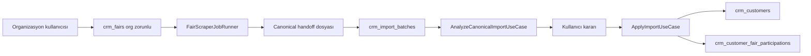

# Fuar kataloğu + scraper + import etki raporu

Status: **Historical research**. The five decisions that were open in this note are accepted. Do not implement from this file. Canonical rules: Constitution §5, [ADR-037](../decisions/DECISIONS.md), [ADR-012](../decisions/DECISIONS.md), [ADR-017](../decisions/DECISIONS.md), [IMPORT_ARCHITECTURE.md](../import/IMPORT_ARCHITECTURE.md), [PERMISSION_SCOPE_GOVERNANCE.md](../PERMISSION_SCOPE_GOVERNANCE.md), [BACKGROUND_JOB_STANDARD.md](../../../standards/jobs/BACKGROUND_JOB_STANDARD.md).

Fair CRM backlog notu. ADR değildir. [IMPORT_ARCHITECTURE.md](../import/IMPORT_ARCHITECTURE.md), [SOURCE_ADAPTER_FRAMEWORK.md](../import/SOURCE_ADAPTER_FRAMEWORK.md) ve [DECISIONS.md](../decisions/DECISIONS.md) üzerinde durmaz. Kod deposu `fair-crm` içine konmaz; insan okumalı ürün bilgisi `kyrox-platform` altındadır.

Bu belge uygulanacak iş listesi değildir. Kod, migration ve dosya değişikliği yapılmadı. Kurallar platformdan okundu: [AGENTS.md](../../../AGENTS.md), [DOCUMENT_GOVERNANCE.md](../../../ecosystem/DOCUMENT_GOVERNANCE.md), [standards/README.md](../../../standards/README.md), [WORKFLOW.md](../../../ecosystem/WORKFLOW.md), [IMPORT_ARCHITECTURE.md](../import/IMPORT_ARCHITECTURE.md), [SOURCE_ADAPTER_FRAMEWORK.md](../import/SOURCE_ADAPTER_FRAMEWORK.md), ADR-012 / ADR-016 / ADR-017 ([DECISIONS.md](../decisions/DECISIONS.md)), [PERMISSION_SCOPE_GOVERNANCE.md](../PERMISSION_SCOPE_GOVERNANCE.md), [BACKGROUND_JOB_STANDARD.md](../../../standards/jobs/BACKGROUND_JOB_STANDARD.md). Arşivdeki [IMPORT_ENGINE.md](../../../archive/fair-crm/import/IMPORT_ENGINE.md) normatif değildir.

## A. Executive Summary

- Fuarlar bugün tamamen organizasyona aittir. `crm_fairs.organization_id` zorunludur (`0003_crm_fairs.py`, `FairModel`). `origin`, `source`, `external_id` yoktur.
- `organization_id = NULL` bugün mümkün değildir. Model `nullable=False`, `FairResponse.organization_id` da `UUID` (opsiyonel değil).
- Ortak sistem fuarı bugün mümkün değildir. `SqlAlchemyFairRepository.get_by_id` ve `list` yalnızca `organization_id` eşitliğini kabul eder.
- Scraper CRM müşterisine doğrudan yazmaz. `FairScraperJobRunner` handoff üretir; `create_and_analyze_import_batch_from_handoff` aynı Import Engine’de batch + satır açar ve `AnalyzeCanonicalImportUseCase` ile eşleştirir. Durum `decision_required` olur. Apply ayrıdır ve kullanıcı kararı ister (`apply_import.py`).
- Kayıtlı `SourceAdapter` yalnızca Excel’dir (`get_source_adapter_registry`). Scraper, dokümandaki adapter protokolüne kayıtlı değildir; canonical JSON ile aynı batch/row/analyze/apply tablolarına girer. Yeni paralel import motoru gerekmez.
- Ortak katılımcı tablosu yoktur. Çıktı, çalıştırmaya ait dosya (`scraper_run_history.output_json_path`) ve organizasyonun `crm_import_rows` satırlarıdır. Müşteri `crm_customers.organization_id` zorunludur; aynı şirket kaydı organizasyonlar arasında paylaşılmaz.
- TOBB takvimi kodda yok. Canlı sayfa yıl bazlı tablo: sıra no, tarihler, ad, konu, yer, şehir, düzenleyici, web, e-posta. Sıra no yıl içinde 1’den başlar; kalıcı UUID görünmez. Excel’e kaydet vardır.
- Zamanlanmış katalog işi yok. Tekrarlayan döngü yalnızca `main.py` içindeki yedek temizliği. Scraper ve import apply elle tetiklenir; FastAPI arka plan işi + süreç içi kuyruk.
- Sistem fuarı salt okunurluğu UI gizleme ile bitmez. `UpdateFairUseCase`, `ArchiveFairUseCase`, `RestoreFairUseCase` bugün yalnızca yetki + organizasyon fuarı arar. Mutation reddi bu use case’lere eklenmelidir. Katılım `ensure_fair_for_participation` üzerinden aynı fuar okumasını kullanır; sistem fuarı okunabilir olursa katılım açılabilir, mutation kapalı kalır.
- Net cevap: mevcut Import mekanizması korunarak scraper çıktısı matching → preview → kullanıcı kararı → Customer + CustomerFairParticipation’a gider. Bu yol bugün organizasyon fuarı için çalışır. Eksik olan, ortak sistem fuarı, TOBB upsert, sistem kapsamlı scraper çalıştırması ve fuar okuma sorgularının sistem satırını organizasyon fuarı sanmadan kabul etmesidir.

## B. Mevcut mimari

Organizasyon kullanıcısı `POST /api/v1/fairs` ile fuar açar. `organization_id` gövdeden gelmez; `CreateFairUseCase` auth bağlamındaki organizasyonu yazar. Yetki `fair_crm.fairs.create`. Güncelleme `fair_crm.fairs.update`, arşiv ve geri alma `fair_crm.fairs.delete`. Arşiv fiziksel silme değildir: `Fair.archive` `status=archived` ve `deleted_at` yazar.

Scraper alanları fuar kartındadır (`0027_crm_fairs_adapter_fields`): `adapter_key`, `source_url`, `scraper_config`. `RunFairScraperUseCase` bunları okur. ADR-017 ve otomasyon ADR’si: URL sihirbazda fuardan salt okunur gelir; scraper CRM’e yazmaz, Veri Entegrasyonu batch’ine bırakır. Fair Detail’deki “scraper çalıştır” aksiyonu kaldırılmış; kullanıcı girişi Otomasyonlar → Web Scraper.

Katılım `crm_customer_fair_participations`. `organization_id` zorunlu. Aktif satırda `(organization_id, customer_id, fair_id)` tekil. `ensure_fair_for_participation` fuarı `get_by_id_including_archived(organization_id, fair_id)` ile arar. Başka organizasyonun fuarı “bulunamadı”dır. Hall/stand katılımda durur (ADR-010).

“Altın müşteri” alanı yoktur. Firma ataması katılım satırıdır.



## C. Mevcut Import Pipeline

Canonical kural ([IMPORT_ARCHITECTURE.md](../import/IMPORT_ARCHITECTURE.md)): preview önce, `fair_id` batch’te zorunlu (ADR-012), CRM yazımı yalnızca karar sonrası apply.

- Batch: `ImportBatchModel` / `crm_import_batches`. `organization_id` var. `fair_id` kolonu nullable; domain kuralı enrichment dışında zorunlu (`FairRequiredError`, `create_and_analyze_import_batch_from_handoff`). `source_type` `ImportSourceType`: excel, csv, api, pdf, scraper, database, manual, other. Scraper değeri kodda var.
- Dosya / kaynak: Excel `ExcelSourceAdapter` + `SourceAdapterRegistry`. Scraper dosyası `handoff_storage.py` (`data/scraper-handoff`), canonical JSON `scraper_handoff_to_canonical`.
- Analysis: Excel `analyze_import.py` / `start_import_analyze_job.py`. Scraper `AnalyzeCanonicalImportUseCase` (`analyze_canonical_import.py`), bitince `mark_decision_required`.
- Mapping: Excel `set_column_mapping.py`, `column_mapping_json`. Scraper canonical alanlarla gelir; Excel header modundan geçmez.
- Normalization / matching: analyze sırasında satır `normalized_data_json`, `match_customer_id`, `match_confidence`, `participation_exists`, `suggested_action`. Eşleşme organizasyon müşterisi + batch fuarının katılımı (ADR-012). Ayrıntı [MATCHING_RULES.md](../import/MATCHING_RULES.md) ve [MERGE_RULES.md](../import/MERGE_RULES.md).
- Preview / decision: `set_row_decision.py`, `bulk_row_decision.py`. Satır alanları `decision`, `suggested_action`.
- Apply: `ApplyImportUseCase` ve `apply_import_decisions.py`. Arka plan `import_job_runner.py` (`run_apply`, `run_analyze`, `run_bulk_decision`). Müşteri ve katılım burada yazılır.
- Rapor: batch sayaçları `created_rows`, `updated_rows`, `created_participations`, `skipped_rows`.
- API: `/api/v1/imports` ve data integration uçları. Frontend: `/data-integration`, `ImportWizardPage.tsx`. Scraper bitince URL ` /data-integration/imports/continue/{batchId}` (`scraper/api/schemas.py`).
- Testler: `backend/tests/modules/imports/`, `backend/tests/modules/data_integration/`, `backend/tests/modules/scraper/test_fair_scraper_run_api.py`.

## D. Mevcut Scraper Pipeline

Kayıtlı motorlar: `tuyap_old`, `tuyap_new`, `customer_contact_enrichment` (`scraper/manifests/__init__.py`, `scraper/adapters/__init__.py`). IFM, Hannover, Canton, CNR anahtarları `ScraperSiteKey` içinde durur, parser yoktur. TOBB yoktur.

Akış: `RunFairScraperUseCase.execute` fuarı organizasyonda bulur, `adapter_key` ve `source_url` boşsa hata. `FairScraperJobRunner` çalıştırır, handoff yazar, `create_and_analyze_import_batch_from_handoff` çağırır. Bu fonksiyon CRM apply etmez.

`scraper_adapters` organizasyon kaydıdır (`organization_id` zorunlu). `scraper_run_history.organization_id` nullable; pratikte fair run organizasyonla açılır. `import_batch_id` bu çalıştırmayı o organizasyonun batch’ine bağlar.

Kanıt, doğrudan CRM yazımı yok: `fair_scraper_import_automation.py` yalnızca batch/row ekler ve analyze çalıştırır. ADR metni de “Scraper never writes CRM customers directly” der.

## E. Hedef mimari ve oturma yerleri

```text
TOBB
 → System Fair
 → System Scraper
 → Participant dataset
 → Mevcut Import Engine
 → Matching
 → Preview
 → User decision
 → Customer + CustomerFairParticipation
```

- TOBB → System Fair: YENİ. Takvim satırı `crm_fairs` içine `origin=system`, `source=tobb`, dış kimlik ile upsert. Müşteri kopyası yok.
- System Fair → System Scraper: KISMEN. Aynı `FairScraperJobRunner` katılımcı çeker; bugün ayar fuar kartında ve çalıştırma organizasyona aittir. Sistem çalıştırması kartı değiştirmemeli ve müşteri ayarı olmamalı. Bu bağ yeni.
- System Scraper → dataset: KISMEN. Dataset = handoff dosyası + run kaydı. Organizasyonlar arası paylaşılan katılımcı tablosu yok. Her organizasyon bu handoff’tan kendi `crm_import_rows` kopyasını açarsa mevcut engine yeter. Ayrı global katılımcı tablosu kodda yoktur; zorunlu olduğu kanıtlanmadı.
- Dataset → Import Engine: MEVCUT, organizasyon fuarı için. `ImportSourceType.SCRAPER` ve canonical batch yolu duruyor. `CreateImportBatchFromCanonicalUseCase` fuarı `get_by_id(organization_id, fair_id)` ile arar; sistem fuarı bugün bulunamaz.
- Matching → Preview → Decision → Apply: MEVCUT. Analyze `decision_required` bırakır. Apply `ApplyImportUseCase`. Excel bu sınıflara girmez; scraper da apply’i atlamaz, sadece analyze’a kadar otomatik gider.
- Customer + Participation: MEVCUT yazım yolu. Kayıtlar organizasyona aittir. Aynı sistem fuarına A ve B ayrı katılım satırı açabilir; fuar satırı tek kalır. Bunun için katılım doğrulaması sistem fuarını “yok” saymamalı, müşteri yine A’nın müşterisi olmalıdır.

## F. Gap

- Fuar sahipliği: bugün her satır bir organizasyon. Hedef sistem satırı ortak, müşteri satırı özel. Değişiklik: `origin` ve okuma sorgusu. Yazma sorgusu sistem satırını reddetmeli.
- `organization_id` null: bugün imkansız. Hedef sistem fuarında null. Değişiklik migration ister. Job standardı her işte `organization_id` ister; sistem işi için açık sistem kapsamı gerekir. AÇIK KARAR: null organizasyon mu, yoksa standarttaki alan dolu kalıp iş kaydı `system` scope ile mi işaretlenecek.
- TOBB kimliği: alan yok. Sayfada kalıcı id görünmedi; sıra no yıla göredir. AÇIK KARAR: upsert anahtarı ham HTML veya Excel kolonundan doğrulanmadan unique constraint yazılmamalı. İsim eşlemesi yetmez.
- Scraper ayarı: bugün fuar kartında, müşteri organizasyonu yönetir. Hedef sistem scraper’ı Super Admin veya sistem job çalıştırır, kartı ve müşteri ayarını yazmaz. Değişiklik: sistem bağının fuar `adapter_key` kolonuna yazılmaması. Müşteri fuarında bugünkü kolonlar kalabilir.
- Katılımcı veri: bugün run dosyası + org import satırı. Hedef ortak güncel liste, sonra org import. Yeni tablo şart değil; paylaşılan handoff + org batch kopyası mevcut modele uyar. AÇIK KARAR: liste ekranı ham handoff’u mu okuyacak, yoksa sorgulanabilir snapshot tablosu mu istenecek.
- Import: Excel registry’sine dokunmadan scraper canonical yolu kullanılabilir. Sistem fuarı seçilebilir olunca Excel’in fuar araması da aynı okuma kuralını kullanır; Excel eşleme kodu değişmek zorunda değildir.
- Zamanlama: katalog ve periyodik sistem scraper için scheduler yok.

## G. Database impact

Henüz migration yok. Mevcut incelemeden çıkan ihtiyaç:

- `crm_fairs`: `origin` (`organization` varsayılan). Mevcut tüm satırlar bu değere backfill edilir; hiçbiri sistem fuarı yapılmaz. Sistem satırları yalnızca TOBB senkronunun ilk upsert’i ile doğar.
- `organization_id` nullable yalnızca `origin=system` için. Müşteri fuarında dolu kalır. Bugünkü `nullable=False` bunu engeller.
- `source` + `external_id` sistem satırında. Unique, kısmi: kaynak ve dış kimlik doluysa tekil. İsim unique değildir; bugün de değil. Duplicate riski: mevcut “Hannover” müşteri fuarı ile yeni sistem fuarı yan yana durur. Otomatik birleştirme kodda yoktur ve isimle yapılmamalıdır. AÇIK KARAR: eski müşteri fuarını sistem fuarına taşıma ayrı iştir; ilk sürümde yapılmaz.
- `crm_customers`, `crm_import_batches`, `crm_import_rows`, `crm_customer_fair_participations`: organizasyon zorunluluğu kalır. Ortak müşteri yok.
- `scraper_run_history.organization_id` zaten nullable. Sistem çalıştırması bu kaydı kullanabilir. Katılımcı satırları için yeni tablo, ancak handoff sorgulanamaz denirse gerekir. Şu kanıt yeni tabloyu zorunlu kılmaz.
- Sistem scraper URL’si fuar kartına yazılmayacaksa bağ için ayrı sistem kaydı gerekir. Böyle bir tablo yok. AÇIK KARAR: ayrı tablo mu, yoksa sistem satırında yalnız platformun yazdığı ve müşteri API’sinin reddettiği alanlar mı. İkinci seçenek “kart değişmez” kuralını müşteri için sağlar, senkron hâlâ kartı günceller.

## H. API / backend

- `GET /fairs`, `GET /fairs/{id}`: sistem + bu organizasyonun fuarları. Başka organizasyonun fuarı 404 kalır.
- `PATCH /fairs/{id}`, `DELETE` (arşiv), `POST /restore`: organizasyon kullanıcısı + `origin=system` → 403. Yetki kontrolünden sonra, kayıt bulunduktan sonra. UI gizleme yetmez ([CRUD standardı](../../../standards/ui/CRUD_UI_AUTHORIZATION_STANDARD.md): gizli UI backend yetkisi değildir).
- `POST /fairs`: gövde `origin=system` gönderemez. Yeni müşteri fuarı `origin=organization`.
- Katılım `POST /fair-participations` ve fuar katılımcı listesi: sistem fuarı için açık. `ensure_fair_for_participation` ve `list_by_fair` okuması sistem satırını görmeli. `participation_repository` içindeki `FairModel.organization_id == organization_id` join’i sistem fuarında katılımcı listesini boşaltır; okuma koşulu değişmeli, yazılan katılımın `organization_id`’si yine çağıran organizasyon olmalı.
- Import canonical create / analyze / apply: batch `organization_id` çağıranın organizasyonu. Fuar doğrulaması sistem fuarını kabul etmeli. Apply müşteriyi bu organizasyonda yaratır.
- TOBB sync ve sistem scraper start: `permission_scope=system`. Super Admin `identity_users.is_super_admin` bypass. OrganizationAdmin rolüne verilmez ([PERMISSION_SCOPE_GOVERNANCE.md](../PERMISSION_SCOPE_GOVERNANCE.md)).
- `RunFairScraperUseCase` sistem fuarında müşteriye açık kalırsa müşteri ortak karttaki URL’yi çalıştırır. Hedef bunu istemiyor. Organizasyon kullanıcısı sistem fuarında scraper start edemez.

## I. Frontend

- `fair-crm/frontend/src/pages/FairsPage.tsx`: `canUpdate` / `canDelete` tüm satırlara uygulanır. Sistem satırında Düzenle ve Arşiv kalkmalı; rozet “Sistem”. Müşteri satırında bugünkü Düzenle / Arşiv ve “Sizin fuarınız”. `Fair` tipinde `organization_id: string` ve `origin` yok; API alanı gelmeden buton kararı eksik kalır.
- `fair-crm/frontend/src/pages/FairDetailPage.tsx`: Action bar’da düzenle, arşiv, katılımcı içe aktar. Sistem detayında düzenle/arşiv yok. “Güncel katılımcı listesi hazır / CRM ile karşılaştır” mevcut scraper devam URL’sine oturur: batch `decision_required` iken `/data-integration/imports/continue/{id}`. Bu ekran organizasyonun kendi batch’idir, ortak ham listenin kendisi değildir. Ortak listeyi göstermek için ya sistem run handoff’undan bu organizasyona batch açan bir aksiyon, ya da salt okunur önizleme gerekir. İçe aktar sihirbazı fair’i doldurarak duruyor (`onImportParticipants`).
- Import sihirbazı ve Excel akışı aynı fuar seçicisini kullanır. Seçici sistem fuarını gösterirse Excel de o fuara yazabilir. Bu, engine’i bozmaz; fuar okuma kuralının sonucudur.

## J. Background jobs

Kullanılan yapı: FastAPI `BackgroundTasks`, `import_job_runner.py`, scraper job runner, mail worker, data operation job. Ayrı kuyruk (Celery/RQ/Redis) yok. Scraper run’da status, heartbeat, progress, cancel var (`scraper_run_history`). Import batch status `queued/analyzing/decision_required/applying/completed`. Retry genel scheduler değil. Idempotency: aynı batch + aynı karar ile apply dokümante; yeni batch aynı firmaları tekrar eşleştirir, katılım unique index ikinci aktif katılımı keser. Scheduled job yok.

TOBB sync ve periyodik sistem scraper için scheduler eksik. Elle tetik ve mevcut job kaydı (status, log, cancel, progress) yeniden kullanılabilir. Süreç restart’ı in-process işi keser. System job kuralı artık [BACKGROUND_JOB_STANDARD.md](../../../standards/jobs/BACKGROUND_JOB_STANDARD.md) içindedir (`job_scope=system`, `organization_id` boş). Bu cümle araştırma anındaki boşluğu tarif eder; kuralın sahibi o standarttır.

## K. Security / tenant

- Müşteri fuarı: repository filtresi nedeniyle A, B’nin fuarını görmez. Bu kalmalı.
- Sistem fuarı her organizasyon listesinde görünür. Bu kasıtlı paylaşımdır, sızıntı değildir.
- Import batch, import row, customer, participation: hepsi `organization_id` ile okunur. A’nın batch’i B’ye açılmaz. Apply A’nın müşterisini yazar.
- Risk: `AdapterLinkedFairService._aggregate_runs_by_fair_name` çalıştırmaları `organization_id` süzmez. Ortak scraper’da bir organizasyonun son run’ı diğerinin adapter ekranına karışabilir. Sistem dataset’i paylaşılacaksa bu sorgu ya sistem run’larıyla sınırlı olmalı ya da org run’ları org’a kilitli kalmalıdır.
- `scraper_run_history` listesi `organization_id` verilince süzer. Sistem run `organization_id` null ise normal listeye girmez; ayrıca sistem-okuma kuralı yazılmazsa ya kimse görmez ya da filtresiz sorgu herkese açılır. İkisi de tasarlanmalıdır.
- Super Admin platform işini (TOBB sync, sistem scraper start) yapar. OrganizationAdmin kendi fuarını ve kendi import kararını yapar. Super Admin bypass, organizasyon verisini birbirine karıştırma izni değildir; her apply yine tek `organization_id` taşır.

## L. Import compatibility

Excel/CSV yolu `SourceAdapterRegistry` ve `upload_raw_import` / mapping / `analyze_import` üzerinden gider. Scraper bu registry’ye kayıtlı olmadığı için Excel kodunu çağırmaz. Ortak olan sonraki katmanlar: batch, row, matching alanları, decision, `ApplyImportUseCase`.

Bozulma, Excel sınıflarını yeniden yazınca değil, fuar aramasını yanlış genişletince olur. `get_by_id` her organizasyona her fuarı açarsa tenant kaçağı olur. Doğru genişleme: bu organizasyonun fuarı veya `origin=system`. Başka organizasyonun `origin=organization` fuarı 404 kalır. Mevcut Excel testleri bu 404’ü doğrular; sistem fuarı için yeni vaka eklenir, eski vaka silinmez.

`fair_id` ADR-012 ile zorunlu. Sistem fuarının id’si batch’e yazılabilir; batch’in kendi `organization_id`’si dolu kalır. Engine’in ikinci kopyası gerekmez.

## M. Test impact

Mevcut: `tests/modules/fairs/`, `tests/modules/participations/` (tenant scope), `tests/modules/imports/`, `tests/modules/data_integration/`, `tests/modules/scraper/` (tenant isolation dosyası var).

İleride, kod yazılırsa:

- Unit: sistem fuarı archive/update reddi; müşteri fuarı archive kalır.
- API: org user system fair PATCH/DELETE/restore 403; GET 200.
- Tenant: A, B’nin müşteri fuarını görmez; her ikisi sistem fuarını görür. A’nın import batch’i B’de 404.
- Participation: sistem fuarına A katılım açar; B’nin müşterisi bu katılıma yazılmaz.
- Scraper: sistem run CRM customer insert etmez; analyze `decision_required`. Apply öncesi customer sayısı değişmez.
- Import: Excel batch aynı mapping ile tamamlanır. İkinci apply aynı katılımcıda duplicate participation üretmez.
- Job: sistem sync iptal/progress. Scheduler varsa tek lider.
- E2E: gerçek JWT ile sistem fuarı listelenir, düzenle görünmez, mutation 403, karşılaştır sihirbazı preview gösterir, karar sonrası yalnız o organizasyonun müşterisi artar.

## N. Dosya etkisi

Yeniden kullanılacak:

- `analyze_canonical_import.py`, `apply_import.py`, `canonical_batch_mapper.py`, `import_job_runner.py` — matching, karar, apply aynı kalır.
- `fair_scraper_job_runner.py`, `handoff_storage.py`, Tuyap adapter’ları — katılımcı çekme ve canonical çıktı.
- `create_participation.py`, `ApplyImportUseCase` — organizasyon müşterisi ve katılım yazımı.
- `ImportWizardPage.tsx` — preview ve karar ekranı.

Değişmesi muhtemel:

- `fairs/infrastructure/persistence/models.py` ve yeni alembic — origin, nullable organization, dış kimlik.
- `fair_repository.py` — liste/get sistem satırını görür; update hâlâ sistem satırını org gibi yazmaz.
- `update_fair.py`, `archive_fair.py`, `restore_fair.py` — sistem satırında 403.
- `participations/application/validators.py` ve `participation_repository.py` fair join — sistem fuarını katılım için görünür kılar.
- `create_import_batch_from_canonical.py`, `fair_scraper_import_automation.py` — fair lookup sistem fuarını kabul eder; batch organizasyonu değişmez.
- `fairs/api/schemas.py`, `frontend/src/types/fair.ts`, `FairsPage.tsx`, `FairDetailPage.tsx` — origin ve salt okunur aksiyonlar.
- `adapter_linked_fair_service.py` — run özeti organizasyon veya sistem kapsamına kilitlenir.
- Platform dokümanları: import mimarisi “fair context = org fair” varsayımını sistem fuarı istisnasıyla günceller; permission scope’a sistem sync/scraper eklenir. Kod reposuna yeni markdown ağacı açılmaz ([DOCUMENT_GOVERNANCE.md](../../../ecosystem/DOCUMENT_GOVERNANCE.md)).

Yeni olması muhtemel:

- TOBB okuyucu ve upsert use case — takvim satırını sistem fuarına yazar. Mevcut katılımcı scraper bunu yapmaz.
- Sistem scraper bağ kaydı — URL ve adapter, müşteri fuar formuna yazılmadan durur. Yer AÇIK KARAR.
- Sistem izin kodu ve Super Admin ucu — elle sync / sistem scraper. Organization rol matrisine eklenmez.
- Scheduler — periyot. Mevcut in-process backup döngüsü örnek alınmaz; standart job kaydı ile çalışır.

## O. Uygulama sırası

Kod yazılmadan önerilen sıra. Her adım bir öncekinin sözleşmesine bağlıdır.

1. Upsert anahtarını TOBB ham HTML veya Excel’den sabitle. Yanlış unique, tüm kataloğu çiftler.
2. `origin` ve sistem okuma/yazma kuralını fuar repository ve mutation use case’lerine koy. Import ve katılım bu okumaya bağlanacak.
3. Katılım ve import fair lookup’ını “kendi fuarın veya sistem fuarı” yap. Aksi halde ortak fuar seçilemez.
4. Sistem scraper çalıştırmasını org kartından ayır; handoff’u org batch’e kopyalayan mevcut canonical yolu kullan. Apply’e otomatik geçme.
5. Super Admin sync ve sistem scraper start iznini system scope yap. OrganizationAdmin’e verme.
6. Adapter linked-fair özetini kilitle. Paylaşım açılınca sızıntı büyür.
7. Liste/detay UI salt okunur rozet ve karşılaştır aksiyonu. Backend 403 zaten duruyor olmalı.
8. Scheduler en son. Elle tek seferlik upsert ve tek scraper doğru çalışmadan periyot eklenmez.
9. Excel regresyon testleri bu sıra boyunca yeşil kalır. Engine kopyalanmaz.

## Açık kararlar

- Sistem job `organization_id`: null mu, standarttaki zorunlu alan için ayrı system scope işareti mi.
- TOBB kalıcı dış kimlik: sıra no yeterli değil.
- Ortak katılımcı: handoff dosyası mı, sorgulanabilir snapshot tablosu mu.
- Sistem scraper URL’sinin durduğu yer.
- Mevcut müşteri fuarlarını aynı isimli sistem fuarıyla birleştirme: ilk sürümde yok.

## Sonuç

Evet. Elimizdeki Import Engine korunarak scraper çıktısı bu mekanizmanın içine girer ve müşteri onayıyla Customer + CustomerFairParticipation’a gider. Bu, bugün organizasyon fuarı + canonical scraper handoff ile çalışıyor. Değişmesi gereken yerler fuarın ortak ve salt okunur olması, TOBB’un o fuarı üretmesi, sistem scraper’ın organizasyon kartına ve organizasyon CRM’ine yazmaması, ve her organizasyonun aynı handoff’tan kendi import batch’ini açabilmesidir. Excel import sınıfları ve apply kuralları bu yüzden yeniden yazılmaz.
